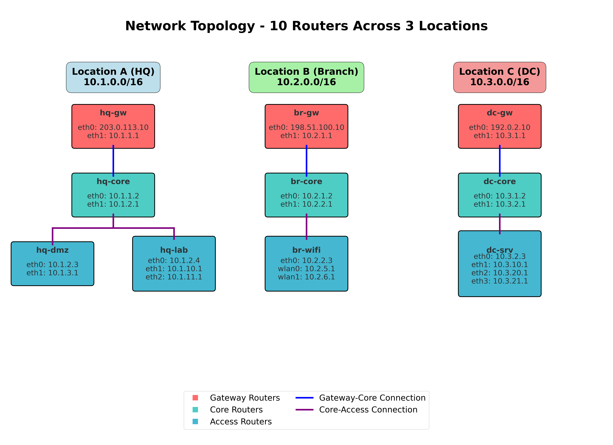

# Network Traceroute Simulator

A comprehensive network path discovery tool that simulates traceroute behavior using real routing information collected from multiple Linux routers. This tool helps network administrators understand packet flow paths through complex network topologies including VPN tunnels, multi-homed connections, and policy-based routing.

## 🌟 Features

- **Real Routing Data**: Uses actual routing tables and policy rules from Linux routers
- **MTR Fallback**: Automatic fallback to real MTR execution when simulation cannot complete paths
- **Multiple Output Formats**: Text, JSON, and verbose modes with consistent formatting
- **Complex Network Support**: Handles VPN tunnels, WireGuard, multi-interface scenarios
- **Error Detection**: Identifies routing loops, blackhole routes, and unreachable destinations
- **Automation Friendly**: Comprehensive exit codes and quiet mode for script integration
- **Comprehensive Testing**: Full test suite with 79 tests and 100% pass rate
- **Professional Visualization**: High-quality network topology diagrams with matplotlib
- **Accurate Interface Tracking**: Precise incoming/outgoing interface determination

## 📋 Table of Contents

- [Installation](#installation)
- [Quick Start](#quick-start)
- [Usage](#usage)
- [Command Line Options](#command-line-options)
- [Data Collection](#data-collection)
- [Network Scenarios](#network-scenarios)
- [Network Visualization](#network-visualization)
- [Output Formats](#output-formats)
- [Exit Codes](#exit-codes)
- [Testing](#testing)
- [Examples](#examples)
- [Troubleshooting](#troubleshooting)
- [Contributing](#contributing)

## 🚀 Installation

### Prerequisites

- Python 3.7 or higher
- Linux environment (for data collection)
- Ansible (for multi-router data collection)
- matplotlib and numpy (for network topology visualization)
- Make (for automated build tasks)

### Setup

1. **Clone the repository**:
   ```bash
   git clone <repository-url>
   cd traceroute_simulator
   ```

2. **Check dependencies and install requirements**:
   ```bash
   make check-deps  # Verify all dependencies and get installation hints
   ```

3. **Install Python dependencies** (if not already installed):
   ```bash
   # Install matplotlib for network visualization
   pip3 install matplotlib
   
   # Verify Python version
   python3 --version  # Ensure Python 3.7+
   ```


## 🏃 Quick Start

1. **Use the provided test network** (see [Network Topology](#network-topology) for details):
   ```bash
   # Complex test network with 10 routers across 3 locations
   ls testing/routing_facts/
   # hq-gw_route.json  hq-core_route.json  br-gw_route.json  dc-gw_route.json  ... (20 files total)
   ```

2. **Run a basic traceroute simulation**:
   ```bash
   python3 traceroute_simulator.py --routing-dir testing/routing_facts -s 10.1.1.1 -d 10.2.1.1
   ```

3. **View results**:
   ```
   traceroute to 10.2.1.1 from 10.1.1.1
     1  hq-gw (10.1.1.1) from eth1 to wg0
     2  br-gw (10.100.1.2) from wg0 to eth1
     3  br-gw (10.2.1.1) on eth1
   ```

## 💻 Usage

### Basic Syntax

```bash
python3 traceroute_simulator.py [OPTIONS] -s SOURCE_IP -d DESTINATION_IP
```

### Simple Examples

```bash
# Basic traceroute between router interfaces (HQ to Branch)
python3 traceroute_simulator.py --routing-dir testing/routing_facts -s 10.1.1.1 -d 10.2.1.1

# JSON output for programmatic processing (WireGuard tunnel)
python3 traceroute_simulator.py --routing-dir testing/routing_facts -j -s 10.100.1.1 -d 10.100.1.3

# Verbose output with debugging information (complex multi-hop)
python3 traceroute_simulator.py --routing-dir testing/routing_facts -v -s 10.1.10.1 -d 10.3.20.1

# Quiet mode for scripts (check exit code)
python3 traceroute_simulator.py --routing-dir testing/routing_facts -q -s 10.1.1.1 -d 10.2.1.1
echo "Exit code: $?"
```

## 🔧 Command Line Options

| Option | Long Form | Description |
|--------|-----------|-------------|
| `-h` | `--help` | Show help message and exit |
| `-s IP` | `--source IP` | **Required:** Source IP address for traceroute |
| `-d IP` | `--destination IP` | **Required:** Destination IP address for traceroute |
| `-v` | `--verbose` | Enable verbose output (-v basic, -vv detailed debugging) |
| `-q` | `--quiet` | Quiet mode - no output, use exit codes only |
| `-j` | `--json` | Output results in JSON format |
| | `--routing-dir DIR` | Custom directory containing routing facts (default: `routing_facts`) |
| | `--no-mtr` | Disable MTR fallback (simulation only) |

### Detailed Option Descriptions

- **Verbose Mode (`-v`)**: Shows router loading process and additional debugging information
  - `-v`: Basic verbose output with router loading information
  - `-vv`: Detailed debugging including simulation output and MTR command details
- **Quiet Mode (`-q`)**: Suppresses all output, useful for automation scripts that check exit codes
- **JSON Mode (`-j`)**: Outputs structured data suitable for parsing by other tools
- **Custom Directory**: Allows using different sets of routing data for testing or multiple environments (default: `routing_facts`)
- **MTR Fallback (`--no-mtr`)**: Disable automatic MTR fallback for simulation-only mode

## 🔄 MTR Integration

The simulator includes automatic MTR (My TraceRoute) fallback functionality:

### How It Works
1. **Simulation First**: Attempts normal route simulation using collected routing data
2. **Automatic Fallback**: If simulation cannot complete the path, automatically falls back to real MTR execution
3. **SSH Execution**: Executes `mtr --report -c 1 -m 30 <destination>` via SSH on the appropriate Linux router
4. **Linux Router Filtering**: Filters MTR results to show only Linux routers from inventory
5. **Consistent Output**: Formats MTR results to match simulation output format

### Use Cases
- **Mixed Networks**: Networks containing both Linux and non-Linux routers
- **External Destinations**: Tracing to internet destinations beyond your network
- **Verification**: Cross-checking simulation results with real network behavior

### Requirements
- SSH access to Linux routers (passwordless recommended)
- MTR installed on target routers: `sudo apt-get install mtr-tiny`
- Proper hostname resolution for router identification

## 🌐 Network Topology

The project includes a comprehensive test network with 10 routers across 3 locations:

### Test Network Overview

- **Location A (Headquarters)**: 4 routers covering 5 network segments (10.1.0.0/16)
  - `hq-gw`: Gateway router with internet and WireGuard connectivity
  - `hq-core`: Core distribution router
  - `hq-dmz`: DMZ services router
  - `hq-lab`: Development lab router with multiple networks

- **Location B (Branch Office)**: 3 routers covering 4 network segments (10.2.0.0/16)
  - `br-gw`: Branch gateway with WireGuard to HQ/DC
  - `br-core`: Branch distribution router
  - `br-wifi`: WiFi controller with multiple wireless networks

- **Location C (Data Center)**: 3 routers covering 5 network segments (10.3.0.0/16)
  - `dc-gw`: Data center gateway with WireGuard connectivity
  - `dc-core`: DC distribution router
  - `dc-srv`: Server farm router with multiple server networks

### WireGuard VPN Mesh
- **10.100.1.0/24**: Full mesh VPN connecting all three locations
- Inter-location traffic flows through encrypted tunnels
- Realistic enterprise network design with redundancy

### Network Diagram



The complete network topology diagram shows all 10 routers with their interface assignments and connections. High-resolution versions are available as `testing/network_topology.png` and `testing/network_topology.pdf`.

For complete topology details, see `testing/NETWORK_TOPOLOGY.md`.

## 📊 Data Collection

### Automated Data Collection with Make

The project provides automated tools for collecting routing information from network devices:

```bash
# Check all dependencies first
make check-deps

# Collect routing data using inventory file
make fetch-routing-data OUTPUT_DIR=production_data INVENTORY_FILE=hosts.yml

# Collect from configured inventory group
make fetch-routing-data OUTPUT_DIR=test_data INVENTORY=routers

# Run comprehensive test suite
make test
```

### Using Ansible Playbook Directly

The project includes an enhanced Ansible playbook that executes basic `ip` commands on remote hosts and converts text output to JSON on the controller:

1. **Configure your inventory** (`hosts.yml`):
   ```yaml
   all:
     children:
       linux_routers:
         hosts:
           router1:
             ansible_host: 192.168.1.1
           router2:
             ansible_host: 192.168.2.1
   ```

2. **Run the data collection playbook**:
   ```bash
   # Using inventory file
   ansible-playbook -i hosts.yml get_routing_info.yml -e "output_dir=my_data"
   
   # Using configured inventory with group targeting
   ansible-playbook get_routing_info.yml --limit routers -e "output_dir=my_data"
   ```

3. **Verify collected data**:
   ```bash
   ls my_data/
   # router1_route.json  router1_rule.json  router2_route.json  router2_rule.json
   ```

### Enhanced Compatibility Features

- **Text-only remote execution**: Executes only basic `ip route show` and `ip rule show` commands on remote hosts
- **Automatic path discovery**: Searches standard utility paths (`/sbin`, `/usr/sbin`, `/bin`, `/usr/bin`) for `ip` command
- **Full path execution**: Uses complete path to `ip` command for maximum reliability across Linux distributions
- **Controller-side JSON conversion**: Transfers text output to Ansible controller for JSON transformation
- **No remote Python dependencies**: Remote hosts only need the standard `ip` command available
- **IP JSON wrapper on controller**: Uses `ip_json_wrapper.py` on the controller to convert text to JSON
- **Automatic cleanup**: Removes temporary text files after processing
- **Detailed logging**: Provides collection statistics and troubleshooting information

### Manual Collection

For single routers or custom setups:

```bash
# Create output directory
mkdir -p routing_facts

# Collect routing table
ip --json route list > routing_facts/hostname_route.json

# Collect policy rules
ip --json rule list > routing_facts/hostname_rule.json
```

### Data Format

The simulator expects JSON files in this format:

- **Route files** (`*_route.json`): Output from `ip --json route list`
- **Rule files** (`*_rule.json`): Output from `ip --json rule list`

File naming convention: `{hostname}_route.json` and `{hostname}_rule.json`

### IP JSON Wrapper for Legacy Systems

The project includes `ip_json_wrapper.py`, a compatibility tool for older Red Hat systems that don't support `ip --json`:

```bash
# Use wrapper script on systems without native JSON support
python3 ip_json_wrapper.py route show
python3 ip_json_wrapper.py addr show  
python3 ip_json_wrapper.py link show
python3 ip_json_wrapper.py rule show

# Wrapper automatically detects and uses native JSON if available
python3 ip_json_wrapper.py --json route show  # Passes through to native command
```

**Key Features:**
- **Transparent replacement**: Drop-in replacement for `ip --json` commands
- **Identical output**: Produces byte-for-byte identical JSON to native commands
- **Automatic detection**: Uses native JSON support when available
- **Comprehensive coverage**: Supports route, addr, link, and rule subcommands
- **Validated compatibility**: 100% test coverage ensures output accuracy

## 🌐 Network Scenarios

The simulator handles various complex network scenarios using the realistic test topology:

### Supported Routing Scenarios

1. **Intra-Location Routing**: Communication within each location through distribution layers
2. **Inter-Location Routing**: Cross-site communication via WireGuard VPN tunnels
3. **Multi-Hop Routing**: Complex paths through multiple routers and network layers
4. **Network Segment Routing**: Host-to-host communication across different subnets
5. **VPN Tunnel Routing**: Encrypted traffic flows between remote locations
6. **Internet Gateway Routing**: Access to external destinations through location gateways

### Example Routing Scenarios

```bash
# Intra-location: HQ internal routing
10.1.10.1 (hq-lab) → 10.1.3.1 (hq-dmz)
Path: hq-lab → hq-core → hq-dmz

# Inter-location: HQ to Branch via WireGuard  
10.1.1.1 (hq-gw) → 10.2.1.1 (br-gw)
Path: hq-gw[wg0] → br-gw[wg0]

# Complex multi-hop: Lab to Data Center servers
10.1.11.100 (HQ lab host) → 10.3.21.200 (DC server host)
Path: lab-network → hq-lab → hq-core → hq-gw → [WireGuard] → dc-gw → dc-core → dc-srv → server-network
```

## 🎨 Network Visualization

The project includes a professional network topology visualization system that generates high-quality diagrams of the test network.

### Generating Network Diagrams

```bash
# Generate network topology diagram
cd testing
python3 network_topology_diagram.py

# Generated files:
# - network_topology.png (300 DPI raster image)
# - network_topology.pdf (vector format for printing)
```

### Visualization Features

- **Professional Layout**: Clean hierarchical design with proper spacing
- **No Crossing Connections**: Optimized routing to avoid visual clutter  
- **Adaptive Sizing**: Router boxes automatically scale based on interface count
- **Color Coding**: Different colors for gateway, core, and access routers
- **Comprehensive Information**: All router names, IP addresses, and interfaces
- **Multiple Formats**: High-resolution PNG and scalable PDF output

### Customization Options

The visualization can be customized by editing `testing/network_topology_diagram.py`:

- **Router Positions**: Modify coordinates in `gateways`, `cores`, and `access` arrays
- **Colors**: Update the `colors` dictionary for different themes
- **Font Sizes**: Adjust text sizing for different display requirements
- **Box Sizing**: Automatic scaling based on interface count (2-4 interfaces)
- **Export Formats**: PNG (300 DPI) and PDF (vector) formats supported

### Use Cases

- **Documentation**: Professional network diagrams for technical documentation
- **Presentations**: High-quality visuals for network architecture presentations  
- **Training**: Visual aids for understanding complex network topologies
- **Planning**: Reference diagrams for network expansion or modifications

## 📄 Output Formats

### Text Format (Default)

Human-readable output showing hop-by-hop path information:

```
traceroute to 10.3.20.1 from 10.1.10.1
  1  hq-lab (10.1.10.1) from eth1 to eth0
  2  hq-core (10.1.2.1) from eth0 to eth0
  3  hq-gw (10.1.1.1) from eth0 to wg0
  4  dc-gw (10.100.1.3) from wg0 to eth1
  5  destination (10.3.20.1) via eth1 on dc-gw
```

### JSON Format (`-j`)

Structured output for programmatic processing:

```json
{
  "traceroute_path": [
    {
      "hop": 1,
      "router_name": "hq-lab",
      "ip_address": "10.1.10.1",
      "interface": "eth1",
      "is_router_owned": true,
      "connected_router": "",
      "outgoing_interface": "eth0"
    },
    {
      "hop": 2,
      "router_name": "hq-core", 
      "ip_address": "10.1.2.1",
      "interface": "eth0",
      "is_router_owned": true,
      "connected_router": "",
      "outgoing_interface": "eth0"
    },
    {
      "hop": 3,
      "router_name": "hq-gw",
      "ip_address": "10.1.1.1",
      "interface": "eth0",
      "is_router_owned": true,
      "connected_router": "",
      "outgoing_interface": "wg0"
    }
  ]
}
```

### Verbose Format (`-v`)

Includes debugging information:

```
Loaded router: hq-gw
Loaded router: hq-core
Loaded router: hq-lab
Loaded router: br-gw
Loaded router: dc-gw
[... additional router loading messages ...]
traceroute to 10.2.5.1 from 10.1.11.1
  1  hq-lab (10.1.11.1) from eth2 to eth0
  2  hq-core (10.1.2.1) from eth0 to eth0
  3  hq-gw (10.1.1.1) from eth0 to wg0
  4  br-gw (10.100.1.2) from wg0 to eth1
  5  br-core (10.2.1.2) from eth1 to eth1
  6  br-wifi (10.2.2.3) from eth1 to wlan0
  7  br-wifi (10.2.5.1) on wlan0
```

## 🚦 Exit Codes

The simulator uses standard exit codes for automation and error handling:

| Code | Meaning | Description |
|------|---------|-------------|
| `0` | **Success** | Path found successfully between source and destination |
| `1` | **No Path** | Source and destination found, but no routing path exists |
| `2` | **Not Found** | Source or destination IP not reachable by any router |
| `4` | **No Linux Routers** | MTR executed but no Linux routers found in path |
| `10` | **Error** | Input validation error or system error |

### Using Exit Codes in Scripts

```bash
#!/bin/bash
python3 traceroute_simulator.py --routing-dir routing_facts -q -s "$1" -d "$2"
case $? in
    0) echo "Route found" ;;
    1) echo "No path available" ;;
    2) echo "IP not reachable" ;;
    4) echo "No Linux routers found" ;;
    10) echo "Invalid input or error" ;;
esac
```

## 🧪 Testing

The project includes comprehensive test suites covering all functionality:

### Automated Testing with Make

```bash
# Run all tests (recommended)
make test

# Check dependencies before testing
make check-deps

# Clean up test artifacts
make clean
```

### Individual Test Suites

**Main Traceroute Simulator Tests (64 test cases)**:
```bash
cd testing
python3 test_traceroute_simulator.py
```

**IP JSON Wrapper Validation (7 test cases)**:
```bash
cd testing  
python3 test_ip_json_comparison.py
```

### Running Tests

```bash
# Run comprehensive test suite
cd testing
python3 test_traceroute_simulator.py

# Expected output
Total tests: 64
Passed: 64 (100%)
Failed: 0
Pass rate: 100.0%

NETWORK TOPOLOGY:
- Location A (HQ): 4 routers, 5 networks (10.1.0.0/16)
- Location B (Branch): 3 routers, 4 networks (10.2.0.0/16)
- Location C (DC): 3 routers, 5 networks (10.3.0.0/16)
- WireGuard mesh: 10.100.1.0/24 interconnecting all locations
```

### Test Categories

1. **Intra-Location Routing**: Communication within each location through distribution layers (11 tests)
2. **Inter-Location Routing**: Cross-site communication via WireGuard VPN tunnels (12 tests)
3. **Network Segment Routing**: Host-to-host communication across different subnets (9 tests)
4. **Command Line Options**: All flags and output formats (4 tests)
5. **Error Conditions**: Invalid inputs, missing files, network errors (14 tests)
6. **Exit Codes**: Verification of all return codes in quiet mode (4 tests)
7. **Edge Cases**: Comprehensive coverage of error handling and boundary conditions (6 tests)
8. **Complex Scenarios**: Multi-hop routing and advanced network paths (8 tests)

### Test Coverage

- ✅ **64 comprehensive test cases** covering all network scenarios and edge cases
- ✅ **100% pass rate** with complete functionality validation
- ✅ **10-router topology** with realistic routing configurations across 3 locations
- ✅ **All command-line options** tested including new required flags (-s/-d)
- ✅ **Comprehensive error handling** including corrupted JSON, missing files, and invalid inputs
- ✅ **Complete exit code verification** across all modes (quiet, verbose, JSON)
- ✅ **Edge case coverage** including IPv6 handling, loop detection, and timeout scenarios
- ✅ **Routing misconfiguration testing** with realistic failure scenarios
- ✅ **JSON output format validation** with structured data verification
- ✅ **WireGuard VPN tunnel routing** with full mesh connectivity testing
- ✅ **Multi-location network testing** covering all inter-site communication paths

## 🔧 Build System

The project includes a comprehensive Makefile for automated development tasks:

### Available Make Targets

```bash
make help                    # Show all available targets and usage examples
make check-deps             # Verify Python modules and provide installation hints  
make test                   # Run comprehensive test suite with environment validation
make clean                  # Clean up Python cache files and temporary artifacts
```

### Data Collection Targets

```bash
# Collect routing data using inventory file
make fetch-routing-data OUTPUT_DIR=my_data INVENTORY_FILE=hosts.ini

# Collect from configured Ansible inventory group  
make fetch-routing-data OUTPUT_DIR=production INVENTORY=routers

# Target specific host from configured inventory
make fetch-routing-data OUTPUT_DIR=temp INVENTORY=router-01
```

### Build System Features

- **Dependency validation**: Checks all required Python modules with helpful installation hints
- **Comprehensive testing**: Runs 64 main tests + 7 wrapper validation tests + integration tests
- **Ansible integration**: Automated data collection with inventory validation and error handling
- **Environment verification**: Validates test data availability and routing facts
- **Clean builds**: Removes cache files while preserving valuable routing data

## 📝 Examples

### Basic Router Communication

```bash
# Intra-location routing (HQ internal)
python3 traceroute_simulator.py --routing-dir testing/routing_facts -s 10.1.1.1 -d 10.1.2.1
# Output: HQ gateway to core router

# Inter-location routing (HQ to Branch)
python3 traceroute_simulator.py --routing-dir testing/routing_facts -s 10.1.1.1 -d 10.2.1.1
# Output: Cross-site via WireGuard tunnel
```

### Network Segment Routing

```bash
# From HQ lab network to DC server network
python3 traceroute_simulator.py --routing-dir testing/routing_facts -s 10.1.10.100 -d 10.3.20.200
# Output: Complex multi-hop path through multiple locations

# Branch WiFi to Data Center servers  
python3 traceroute_simulator.py --routing-dir testing/routing_facts -s 10.2.5.50 -d 10.3.21.100
# Output: Cross-location routing via distribution layers
```

### Automation Examples

```bash
# Check connectivity in script
if python3 traceroute_simulator.py --routing-dir testing/routing_facts -q -s 10.1.1.1 -d 10.3.1.1; then
    echo "HQ to DC route available"
else
    echo "No route found"
fi

# JSON processing with jq
python3 traceroute_simulator.py --routing-dir testing/routing_facts -j -s 10.1.10.1 -d 10.3.20.1 | \
    jq '.traceroute_path[].router_name'
```

### Complex Scenarios

```bash
# WireGuard tunnel mesh routing
python3 traceroute_simulator.py --routing-dir testing/routing_facts -s 10.100.1.1 -d 10.100.1.3
# Output: Direct VPN tunnel communication

# Multi-hop cross-location routing
python3 traceroute_simulator.py --routing-dir testing/routing_facts -v -s 10.1.11.1 -d 10.2.6.1  
# Output: HQ lab to Branch WiFi with detailed hop information

# Maximum complexity: End-to-end across all 3 locations
python3 traceroute_simulator.py --routing-dir testing/routing_facts -s 10.1.11.100 -d 10.3.21.200
# Output: Lab host → HQ → Branch → DC → Server host
```

## 🔍 Troubleshooting

### Common Issues

**1. "No router data found" Error**
```bash
Error: No router data found in testing/routing_facts
```
- **Solution**: Ensure routing JSON files exist in the testing/routing_facts directory
- **Check**: `ls testing/routing_facts/*_route.json` (should show 10 files)

**2. "IP not configured on any router" Error**
```bash
Error: Source IP 1.2.3.4 is not configured on any router or in any directly connected network
```
- **Solution**: Use IP addresses from the test topology (10.1.x.x, 10.2.x.x, 10.3.x.x, 10.100.1.x)
- **Check**: See `testing/NETWORK_TOPOLOGY.md` for complete IP address listing

**3. Invalid IP Address Error**
```bash
Error: Invalid IP address - '999.999.999.999' does not appear to be an IPv4 or IPv6 address
```
- **Solution**: Use valid IP address format (IPv4 or IPv6)
- **Example**: `10.1.1.1` instead of `999.999.999.999`

### Debugging Tips

1. **Use Verbose Mode**: Add `-v` flag to see router loading information
2. **Check JSON Files**: Ensure routing data files are valid JSON
3. **Verify IP Addresses**: Use IPs that appear in your routing tables
4. **Test with Known Good IPs**: Start with router interface IPs

### Validation Commands

```bash
# Validate JSON files
for file in testing/routing_facts/*.json; do
    echo "Checking $file"
    python3 -m json.tool "$file" > /dev/null && echo "✓ Valid" || echo "✗ Invalid"
done

# List available router IPs
python3 -c "
import json, glob
for f in glob.glob('testing/routing_facts/*_route.json'):
    with open(f) as file:
        routes = json.load(file)
        print(f'{f}:')
        for r in routes:
            if 'prefsrc' in r:
                print(f'  {r[\"prefsrc\"]} on {r.get(\"dev\", \"unknown\")}')
"

# Quick test with known good IPs
python3 traceroute_simulator.py --routing-dir testing/routing_facts -s 10.1.1.1 -d 10.2.1.1
```

## 🤝 Contributing

We welcome contributions to improve the traceroute simulator!

### Development Setup

1. **Fork and clone the repository**
2. **Create a feature branch**: `git checkout -b feature-name`
3. **Make changes and add tests**
4. **Run the test suite**: `python3 test_traceroute_simulator.py`
5. **Submit a pull request**

### Code Standards

- **Python Style**: Follow PEP 8 guidelines
- **Comments**: Add comprehensive docstrings and inline comments
- **Testing**: Include tests for new functionality
- **Documentation**: Update README for new features

### Project Structure

```
traceroute_simulator/
├── traceroute_simulator.py      # Main simulator script
├── mtr_executor.py              # MTR execution and SSH management
├── route_formatter.py           # Output formatting for simulation and MTR results
├── ip_json_wrapper.py           # IP JSON compatibility wrapper for legacy systems
├── get_routing_info.yml         # Ansible data collection playbook
├── Makefile                     # Comprehensive build system
├── testing/                     # Test environment directory
│   ├── test_traceroute_simulator.py # Main test suite (64 tests)
│   ├── test_ip_json_comparison.py   # IP wrapper validation (7 tests)
│   ├── test_mtr_integration.py      # MTR integration tests (8 tests)
│   ├── NETWORK_TOPOLOGY.md      # Detailed network documentation
│   ├── network_topology_diagram.py  # Network visualization generator
│   ├── network_topology.png     # High-resolution network diagram
│   ├── network_topology.pdf     # Vector network diagram
│   └── routing_facts/           # Test network routing data
│       ├── hq-gw_route.json     # HQ gateway routing table
│       ├── hq-gw_rule.json      # HQ gateway policy rules
│       ├── br-gw_route.json     # Branch gateway routing table
│       ├── dc-gw_route.json     # DC gateway routing table
│       └── ...                  # Additional router data (20 files total)
├── CLAUDE.md                    # Development guidelines
└── README.md                    # This documentation
```

---

## 📞 Support

If you encounter issues or have questions:

1. **Check the [Troubleshooting](#troubleshooting) section**
2. **Review existing issues in the repository**
3. **Run the test suite to verify your setup**
4. **Create a detailed issue report with example commands and output**

---

**Happy Network Analysis! 🚀**