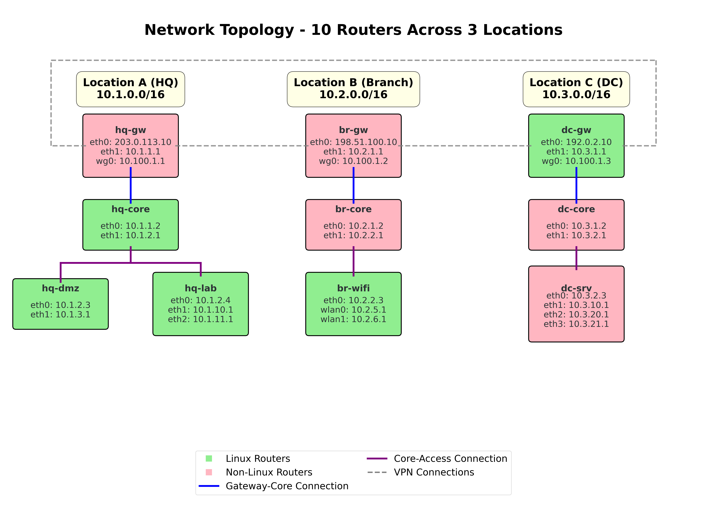

# Network Traceroute Simulator

A comprehensive network path discovery tool that simulates traceroute behavior using real routing information collected from multiple Linux routers. This tool helps network administrators understand packet flow paths through complex network topologies including VPN tunnels, multi-homed connections, and policy-based routing.

## 🌟 Features

- **Real Routing Data**: Uses actual routing tables and policy rules from Linux routers
- **Router Metadata System**: Comprehensive router classification with Linux/non-Linux differentiation
- **Gateway Internet Connectivity**: Realistic internet access simulation for gateway routers only
- **Automatic Controller Detection**: Intelligent Ansible controller IP detection from metadata
- **Iptables Forward Analysis**: Comprehensive packet forwarding analysis using actual iptables configurations
- **Ipset Integration**: Full support for ipset match-set conditions with efficient Python set-based lookups
- **YAML Configuration Support**: Flexible configuration with environment variables and precedence handling
- **FQDN Resolution**: Automatically resolves source and destination IPs to hostnames when possible
- **MTR Fallback**: Automatic fallback to real MTR execution when simulation cannot complete paths
- **Reverse Path Tracing**: Advanced three-step bidirectional path discovery for complex topologies
- **Timing Information**: Real round-trip time (RTT) data from MTR execution for performance analysis
- **Router Name Consistency**: Shows actual router names instead of generic labels when possible
- **Unreachable Destination Detection**: Proper validation and reporting of truly unreachable targets
- **Multiple Output Formats**: Text, JSON, and verbose modes with consistent formatting and timing data
- **Complex Network Support**: Handles VPN tunnels, WireGuard, multi-interface scenarios
- **Error Detection**: Identifies routing loops, blackhole routes, and unreachable destinations
- **Automation Friendly**: Comprehensive exit codes and quiet mode for script integration
- **Comprehensive Testing**: Full test suite with 79+ tests and 100% pass rate
- **Professional Visualization**: High-quality network topology diagrams with metadata-aware color coding
- **Accurate Interface Tracking**: Precise incoming/outgoing interface determination

## 📋 Table of Contents

- [Installation](#installation)
- [Quick Start](#quick-start)
- [Configuration](#configuration)
- [Router Metadata System](#router-metadata-system)
- [Gateway Internet Connectivity](#gateway-internet-connectivity)
- [Iptables Forward Analysis](#iptables-forward-analysis)
- [Usage](#usage)
- [Command Line Options](#command-line-options)
- [MTR Integration](#mtr-integration)
- [Reverse Path Tracing](#reverse-path-tracing)
- [FQDN Resolution](#fqdn-resolution)
- [Data Collection](#data-collection)
- [Network Scenarios](#network-scenarios)
- [Network Visualization](#network-visualization)
- [Output Formats](#output-formats)
- [Exit Codes](#exit-codes)
- [Testing](#testing)
- [Examples](#examples)
- [Troubleshooting](#troubleshooting)
- [Contributing](#contributing)

## 🚀 Installation

### Prerequisites

- Python 3.7 or higher
- Linux environment (for data collection)
- Ansible (for multi-router data collection)
- matplotlib and numpy (for network topology visualization)
- Make (for automated build tasks)

### Setup

1. **Clone the repository**:
   ```bash
   git clone <repository-url>
   cd traceroute_simulator
   ```

2. **Check dependencies and install requirements**:
   ```bash
   make check-deps  # Verify all dependencies and get installation hints
   ```

3. **Install Python dependencies** (if not already installed):
   ```bash
   # Install matplotlib for network visualization
   pip3 install matplotlib
   
   # Install PyYAML for configuration file support (optional)
   pip3 install PyYAML
   
   # Verify Python version
   python3 --version  # Ensure Python 3.7+
   ```


## 🏃 Quick Start

1. **Use the provided test network** (see [Network Topology](#network-topology) for details):
   ```bash
   # Complex test network with 10 routers across 3 locations
   ls tests/tsim_facts/
   # hq-gw.json  hq-core.json  br-gw.json  dc-gw.json  ... (10 unified JSON files)
   ```

2. **Run a basic traceroute simulation**:
   ```bash
   python3 traceroute_simulator.py --tsim-facts tests/tsim_facts -s 10.1.1.1 -d 10.2.1.1
   ```

3. **View results**:
   ```
   traceroute to 10.2.1.1 from 10.1.1.1
     1  hq-gw (10.1.1.1) from eth1 to wg0
     2  br-gw (10.100.1.2) from wg0 to eth1
     3  br-gw (10.2.1.1) on eth1
   ```

## ⚙️ Configuration

The traceroute simulator supports comprehensive YAML configuration files for flexible deployment scenarios.

### Configuration File Locations (by precedence)

1. **Environment Variable**: `TRACEROUTE_SIMULATOR_CONF` (highest precedence)
2. **User Home Directory**: `~/traceroute_simulator.yaml`
3. **Current Directory**: `./traceroute_simulator.yaml` (lowest precedence)

### Configuration Options

Create a `traceroute_simulator.yaml` file with your preferred settings:

```yaml
# Network and routing configuration
tsim_facts: "tsim_facts"                        # Directory containing unified facts files

# Output configuration  
verbose: false                                  # Enable verbose output (-v flag)
verbose_level: 1                               # Verbosity level (1=basic, 2=detailed)
quiet: false                                   # Quiet mode (no output, exit codes only)
json_output: false                             # Output results in JSON format

# Tracing behavior
enable_mtr_fallback: true                      # Enable MTR fallback for incomplete paths
enable_reverse_trace: false                    # Enable reverse path tracing when forward fails

# Network discovery
controller_ip: null                            # Ansible controller IP (auto-detect if null)
```

### Configuration Examples

**Production Environment:**
```yaml
tsim_facts: "/etc/traceroute-simulator/tsim_facts"
enable_mtr_fallback: true
enable_reverse_trace: true
verbose: false
controller_ip: "192.168.1.100"
```

**Development/Testing:**
```yaml
tsim_facts: "tests/tsim_facts"
enable_mtr_fallback: false  # Simulation only
verbose: true
verbose_level: 2
json_output: true
```

### Precedence Rules

Configuration values are resolved in this order (highest to lowest):
1. **Command line arguments** (e.g., `-v`, `--json`)
2. **Configuration file values**
3. **Hard-coded defaults**

```bash
# Example: Override config file settings via command line
TRACEROUTE_SIMULATOR_CONF=production.yaml python3 traceroute_simulator.py --tsim-facts custom_facts -s 10.1.1.1 -d 10.2.1.1 -v
# Uses production.yaml settings but overrides facts directory and enables verbose mode
```

## 🏷️ Router Metadata System

The traceroute simulator includes a comprehensive metadata system that classifies routers based on their network role, capabilities, and properties. This enables advanced features like Linux/non-Linux router differentiation, gateway internet connectivity, and automatic Ansible controller detection.

### Metadata File Structure

Each router can have an optional `*_metadata.json` file alongside its routing data:

```json
{
  "linux": true,
  "type": "gateway", 
  "location": "hq",
  "role": "gateway",
  "vendor": "linux",
  "manageable": true,
  "ansible_controller": false
}
```

### Metadata Properties

- **`linux`** (boolean): Whether the router runs Linux OS (enables MTR execution)
- **`type`** (string): Router type - `"gateway"`, `"core"`, `"access"`, or `"none"`
- **`location`** (string): Physical location - `"hq"`, `"branch"`, `"datacenter"`, etc.
- **`role`** (string): Network role - `"gateway"`, `"distribution"`, `"server"`, `"wifi"`, etc.
- **`vendor`** (string): Router vendor - `"linux"`, `"cisco"`, `"juniper"`, etc.
- **`manageable`** (boolean): Whether manageable via automation tools
- **`ansible_controller`** (boolean): Whether this router is the Ansible controller

### Enhanced Features

1. **MTR Execution**: Only available on Linux routers (`linux: true`)
2. **Gateway Internet Access**: Only gateway routers (`type: "gateway"`) can reach public IPs
3. **Auto Controller Detection**: Router with `ansible_controller: true` provides controller IP
4. **Network Visualization**: Diagrams color-coded by router type
5. **Iptables Analysis**: Packet forwarding decisions based on actual firewall rules
6. **Unified Facts Collection**: Single JSON file per router with all routing, metadata, and firewall data

### Default Values

When metadata files don't exist, routers use these defaults:
```json
{
  "linux": true,
  "type": "none", 
  "location": "none",
  "role": "none",
  "vendor": "linux",
  "manageable": true,
  "ansible_controller": false
}
```

## 🌐 Gateway Internet Connectivity

Gateway routers with `type: "gateway"` can reach public internet IP addresses, providing realistic enterprise network simulation.

### Internet Access Examples

```bash
# Gateway router direct internet access
python3 traceroute_simulator.py --tsim-facts tests/tsim_facts -s 10.1.1.1 -d 1.1.1.1
# Output: hq-gw (10.1.1.1) → one.one.one.one (1.1.1.1)

# Multi-hop internet access from internal network
python3 traceroute_simulator.py --tsim-facts tests/tsim_facts -s 10.1.10.1 -d 8.8.8.8
# Output: hq-lab → hq-core → hq-gw → dns.google (8.8.8.8)
```

### Supported Internet Destinations

- **DNS Servers**: 1.1.1.1, 8.8.8.8, 208.67.222.222
- **Any Public IP**: Automatically detected using RFC standards
- **FQDN Resolution**: Shows hostnames like `dns.google` when available

### Gateway Routers in Test Network

- **hq-gw**: 203.0.113.10 (HQ location)
- **br-gw**: 198.51.100.10 (Branch location) 
- **dc-gw**: 192.0.2.10 (Data Center location)

## 🔥 Iptables Forward Analysis

The project includes a comprehensive iptables analysis tool that determines whether packets will be forwarded by specific routers based on their actual firewall configurations.

### Key Features

- **Real Iptables Rules**: Analyzes actual iptables FORWARD chain rules from live routers
- **Ipset Integration**: Full support for ipset match-set conditions with efficient lookups
- **Multi-format Input**: Supports IP ranges (CIDR), comma-separated lists, and port ranges
- **Protocol Support**: Handles tcp, udp, icmp, and all protocols
- **Verbose Analysis**: Three verbosity levels for detailed rule evaluation
- **Exit Code Integration**: Returns clear exit codes for automation (0=allowed, 1=denied, 2=error)

### Usage Examples

```bash
# Basic packet forwarding analysis
python3 iptables_forward_analyzer.py --router hq-gw --tsim-facts tests/tsim_facts \
  -s 10.1.1.1 -d 10.2.1.1 -p tcp

# Analyze specific ports with verbose output
python3 iptables_forward_analyzer.py --router hq-gw --tsim-facts tests/tsim_facts \
  -s 10.1.1.1 -sp 80,443 -d 10.2.1.1 -dp 8080:8090 -p tcp -vv

# Analyze IP ranges and show ipset structure
python3 iptables_forward_analyzer.py --router br-core --tsim-facts tests/tsim_facts \
  -s 10.1.0.0/16 -d 10.2.0.0/16,10.3.0.0/16 -p all -vvv
```

### Command Line Options

- `-s, --source`: Source IP address (supports CIDR, lists: `10.1.1.1,10.1.1.2` or `10.1.1.0/24`)
- `-sp, --source-port`: Source port (supports ranges: `80,443` or `8000:8080`)
- `-d, --dest`: Destination IP address (supports CIDR, lists)
- `-dp, --dest-port`: Destination port (supports ranges)
- `-p, --protocol`: Protocol type (`tcp`, `udp`, `icmp`, `all`)
- `--router`: Router name to analyze (must have unified facts file)
- `--tsim-facts`: Directory containing unified facts files with iptables and ipset data
- `-v, -vv, -vvv`: Verbosity levels (basic decisions, detailed rules, ipset structure)

### Integration with Data Collection

The iptables analyzer uses data from unified facts files collected by the enhanced Ansible playbook:
- `{router}.json`: Complete unified facts including iptables configuration and ipset data
- Structured firewall data with comprehensive rule parsing
- Automatically collected during `make fetch-routing-data`

## 💻 Usage

### Basic Syntax

```bash
python3 traceroute_simulator.py [OPTIONS] --tsim-facts FACTS_DIR -s SOURCE_IP -d DESTINATION_IP
```

### Simple Examples

```bash
# Basic traceroute between router interfaces (HQ to Branch)
python3 traceroute_simulator.py --tsim-facts tests/tsim_facts -s 10.1.1.1 -d 10.2.1.1

# Gateway internet access (gateway to Cloudflare DNS)
python3 traceroute_simulator.py --tsim-facts tests/tsim_facts -s 10.1.1.1 -d 1.1.1.1

# Multi-hop internet access (internal network to Google DNS)
python3 traceroute_simulator.py --tsim-facts tests/tsim_facts -s 10.1.10.1 -d 8.8.8.8

# JSON output for programmatic processing (WireGuard tunnel)
python3 traceroute_simulator.py --tsim-facts tests/tsim_facts -j -s 10.100.1.1 -d 10.100.1.3

# Verbose output with metadata loading (shows router types)
python3 traceroute_simulator.py --tsim-facts tests/tsim_facts -vvv -s 10.1.1.1 -d 10.2.1.1

# Reverse path tracing with auto-detected controller IP
python3 traceroute_simulator.py --tsim-facts tests/tsim_facts --reverse-trace -s 10.1.1.1 -d 192.168.1.1

# Quiet mode for scripts (check exit code)
python3 traceroute_simulator.py --tsim-facts tests/tsim_facts -q -s 10.1.1.1 -d 10.2.1.1
echo "Exit code: $?"
```

## 🔧 Command Line Options

| Option | Long Form | Description |
|--------|-----------|-------------|
| `-h` | `--help` | Show help message and exit |
| `-s IP` | `--source IP` | **Required:** Source IP address for traceroute |
| `-d IP` | `--destination IP` | **Required:** Destination IP address for traceroute |
| `-v` | `--verbose` | Enable verbose output (-v basic, -vv detailed debugging) |
| `-q` | `--quiet` | Quiet mode - no output, use exit codes only |
| `-j` | `--json` | Output results in JSON format |
| | `--tsim-facts DIR` | Directory containing unified facts files (default: `tsim_facts`) |
| | `--no-mtr` | Disable MTR fallback (simulation only) |
| | `--reverse-trace` | Enable reverse path tracing when forward simulation fails |
| | `--controller-ip IP` | Ansible controller IP address (auto-detected if not specified) |

### Detailed Option Descriptions

- **Verbose Mode (`-v`)**: Shows router loading process and additional debugging information
  - `-v`: Basic verbose output with router loading information
  - `-vv`: Detailed debugging including simulation output and MTR command details
- **Quiet Mode (`-q`)**: Suppresses all output, useful for automation scripts that check exit codes
- **JSON Mode (`-j`)**: Outputs structured data suitable for parsing by other tools
- **Custom Directory**: Allows using different sets of unified facts for testing or multiple environments (default: `tsim_facts`)
- **MTR Fallback (`--no-mtr`)**: Disable automatic MTR fallback for simulation-only mode
- **Reverse Path Tracing (`--reverse-trace`)**: Enable three-step reverse path discovery when forward simulation fails
- **Controller IP (`--controller-ip`)**: Specify Ansible controller IP for reverse tracing (auto-detected using default route if not provided)

## 🔄 MTR Integration

The simulator includes automatic MTR (My TraceRoute) fallback functionality:

### How It Works
1. **Simulation First**: Attempts normal route simulation using collected routing data
2. **Automatic Fallback**: If simulation cannot complete the path, automatically falls back to real MTR execution
3. **SSH Execution**: Executes `mtr --report -c 1 -m 30 <destination>` via SSH on the appropriate Linux router
4. **Linux Router Filtering**: Filters MTR results to show only Linux routers from inventory
5. **Timing Information**: Extracts round-trip time (RTT) data from MTR results for accurate performance metrics
6. **Unreachable Destination Detection**: Validates that destinations are actually reached (not just intermediate hops)
7. **Consistent Output**: Formats MTR results to match simulation output format with timing data

### Use Cases
- **Mixed Networks**: Networks containing both Linux and non-Linux routers
- **External Destinations**: Tracing to internet destinations beyond your network
- **Performance Analysis**: Real timing information for latency analysis and troubleshooting
- **Unreachable Destinations**: Proper detection and reporting of truly unreachable targets
- **Verification**: Cross-checking simulation results with real network behavior

### Requirements
- SSH access to Linux routers (passwordless recommended)
- MTR installed on target routers: `sudo apt-get install mtr-tiny`
- Proper hostname resolution for router identification
- Network connectivity from routers to destination targets

## 🌐 FQDN Resolution

The simulator automatically resolves IP addresses to Fully Qualified Domain Names (FQDNs) for improved readability and network troubleshooting.

### How It Works

1. **Automatic Resolution**: Uses reverse DNS lookup via `getent hosts` for consistency with MTR executor
2. **Smart Fallback**: Falls back to original IP address if resolution fails
3. **Router Priority**: Router-owned IPs still show router names (not FQDNs)
4. **Fast Resolution**: Uses 2-second timeout for UI responsiveness

### Before and After

**Before (Generic Labels):**
```
traceroute to 8.8.8.8 from 10.1.1.1
  1  hq-gw (10.1.1.1)
  2  destination (8.8.8.8) 45.9ms
```

**After (FQDN Resolution):**
```
traceroute to 8.8.8.8 from 10.1.1.1
  1  hq-gw (10.1.1.1)
  2  dns.google (8.8.8.8) 45.9ms
```

### Configuration

FQDN resolution is enabled by default and works automatically. No configuration required.

### Benefits

- **Better Clarity**: `dns.google (8.8.8.8)` instead of `destination (8.8.8.8)`
- **Easier Troubleshooting**: Real hostnames help identify network endpoints
- **Consistent Behavior**: Uses same DNS resolution approach as MTR filtering
- **Production Ready**: Graceful fallback ensures reliability

## 🔄 Reverse Path Tracing

The simulator includes advanced reverse path tracing functionality for scenarios where traditional forward simulation and MTR fallback cannot determine complete paths. This is particularly useful in mixed Linux/non-Linux environments.

### How Reverse Path Tracing Works

Reverse path tracing implements a sophisticated three-step approach:

1. **Step 1: Controller to Destination**
   - Replaces original source IP with Ansible controller IP
   - Performs simulation or MTR tracing from controller to destination
   - Establishes the forward path and identifies the last Linux router
   - Extracts timing information for destination reachability validation

2. **Step 2: Destination to Original Source**
   - Finds the last Linux router from Step 1 path
   - Performs reverse simulation/MTR from destination back to original source
   - Uses the last Linux router as the execution point for MTR if needed
   - Includes timing information for intermediate Linux routers when available

3. **Step 3: Path Reversal and Combination**
   - Reverses the path from Step 2 to create original source → destination path
   - Combines bidirectional path information for complete routing picture
   - Preserves timing data from both forward and reverse traces
   - Provides comprehensive view of both forward and reverse connectivity

### Use Cases

- **Complex Network Topologies**: Multi-vendor environments with mixed routing platforms
- **Non-Linux Infrastructure**: Networks where only some routers provide routing data
- **Internet Connectivity**: Tracing paths that traverse external networks
- **Asymmetric Routing**: Scenarios where forward and reverse paths differ significantly
- **Network Troubleshooting**: Understanding bidirectional connectivity issues

### Configuration

```bash
# Enable reverse path tracing with auto-detected controller IP
python3 traceroute_simulator.py --tsim-facts tests/tsim_facts -s 10.1.1.1 -d 192.168.1.1 --reverse-trace

# Specify custom controller IP for reverse tracing
python3 traceroute_simulator.py --tsim-facts tests/tsim_facts -s 10.1.1.1 -d 192.168.1.1 --reverse-trace --controller-ip 192.168.100.1

# Verbose mode shows all three steps in detail
python3 traceroute_simulator.py --tsim-facts tests/tsim_facts -s 10.1.1.1 -d 192.168.1.1 --reverse-trace -vv
```

### Requirements

- Ansible controller connectivity to target networks
- At least one Linux router reachable from both source and destination networks
- SSH access to Linux routers for MTR execution
- Proper network connectivity for bidirectional path discovery

## 🌐 Network Topology

The project includes a comprehensive test network with 10 routers across 3 locations:

### Test Network Overview

- **Location A (Headquarters)**: 4 routers covering 5 network segments (10.1.0.0/16)
  - `hq-gw`: Gateway router with internet and WireGuard connectivity
  - `hq-core`: Core distribution router
  - `hq-dmz`: DMZ services router
  - `hq-lab`: Development lab router with multiple networks

- **Location B (Branch Office)**: 3 routers covering 4 network segments (10.2.0.0/16)
  - `br-gw`: Branch gateway with WireGuard to HQ/DC
  - `br-core`: Branch distribution router
  - `br-wifi`: WiFi controller with multiple wireless networks

- **Location C (Data Center)**: 3 routers covering 5 network segments (10.3.0.0/16)
  - `dc-gw`: Data center gateway with WireGuard connectivity
  - `dc-core`: DC distribution router
  - `dc-srv`: Server farm router with multiple server networks

### WireGuard VPN Mesh
- **10.100.1.0/24**: Full mesh VPN connecting all three locations
- Inter-location traffic flows through encrypted tunnels
- Realistic enterprise network design with redundancy

### Network Diagram



The complete network topology diagram shows all 10 routers with their interface assignments and connections. High-resolution versions are available as `docs/network_topology.png` and `docs/network_topology.pdf`.

For complete topology details, see `docs/NETWORK_TOPOLOGY.md`.

## 📊 Data Collection

### Automated Data Collection with Make

The project provides automated tools for collecting routing information from network devices:

```bash
# Check all dependencies first
make check-deps

# Collect routing data using inventory file
make fetch-routing-data OUTPUT_DIR=production_data INVENTORY_FILE=hosts.yml

# Collect from configured inventory group
make fetch-routing-data OUTPUT_DIR=test_data INVENTORY=routers

# Run comprehensive test suite
make test
```

### Using Ansible Playbook Directly

The project includes an enhanced Ansible playbook that executes basic `ip` commands on remote hosts and converts text output to JSON on the controller:

1. **Configure your inventory** (`hosts.yml`):
   ```yaml
   all:
     children:
       linux_routers:
         hosts:
           hq-gw:
             ansible_host: 10.1.1.1
           br-gw:
             ansible_host: 10.2.1.1
   ```

2. **Run the data collection playbook**:
   ```bash
   # Using inventory file
   ansible-playbook -i hosts.yml ansible/get_tsim_facts.yml -e "tsim_facts_dir=my_data"
   
   # Using configured inventory with group targeting
   ansible-playbook ansible/get_tsim_facts.yml --limit routers -e "tsim_facts_dir=my_data"
   ```

3. **Verify collected data**:
   ```bash
   ls my_data/
   # hq-gw.json  br-gw.json  dc-gw.json  ... (unified JSON files)
   ```

### Enhanced Compatibility Features

- **Comprehensive data collection**: Executes `ip route show`, `ip rule show`, `iptables` commands, and `ipset list` on remote hosts
- **Automatic path discovery**: Searches standard utility paths (`/sbin`, `/usr/sbin`, `/bin`, `/usr/bin`) for commands
- **Full path execution**: Uses complete path to commands for maximum reliability across Linux distributions
- **Root access management**: Proper sudo/root access for complete iptables and ipset visibility
- **Controller-side JSON conversion**: Transfers text output to Ansible controller for JSON transformation
- **No remote Python dependencies**: Remote hosts only need standard Linux commands available
- **IP JSON wrapper on controller**: Uses `ansible/ip_json_wrapper.py` on the controller to convert text to JSON
- **Graceful degradation**: Continues operation even when ipset command is not available
- **Automatic cleanup**: Removes temporary text files after processing
- **Detailed logging**: Provides collection statistics and troubleshooting information

### Manual Collection

For single routers or custom setups:

```bash
# Create output directory
mkdir -p tsim_facts

# Run unified facts collection script
sudo bash ansible/get_facts.sh > tsim_facts/hostname_raw_facts.txt

# Convert to structured JSON
python3 ansible/process_facts.py tsim_facts/hostname_raw_facts.txt tsim_facts/hostname.json
```

### Data Format

The project uses a unified JSON format for comprehensive network analysis:

- **Unified JSON files** (`*.json`): Complete network facts including routing, rules, iptables, and system information
- **Metadata files** (`*_metadata.json`): Router classification and properties (optional)

File naming convention: `{hostname}.json` (e.g., `hq-gw.json`, `br-gw.json`)

**Legacy Data Conversion**: The project includes `convert_legacy_facts.py` to migrate from the old 3-file format (`*_route.json`, `*_rule.json`, `*_metadata.json`) to the new unified format.

### IP JSON Wrapper for Legacy Systems

The project includes `ansible/ip_json_wrapper.py`, a compatibility tool for older Red Hat systems that don't support `ip --json`:

```bash
# Use wrapper script on systems without native JSON support
python3 ansible/ip_json_wrapper.py route show
python3 ansible/ip_json_wrapper.py addr show  
python3 ansible/ip_json_wrapper.py link show
python3 ansible/ip_json_wrapper.py rule show

# Wrapper automatically detects and uses native JSON if available
python3 ansible/ip_json_wrapper.py --json route show  # Passes through to native command
```

**Key Features:**
- **Transparent replacement**: Drop-in replacement for `ip --json` commands
- **Identical output**: Produces byte-for-byte identical JSON to native commands
- **Automatic detection**: Uses native JSON support when available
- **Comprehensive coverage**: Supports route, addr, link, and rule subcommands
- **Validated compatibility**: 100% test coverage ensures output accuracy

## 🌐 Network Scenarios

The simulator handles various complex network scenarios using the realistic test topology:

### Supported Routing Scenarios

1. **Intra-Location Routing**: Communication within each location through distribution layers
2. **Inter-Location Routing**: Cross-site communication via WireGuard VPN tunnels
3. **Multi-Hop Routing**: Complex paths through multiple routers and network layers
4. **Network Segment Routing**: Host-to-host communication across different subnets
5. **VPN Tunnel Routing**: Encrypted traffic flows between remote locations
6. **Internet Gateway Routing**: Access to external destinations through location gateways

### Example Routing Scenarios

```bash
# Intra-location: HQ internal routing
10.1.10.1 (hq-lab) → 10.1.3.1 (hq-dmz)
Path: hq-lab → hq-core → hq-dmz

# Inter-location: HQ to Branch via WireGuard  
10.1.1.1 (hq-gw) → 10.2.1.1 (br-gw)
Path: hq-gw[wg0] → br-gw[wg0]

# Complex multi-hop: Lab to Data Center servers
10.1.11.100 (HQ lab host) → 10.3.21.200 (DC server host)
Path: lab-network → hq-lab → hq-core → hq-gw → [WireGuard] → dc-gw → dc-core → dc-srv → server-network
```

## 🎨 Network Visualization

The project includes a professional network topology visualization system that generates high-quality diagrams of the test network.

### Generating Network Diagrams

```bash
# Generate network topology diagram
cd docs
python3 network_topology_diagram.py

# Generated files:
# - network_topology.png (300 DPI raster image)
# - network_topology.pdf (vector format for printing)
```

### Visualization Features

- **Professional Layout**: Clean hierarchical design with proper spacing
- **No Crossing Connections**: Optimized routing to avoid visual clutter  
- **Adaptive Sizing**: Router boxes automatically scale based on interface count
- **Color Coding**: Different colors for gateway, core, and access routers
- **Comprehensive Information**: All router names, IP addresses, and interfaces
- **Multiple Formats**: High-resolution PNG and scalable PDF output

### Customization Options

The visualization can be customized by editing `docs/network_topology_diagram.py`:

- **Router Positions**: Modify coordinates in `gateways`, `cores`, and `access` arrays
- **Colors**: Update the `colors` dictionary for different themes
- **Font Sizes**: Adjust text sizing for different display requirements
- **Box Sizing**: Automatic scaling based on interface count (2-4 interfaces)
- **Export Formats**: PNG (300 DPI) and PDF (vector) formats supported

### Use Cases

- **Documentation**: Professional network diagrams for technical documentation
- **Presentations**: High-quality visuals for network architecture presentations  
- **Training**: Visual aids for understanding complex network topologies
- **Planning**: Reference diagrams for network expansion or modifications

## 📄 Output Formats

### Text Format (Default)

Human-readable output showing hop-by-hop path information:

```
# Normal simulation (no timing information)
traceroute to 10.3.20.1 from 10.1.10.1
  1  hq-lab (10.1.10.1) from eth1 to eth0
  2  hq-core (10.1.2.1) from eth0 to eth0
  3  hq-gw (10.1.1.1) from eth0 to wg0
  4  dc-gw (10.100.1.3) from wg0 to eth1
  5  destination (10.3.20.1) via eth1 on dc-gw

# MTR fallback with timing information
traceroute to 8.8.8.8 from 10.1.1.1 (using forward path tracing with mtr tool)
  1  hq-gw (10.1.1.1)
  2  destination (8.8.8.8) 45.6ms

# Reverse path tracing with timing
traceroute to 8.8.8.8 from 10.10.0.2 (using reverse path tracing with mtr tool)
  1  source (10.10.0.2)
  2  hq-gw (10.1.1.1) 55.2ms
  3  destination (8.8.8.8) 52.1ms
```

### JSON Format (`-j`)

Structured output for programmatic processing:

```json
{
  "traceroute_path": [
    {
      "hop": 1,
      "router_name": "hq-gw",
      "ip_address": "10.1.1.1",
      "interface": "",
      "is_router_owned": true,
      "connected_router": "",
      "outgoing_interface": "",
      "rtt": 0.0
    },
    {
      "hop": 2,
      "router_name": "destination",
      "ip_address": "8.8.8.8",
      "interface": "",
      "is_router_owned": false,
      "connected_router": "",
      "outgoing_interface": "",
      "rtt": 45.6
    }
  ]
}
```

**Key JSON Fields:**
- `rtt`: Round-trip time in milliseconds (included when MTR is used)
- `router_name`: Actual router hostname when source IP belongs to a router
- `is_router_owned`: `true` when IP address belongs to a router interface

### Verbose Format (`-v`)

Includes debugging information:

```
Loaded router: hq-gw
Loaded router: hq-core
Loaded router: hq-lab
Loaded router: br-gw
Loaded router: dc-gw
[... additional router loading messages ...]
traceroute to 10.2.5.1 from 10.1.11.1
  1  hq-lab (10.1.11.1) from eth2 to eth0
  2  hq-core (10.1.2.1) from eth0 to eth0
  3  hq-gw (10.1.1.1) from eth0 to wg0
  4  br-gw (10.100.1.2) from wg0 to eth1
  5  br-core (10.2.1.2) from eth1 to eth1
  6  br-wifi (10.2.2.3) from eth1 to wlan0
  7  br-wifi (10.2.5.1) on wlan0
```

## 🚦 Exit Codes

The simulator uses standard exit codes for automation and error handling:

| Code | Meaning | Description |
|------|---------|-------------|
| `0` | **Success** | Path found successfully between source and destination |
| `1` | **No Path** | Source and destination found, but no routing path exists |
| `2` | **Not Found** | Source or destination IP not reachable by any router |
| `4` | **No Linux Routers** | MTR executed but no Linux routers found in path |
| `10` | **Error** | Input validation error or system error |

### Using Exit Codes in Scripts

```bash
#!/bin/bash
python3 traceroute_simulator.py --tsim-facts tsim_facts -q -s "$1" -d "$2"
case $? in
    0) echo "Route found" ;;
    1) echo "No path available" ;;
    2) echo "IP not reachable" ;;
    4) echo "No Linux routers found" ;;
    10) echo "Invalid input or error" ;;
esac
```

## 🧪 Testing

The project includes comprehensive test suites covering all functionality:

### Automated Testing with Make

```bash
# Run all tests (recommended)
make test

# Check dependencies before testing
make check-deps

# Clean up test artifacts
make clean
```

### Individual Test Suites

**Main Traceroute Simulator Tests (64 test cases)**:
```bash
cd tests
python3 test_traceroute_simulator.py
```

**IP JSON Wrapper Validation (7 test cases)**:
```bash
cd tests  
python3 test_ip_json_comparison.py
```

### Running Tests

```bash
# Run comprehensive test suite
cd tests
python3 test_traceroute_simulator.py

# Expected output
Total tests: 64
Passed: 64 (100%)
Failed: 0
Pass rate: 100.0%

NETWORK TOPOLOGY:
- Location A (HQ): 4 routers, 5 networks (10.1.0.0/16)
- Location B (Branch): 3 routers, 4 networks (10.2.0.0/16)
- Location C (DC): 3 routers, 5 networks (10.3.0.0/16)
- WireGuard mesh: 10.100.1.0/24 interconnecting all locations
```

**MTR Integration Tests (8 test cases)**:
```bash
cd tests  
python3 test_mtr_integration.py
```

### Test Categories

1. **Intra-Location Routing**: Communication within each location through distribution layers (11 tests)
2. **Inter-Location Routing**: Cross-site communication via WireGuard VPN tunnels (12 tests)
3. **Network Segment Routing**: Host-to-host communication across different subnets (9 tests)
4. **Command Line Options**: All flags and output formats (4 tests)
5. **Error Conditions**: Invalid inputs, missing files, network errors (14 tests)
6. **Exit Codes**: Verification of all return codes in quiet mode (4 tests)
7. **Edge Cases**: Comprehensive coverage of error handling and boundary conditions (6 tests)
8. **Complex Scenarios**: Multi-hop routing and advanced network paths (8 tests)

### Test Coverage

- ✅ **64 comprehensive test cases** covering all network scenarios and edge cases
- ✅ **100% pass rate** with complete functionality validation
- ✅ **10-router topology** with realistic routing configurations across 3 locations
- ✅ **All command-line options** tested including new required flags (-s/-d)
- ✅ **Comprehensive error handling** including corrupted JSON, missing files, and invalid inputs
- ✅ **Complete exit code verification** across all modes (quiet, verbose, JSON)
- ✅ **Edge case coverage** including IPv6 handling, loop detection, and timeout scenarios
- ✅ **Routing misconfiguration testing** with realistic failure scenarios
- ✅ **JSON output format validation** with structured data verification
- ✅ **WireGuard VPN tunnel routing** with full mesh connectivity testing
- ✅ **Multi-location network testing** covering all inter-site communication paths

## 🔧 Build System

The project includes a comprehensive Makefile for automated development tasks:

### Available Make Targets

```bash
make help                    # Show all available targets and usage examples
make check-deps             # Verify Python modules and provide installation hints  
make test                   # Run comprehensive test suite with environment validation
make clean                  # Clean up Python cache files and temporary artifacts
```

### Data Collection Targets

```bash
# Collect routing data using inventory file
make fetch-routing-data OUTPUT_DIR=my_data INVENTORY_FILE=hosts.ini

# Collect from configured Ansible inventory group  
make fetch-routing-data OUTPUT_DIR=production INVENTORY=routers

# Target specific host from configured inventory
make fetch-routing-data OUTPUT_DIR=temp INVENTORY=router-01
```

### Build System Features

- **Dependency validation**: Checks all required Python modules with helpful installation hints
- **Comprehensive testing**: Runs 64 main tests + 7 wrapper validation tests + integration tests
- **Ansible integration**: Automated data collection with inventory validation and error handling
- **Environment verification**: Validates test data availability and routing facts
- **Clean builds**: Removes cache files while preserving valuable routing data

## 📝 Examples

### Basic Router Communication

```bash
# Intra-location routing (HQ internal)
python3 traceroute_simulator.py --tsim-facts tests/tsim_facts -s 10.1.1.1 -d 10.1.2.1
# Output: HQ gateway to core router

# Inter-location routing (HQ to Branch)
python3 traceroute_simulator.py --tsim-facts tests/tsim_facts -s 10.1.1.1 -d 10.2.1.1
# Output: Cross-site via WireGuard tunnel
```

### Network Segment Routing

```bash
# From HQ lab network to DC server network
python3 traceroute_simulator.py --tsim-facts tests/tsim_facts -s 10.1.10.100 -d 10.3.20.200
# Output: Complex multi-hop path through multiple locations

# Branch WiFi to Data Center servers  
python3 traceroute_simulator.py --tsim-facts tests/tsim_facts -s 10.2.5.50 -d 10.3.21.100
# Output: Cross-location routing via distribution layers
```

### Automation Examples

```bash
# Check connectivity in script
if python3 traceroute_simulator.py --tsim-facts tests/tsim_facts -q -s 10.1.1.1 -d 10.3.1.1; then
    echo "HQ to DC route available"
else
    echo "No route found"
fi

# JSON processing with jq
python3 traceroute_simulator.py --tsim-facts tests/tsim_facts -j -s 10.1.10.1 -d 10.3.20.1 | \
    jq '.traceroute_path[].router_name'
```

### Complex Scenarios

```bash
# WireGuard tunnel mesh routing
python3 traceroute_simulator.py --tsim-facts tests/tsim_facts -s 10.100.1.1 -d 10.100.1.3
# Output: Direct VPN tunnel communication

# Multi-hop cross-location routing
python3 traceroute_simulator.py --tsim-facts tests/tsim_facts -v -s 10.1.11.1 -d 10.2.6.1  
# Output: HQ lab to Branch WiFi with detailed hop information

# Maximum complexity: End-to-end across all 3 locations
python3 traceroute_simulator.py --tsim-facts tests/tsim_facts -s 10.1.11.100 -d 10.3.21.200
# Output: Lab host → HQ → Branch → DC → Server host
```

### Reverse Path Tracing Examples

```bash
# Basic reverse path tracing to external destination with timing
python3 traceroute_simulator.py --tsim-facts tests/tsim_facts -s 10.1.1.1 -d 8.8.8.8 --reverse-trace
# Output: Three-step bidirectional path discovery with RTT data

# MTR fallback with timing information  
python3 traceroute_simulator.py --tsim-facts tests/tsim_facts -s 10.1.1.1 -d 8.8.8.8
# Output: Forward tracing with mtr tool and timing data

# Detailed reverse tracing with full debugging
python3 traceroute_simulator.py --tsim-facts tests/tsim_facts -s 10.1.1.1 -d 203.0.113.1 --reverse-trace -vv
# Output: Step-by-step reverse path tracing process with detailed MTR command output
```

## 🔍 Troubleshooting

### Common Issues

**1. "No router data found" Error**
```bash
Error: No router data found in tests/routing_facts
```
- **Solution**: Ensure routing JSON files exist in the tests/routing_facts directory
- **Check**: `ls tests/routing_facts/*_route.json` (should show 10 files)

**2. "IP not configured on any router" Error**
```bash
Error: Source IP 1.2.3.4 is not configured on any router or in any directly connected network
```
- **Solution**: Use IP addresses from the test topology (10.1.x.x, 10.2.x.x, 10.3.x.x, 10.100.1.x)
- **Check**: See `docs/NETWORK_TOPOLOGY.md` for complete IP address listing

**3. Invalid IP Address Error**
```bash
Error: Invalid IP address - '999.999.999.999' does not appear to be an IPv4 or IPv6 address
```
- **Solution**: Use valid IP address format (IPv4 or IPv6)
- **Example**: `10.1.1.1` instead of `999.999.999.999`

### Debugging Tips

1. **Use Verbose Mode**: Add `-v` flag to see router loading information
2. **Check JSON Files**: Ensure routing data files are valid JSON
3. **Verify IP Addresses**: Use IPs that appear in your routing tables
4. **Test with Known Good IPs**: Start with router interface IPs

### Validation Commands

```bash
# Validate JSON files
for file in tests/routing_facts/*.json; do
    echo "Checking $file"
    python3 -m json.tool "$file" > /dev/null && echo "✓ Valid" || echo "✗ Invalid"
done

# List available router IPs
python3 -c "
import json, glob
for f in glob.glob('tests/routing_facts/*_route.json'):
    with open(f) as file:
        routes = json.load(file)
        print(f'{f}:')
        for r in routes:
            if 'prefsrc' in r:
                print(f'  {r[\"prefsrc\"]} on {r.get(\"dev\", \"unknown\")}')
"

# Quick test with known good IPs
python3 traceroute_simulator.py --routing-dir tests/routing_facts -s 10.1.1.1 -d 10.2.1.1
```

## 🤝 Contributing

We welcome contributions to improve the traceroute simulator!

### Development Setup

1. **Fork and clone the repository**
2. **Create a feature branch**: `git checkout -b feature-name`
3. **Make changes and add tests**
4. **Run the test suite**: `python3 test_traceroute_simulator.py`
5. **Submit a pull request**

### Code Standards

- **Python Style**: Follow PEP 8 guidelines
- **Comments**: Add comprehensive docstrings and inline comments
- **Testing**: Include tests for new functionality
- **Documentation**: Update README for new features

### Project Structure

```
traceroute_simulator/
├── traceroute_simulator.py      # Main simulator script
├── mtr_executor.py              # MTR execution and SSH management
├── route_formatter.py           # Output formatting for simulation and MTR results
├── ip_json_wrapper.py           # IP JSON compatibility wrapper for legacy systems
├── Makefile                     # Comprehensive build system
├── tests/                       # Test environment directory
│   ├── test_traceroute_simulator.py # Main test suite (64 tests)
│   ├── test_ip_json_comparison.py   # IP wrapper validation (7 tests)
│   ├── test_mtr_integration.py      # MTR integration tests (8 tests)
│   ├── test_config.yaml         # Test-specific configuration
│   └── routing_facts/           # Test routing data (20 JSON files)
├── docs/                        # Documentation and visualization
│   ├── NETWORK_TOPOLOGY.md      # Detailed network documentation
│   ├── network_topology_diagram.py  # Network visualization generator
│   ├── network_topology.png     # High-resolution network diagram
│   └── network_topology.pdf     # Vector network diagram
├── ansible/                     # Data collection automation
│   └── get_tsim_facts.yml       # Unified facts collection playbook
├── CLAUDE.md                    # Development guidelines
└── README.md                    # This documentation
```

## 🆕 Recent Improvements (2025)

### YAML Configuration Support (Latest)
- **Comprehensive Configuration**: Full YAML configuration file support with flexible location precedence
- **Environment Variable Support**: `TRACEROUTE_SIMULATOR_CONF` for custom configuration file paths
- **Precedence Handling**: Command line → Configuration file → Hard-coded defaults
- **Positive Logic**: All options use intuitive positive logic (e.g., `enable_mtr_fallback: true`)
- **Production Ready**: Graceful degradation when PyYAML is not available
- **Complete Coverage**: All command line options configurable except source/destination IPs

### FQDN Resolution (Latest)
- **Automatic DNS Resolution**: Resolves source and destination IPs to FQDNs when possible
- **Smart Fallback**: Uses original IP if DNS resolution fails
- **Consistent Behavior**: Same DNS resolution approach as MTR filtering for consistency
- **Router Priority**: Router-owned IPs still show router names instead of FQDNs
- **Fast Resolution**: 2-second timeout for responsive UI experience
- **Production Examples**: Shows `dns.google (8.8.8.8)` instead of `destination (8.8.8.8)`

### Enhanced MTR Integration and Timing Information
- **Timing Data Collection**: All MTR results now include round-trip time (RTT) information for performance analysis
- **Router Name Consistency**: Source IPs that belong to routers now display the actual router name instead of generic "source" label
- **Unreachable Destination Detection**: Improved validation ensures destinations are actually reached by MTR, not just intermediate hops
- **Forward Tracing Improvements**: Forward tracing with no Linux routers now returns SUCCESS with timing information instead of failure
- **Enhanced Output Formatting**: Consistent timing display across all tracing methods (simulation, MTR forward, MTR reverse)

### Reverse Path Tracing Enhancements  
- **Timing Information**: Reverse path tracing now includes timing data for both intermediate Linux routers and destinations
- **Improved Path Construction**: Better handling of tuple formats (7-tuple vs 8-tuple) with and without RTT data
- **Router Duplication Prevention**: Fixed issues where the last Linux router appeared twice in final paths
- **Enhanced Error Handling**: Proper detection and reporting of unreachable destinations in reverse tracing

### Code Quality and Testing
- **Comprehensive Tuple Handling**: All code paths now safely handle both 7-tuple (simulation) and 8-tuple (MTR with RTT) formats
- **100% Test Suite Pass Rate**: All 79 tests continue to pass with enhanced functionality
- **Improved Error Classification**: Better distinction between routing misconfigurations and unreachable destinations
- **Enhanced Exit Code Logic**: Consistent exit code behavior across quiet and non-quiet modes

### Bug Fixes
- **MTR Parsing**: Fixed tuple unpacking errors when processing MTR results with timing information
- **Router Name Display**: Corrected logic to show actual router names when source IP belongs to a router interface
- **Unreachable Detection**: Fixed false positive cases where unreachable destinations were reported as reachable
- **Test Regressions**: Updated test expectations to reflect working MTR fallback functionality

---

## 📞 Support

If you encounter issues or have questions:

1. **Check the [Troubleshooting](#troubleshooting) section**
2. **Review existing issues in the repository**
3. **Run the test suite to verify your setup**
4. **Create a detailed issue report with example commands and output**

---

**Happy Network Analysis! 🚀**