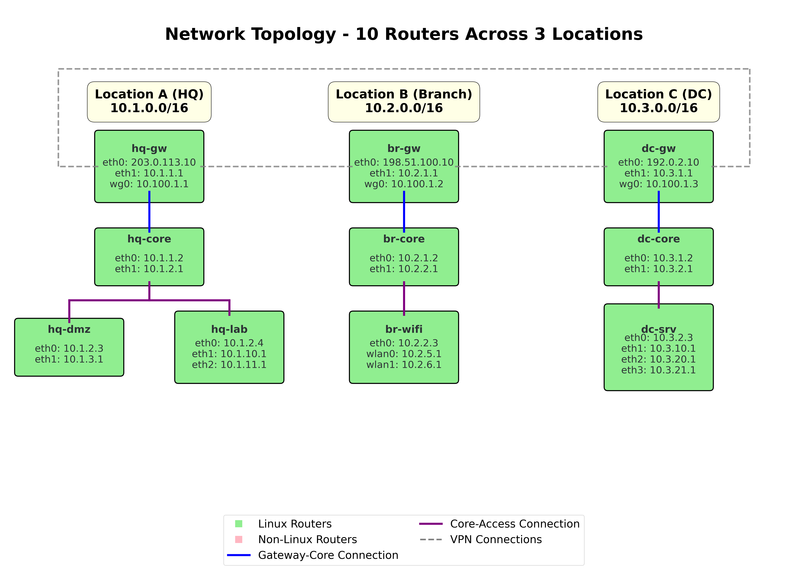

# Network Topology Documentation

This document describes the complex 10-router network topology used for testing the traceroute simulator with mixed Linux and non-Linux router environments.

## Overview

The test environment consists of 3 locations connected via WireGuard VPN tunnels:
- **Location A (Headquarters)**: 4 routers (2 Linux, 2 non-Linux), 5 network segments
- **Location B (Branch Office)**: 3 routers (1 Linux, 2 non-Linux), 4 network segments  
- **Location C (Data Center)**: 3 routers (1 Linux, 2 non-Linux), 5 network segments

### Router Type Distribution
- **Linux Routers (5)**: hq-core, hq-dmz, hq-lab, br-wifi, dc-gw
- **Non-Linux Routers (5)**: hq-gw, br-gw, br-core, dc-core, dc-srv

## Linux vs Non-Linux Router Differences

### Linux Routers (Light Green in Diagram)
Linux routers in this topology support full MTR (My TraceRoute) functionality and SSH connectivity:

**Capabilities:**
- **MTR Support**: Can execute `mtr` commands for advanced path tracing
- **SSH Connectivity**: Accessible via SSH for remote command execution
- **JSON Output**: Support for `ip --json` commands
- **Advanced Debugging**: Detailed hop-by-hop analysis with timing information
- **Reverse Path Tracing**: Can perform bidirectional path discovery

**Testing Scenarios:**
- Forward tracing from Linux sources
- Reverse tracing to Linux destinations
- SSH-based MTR execution for real network validation
- Comprehensive timing and latency analysis

### Non-Linux Routers (Light Red in Diagram)
Non-Linux routers represent commercial network equipment (Cisco, Juniper, Fortinet) that cannot execute MTR:

**Limitations:**
- **No MTR Support**: Cannot execute `mtr` commands
- **No SSH Access**: Not accessible for remote command execution
- **Limited Debugging**: Basic hop information without advanced timing data

**Testing Scenarios:**
- Mixed-vendor network environments
- Forward tracing through non-Linux intermediate hops
- Fallback scenarios when MTR is unavailable

### Strategic Placement for Testing

The non-Linux routers are strategically positioned to force comprehensive testing scenarios:

**Gateway Layer**: `hq-gw`, `br-gw` act as entry points, testing VPN mesh connectivity
**Core Layer**: `br-core`, `dc-core` force routing through non-Linux infrastructure
**Access Layer**: `dc-srv` tests end-to-end paths with non-Linux destinations

This arrangement ensures that:
- Some paths require forward tracing (through non-Linux routers)
- Some paths require reverse tracing (to non-Linux destinations)
- Mixed vendor scenarios are thoroughly tested
- Fallback mechanisms are validated

## Network Diagram



The complete network topology diagram shows the 10-router enterprise network across 3 locations with mixed Linux/non-Linux routers and WireGuard VPN mesh connectivity. 

**Visual Elements:**
- **Light Green Boxes**: Linux routers (MTR capable)
- **Light Red Boxes**: Non-Linux routers (simulation only)
- **Light Yellow Headers**: Location identifiers
- **Gray Dashed Lines**: WireGuard VPN connections
- **Blue Solid Lines**: Gateway-Core connections  
- **Purple Solid Lines**: Core-Access connections

High-resolution versions are available as `network_topology.png` and `network_topology.pdf` (generated by `network_topology_diagram.py`).

### Updating the Topology Diagram

To regenerate or modify the network topology diagram:

1. **Regenerate existing diagram:**
   ```bash
   cd docs
   python3 network_topology_diagram.py
   ```

2. **Router type determination:**
   - Router colors are determined by `linux` flag in `tests/routing_facts/{router}_metadata.json`
   - Light green for `"linux": true`, light red for `"linux": false`
   - VPN connections automatically connect gateway routers with proper routing

3. **Modify diagram layout:**
   - Edit `network_topology_diagram.py` to adjust router positions, colors, or styling
   - Router positions are defined in the `gateways`, `cores`, and `access` arrays
   - Box sizes automatically adjust based on number of interfaces
   - VPN connections route around location boxes to avoid intersections

4. **Generated files:**
   - `network_topology.png` - High-resolution raster image (300 DPI)
   - `network_topology.pdf` - Vector format for scalable printing

5. **Customization options:**
   - Font sizes: Router names (20pt), interfaces (19pt), titles (33pt), headers (24pt)
   - Colors: Linux (#90EE90), Non-Linux (#FFB6C1), Location headers (#FFFFE0)
   - Layout: Hierarchical positioning with automatic connection routing
   - VPN mesh: Gray dashed lines with rectangular routing around obstacles

## Location Details

### Location A - Headquarters (10.1.0.0/16)

**Router: hq-gw** (Gateway Router) - **NON-LINUX**
- Role: Internet gateway and WireGuard hub
- Type: Commercial router/firewall
- Interfaces:
  - eth0: 203.0.113.10/24 (Internet)
  - eth1: 10.1.1.1/24 (Internal core)
  - wg0: 10.100.1.1/24 (WireGuard mesh)
- Routes: Default to internet, static routes to other locations
- Testing: Entry point for VPN mesh, no MTR capability

**Router: hq-core** (Core Distribution) - **LINUX**
- Role: Internal distribution and routing
- Type: Linux router with full MTR support
- Interfaces:
  - eth0: 10.1.1.2/24 (Core network)
  - eth1: 10.1.2.1/24 (Distribution network)
- Routes: Default via hq-gw, local distribution
- Testing: MTR-capable internal routing, SSH accessible

**Router: hq-dmz** (DMZ Router) - **LINUX**
- Role: DMZ and security services, Ansible controller
- Type: Linux router with full MTR support
- Interfaces:
  - eth0: 10.1.2.3/24 (Distribution network)
  - eth1: 10.1.3.1/24 (DMZ network)
- Routes: Default via hq-core
- Testing: MTR-capable destination, SSH accessible, reverse tracing

**Router: hq-lab** (Lab Router) - **LINUX**
- Role: Development and lab networks
- Type: Linux router with full MTR support
- Interfaces:
  - eth0: 10.1.2.4/24 (Distribution network)
  - eth1: 10.1.10.1/24 (Lab network 1)
  - eth2: 10.1.11.1/24 (Lab network 2)
- Routes: Default via hq-core
- Testing: MTR-capable multi-interface destination, SSH accessible

**Networks:**
- 10.1.1.0/24 - Core infrastructure
- 10.1.2.0/24 - Distribution layer
- 10.1.3.0/24 - DMZ services
- 10.1.10.0/24 - Lab network 1
- 10.1.11.0/24 - Lab network 2

### Location B - Branch Office (10.2.0.0/16)

**Router: br-gw** (Branch Gateway) - **NON-LINUX**
- Role: Internet gateway and WireGuard endpoint
- Type: Commercial router
- Interfaces:
  - eth0: 198.51.100.10/24 (Internet)
  - eth1: 10.2.1.1/24 (Internal core)
  - wg0: 10.100.1.2/24 (WireGuard mesh)
- Routes: Default to internet, static routes to other locations
- Testing: VPN mesh entry point, no MTR capability

**Router: br-core** (Branch Core) - **NON-LINUX**
- Role: Internal distribution
- Type: Commercial core switch
- Interfaces:
  - eth0: 10.2.1.2/24 (Core network)
  - eth1: 10.2.2.1/24 (Distribution network)
- Routes: Default via br-gw
- Testing: Critical intermediate hop, no MTR capability

**Router: br-wifi** (WiFi Controller) - **LINUX**
- Role: Wireless network management
- Type: Linux router with full MTR support
- Interfaces:
  - eth0: 10.2.2.3/24 (Distribution network)
  - wlan0: 10.2.5.1/24 (WiFi network 1)
  - wlan1: 10.2.6.1/24 (WiFi network 2)
- Routes: Default via br-core
- Testing: MTR-capable wireless destination, SSH accessible

**Networks:**
- 10.2.1.0/24 - Core infrastructure
- 10.2.2.0/24 - Distribution layer
- 10.2.5.0/24 - WiFi network 1
- 10.2.6.0/24 - WiFi network 2

### Location C - Data Center (10.3.0.0/16)

**Router: dc-gw** (Data Center Gateway) - **LINUX**
- Role: Internet gateway and WireGuard endpoint
- Type: Linux router with full MTR support
- Interfaces:
  - eth0: 192.0.2.10/24 (Internet)
  - eth1: 10.3.1.1/24 (Internal core)
  - wg0: 10.100.1.3/24 (WireGuard mesh)
- Routes: Default to internet, static routes to other locations
- Testing: MTR-capable VPN endpoint, SSH accessible

**Router: dc-core** (Data Center Core) - **NON-LINUX**
- Role: Internal distribution
- Type: Commercial core switch
- Interfaces:
  - eth0: 10.3.1.2/24 (Core network)
  - eth1: 10.3.2.1/24 (Distribution network)
- Routes: Default via dc-gw
- Testing: Critical data center hop, no MTR capability

**Router: dc-srv** (Server Router) - **NON-LINUX**
- Role: Server network management
- Type: Commercial server switch
- Interfaces:
  - eth0: 10.3.2.3/24 (Distribution network)
  - eth1: 10.3.10.1/24 (Server network 1)
  - eth2: 10.3.20.1/24 (Server network 2)
  - eth3: 10.3.21.1/24 (Server network 3)
- Routes: Default via dc-core
- Testing: Non-Linux destination, no MTR capability

**Networks:**
- 10.3.1.0/24 - Core infrastructure
- 10.3.2.0/24 - Distribution layer
- 10.3.10.0/24 - Server network 1
- 10.3.20.0/24 - Server network 2
- 10.3.21.0/24 - Server network 3

## WireGuard VPN Configuration

The three locations are interconnected using a full-mesh WireGuard VPN on the 10.100.1.0/24 network:

- **hq-gw**: 10.100.1.1/24 (Hub node)
- **br-gw**: 10.100.1.2/24 (Spoke node)
- **dc-gw**: 10.100.1.3/24 (Spoke node)

## Routing Summary

### Inter-Location Routing
- All inter-location traffic flows through WireGuard tunnels
- Each gateway router has static routes to other locations' networks
- Metric 10 preference for VPN routes

### Intra-Location Routing
- Default routes point to location gateway
- Distribution layer handles internal routing
- Metric 1 for local routes

### Internet Access
- Each location has independent internet connectivity
- Default routes to respective ISP gateways
- Metric 100 for internet routes

## Test Scenarios

The mixed Linux/non-Linux network supports comprehensive testing scenarios:

### Linux Router Testing (MTR Capable)
1. **Forward Tracing from Linux Sources**: 
   - hq-core, hq-dmz, hq-lab, br-wifi, dc-gw as source routers
   - Full MTR execution with timing information
   - SSH-based remote command execution

2. **Reverse Tracing to Linux Destinations**:
   - Bidirectional path discovery
   - MTR validation of reverse paths
   - Comprehensive hop analysis

### Non-Linux Router Testing
3. **Non-Linux Path Discovery**:
   - hq-gw, br-gw, br-core, dc-core, dc-srv as intermediate or destination hops
   - Pure routing table analysis
   - Fallback scenarios when MTR unavailable

4. **Mixed Vendor Scenarios**:
   - Paths through both Linux and non-Linux routers
   - Forward tracing through non-Linux intermediate hops
   - Testing commercial equipment integration

### Advanced Testing Scenarios
5. **VPN Mesh Routing**: Between locations via WireGuard (all gateways)
6. **Multi-hop Routing**: Complex paths through mixed router types
7. **Network Segment Routing**: Host-to-host across diverse infrastructure
8. **Fallback Validation**: MTR failure scenarios and simulation recovery

### Specific Test Cases
- **HQ to Branch**: Linux → Non-Linux → Non-Linux → Linux
- **HQ to DC**: Linux → Non-Linux → Linux (via VPN)  
- **Branch to DC**: Non-Linux → Non-Linux → Linux
- **Intra-location**: Mixed Linux/non-Linux internal routing

## IP Address Allocation

- **10.1.0.0/16**: Location A (Headquarters)
- **10.2.0.0/16**: Location B (Branch Office)  
- **10.3.0.0/16**: Location C (Data Center)
- **10.100.1.0/24**: WireGuard VPN mesh network
- **203.0.113.0/24**: HQ Internet (RFC 5737 documentation)
- **198.51.100.0/24**: Branch Internet (RFC 5737 documentation)
- **192.0.2.0/24**: DC Internet (RFC 5737 documentation)

This mixed Linux/non-Linux topology provides comprehensive coverage for testing complex routing scenarios with realistic commercial network integration, MTR fallback mechanisms, and diverse vendor environments while maintaining enterprise network design principles.

## Test Cases Plan

The following test cases demonstrate various routing scenarios through the mixed Linux/non-Linux infrastructure. Each path is derived from actual routing table analysis.

### Test Case 1: Intra-Location Direct Routing
**Source:** 10.1.3.1 (hq-dmz network)  
**Destination:** 10.1.2.4 (hq-lab router)  
**Path:** 
1. 10.1.3.1 → **hq-dmz** (10.1.2.3) - **LINUX**
2. **hq-dmz** → 10.1.2.4 (**hq-lab**) - **LINUX**

**Scenario:** Simple intra-location routing between Linux routers on same distribution network.

### Test Case 2: Inter-Location VPN Routing (HQ → Branch)
**Source:** 10.1.3.10 (hq-dmz network)  
**Destination:** 10.2.6.10 (br-wifi wlan1 network)  
**Path:**
1. 10.1.3.10 → **hq-dmz** (10.1.2.3) - **LINUX**
2. **hq-dmz** → **hq-core** (10.1.2.1) - **LINUX**
3. **hq-core** → **hq-gw** (10.1.1.1) - **NON-LINUX**
4. **hq-gw** → **br-gw** (10.100.1.2) - **NON-LINUX** [VPN]
5. **br-gw** → **br-core** (10.2.1.2) - **NON-LINUX**
6. **br-core** → **br-wifi** (10.2.2.3) - **LINUX**
7. **br-wifi** → 10.2.6.10 (wlan1 network)

**Scenario:** Complex inter-location path through VPN mesh with mixed Linux/non-Linux routers.

### Test Case 3: Gateway-to-Server VPN Routing (HQ → DC)
**Source:** 10.1.1.1 (hq-gw router)  
**Destination:** 10.3.2.3 (dc-srv router)  
**Path:**
1. **hq-gw** (10.1.1.1) - **NON-LINUX**
2. **hq-gw** → **dc-gw** (10.100.1.3) - **LINUX** [VPN]
3. **dc-gw** → **dc-core** (10.3.1.2) - **NON-LINUX**
4. **dc-core** → **dc-srv** (10.3.2.3) - **NON-LINUX**

**Scenario:** VPN routing from non-Linux gateway to non-Linux server through mixed infrastructure.

### Test Case 4: Access-to-Gateway Routing (Branch → DC)
**Source:** 10.2.2.3 (br-wifi router)  
**Destination:** 10.3.1.1 (dc-gw router)  
**Path:**
1. **br-wifi** (10.2.2.3) - **LINUX**
2. **br-wifi** → **br-core** (10.2.2.1) - **NON-LINUX**
3. **br-core** → **br-gw** (10.2.1.1) - **NON-LINUX**
4. **br-gw** → **dc-gw** (10.100.1.3) - **LINUX** [VPN]

**Scenario:** Linux access router to Linux gateway via non-Linux intermediate hops and VPN.

### Test Case 5: Internet Access Routing
**Source:** 10.1.11.1 (hq-lab eth2 interface)  
**Destination:** 1.1.1.1 (Internet)  
**Path:**
1. **hq-lab** (10.1.11.1) - **LINUX**
2. **hq-lab** → **hq-core** (10.1.2.1) - **LINUX**
3. **hq-core** → **hq-gw** (10.1.1.1) - **NON-LINUX**
4. **hq-gw** → 203.0.113.1 (Internet Gateway)
5. Internet routing to 1.1.1.1

**Scenario:** Internet access from Linux lab network through mixed infrastructure to external destination.

### Router Type Analysis Summary

**Linux Routers in Paths:** hq-core, hq-dmz, hq-lab, br-wifi, dc-gw
- Support MTR execution and SSH connectivity
- Provide detailed hop analysis and timing information
- Enable reverse path tracing capabilities

**Non-Linux Routers in Paths:** hq-gw, br-gw, br-core, dc-core, dc-srv
- Require simulation-based path discovery
- Force fallback scenarios when MTR unavailable
- Test commercial equipment integration

**VPN Mesh Utilization:** All inter-location paths utilize WireGuard VPN connections between gateway routers (hq-gw ↔ br-gw ↔ dc-gw), demonstrating mesh connectivity and routing through non-Linux VPN endpoints.