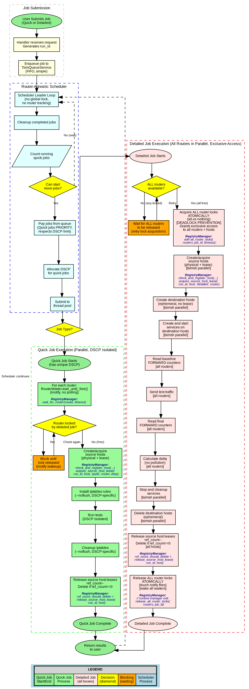

# Comprehensive Race Condition Elimination Plan

## Executive Summary

Implement host reference counting and per-router locking to eliminate race conditions between concurrent quick analysis jobs and between quick/detailed analysis jobs. This involves enhancing the existing Host Registry with reference counting capabilities, modifying iptables rule management, and adding conflict detection mechanisms.

## Design Principles

### No Hardcoded Paths
- All runtime paths come from `config_loader.get_registry_paths()` or `config.get()`
- Never hardcode `/dev/shm/`, `/var/opt/`, or absolute system paths
- File paths in documentation are relative to repository root

### No Environment Variables for IPC
- **Job-specific values** (DSCP, run_id): Command-line arguments
- **Global configuration** (registry paths, lock directories): Read from config in each process
- Environment variables eliminated for inter-process communication
- Makes data flow explicit and testable

### Configuration-Driven
- All coordination mechanisms configurable via `wsgi/config.json`
- Can disable registry coordination for single-threaded deployments
- Lock timeouts, retry attempts, and DSCP ranges all configurable

### Router-Agnostic Scheduler with Job-Level Coordination
- **Scheduler is router-agnostic** - does NOT track router usage
- **No global lock** - scheduler runs jobs without global serialization
- **Job-level coordination** via router locks and waiters:
  - **Quick jobs**: Use `RouterWaiter` to wait (inotify, no polling) if router locked by detailed job; otherwise proceed immediately. Multiple quick jobs can run on same router concurrently.
  - **Detailed jobs**: Acquire exclusive per-router locks for each router being processed; release immediately when that router completes.
- DSCP allocation/deallocation handled by scheduler
- Up to 32 concurrent quick jobs (DSCP range limit)
- Existing queue/scheduler infrastructure leveraged

### Hosts vs Routers: Fundamental Architectural Distinction

**Routers are persistent** - created at system startup, remain until OS reboot:
- Always exist during testing operations
- Shared infrastructure across all jobs
- Coordination via router locks

**Hosts are fluid** - created, used, and removed dynamically by jobs:
- Created on-demand when needed
- Removed when no longer needed
- Two categories with different lifecycles:

**Source Hosts** (e.g., "destination-1"):
- Shared resource across multiple jobs
- Reference counted: persist while any job needs them
- Deleted only when ref_count reaches 0
- Access controlled by router lock: when router is locked, all hosts on that router are locked too

**Destination Hosts** (e.g., service hosts):
- Exclusive to single detailed job
- Created at job start
- Deleted at job end (no reference counting)
- Access controlled by router lock: detailed job locks router, gets exclusive access to all hosts on that router

**Key Principle: Router Locks Control Host Access**
- Acquiring a router lock grants exclusive access to ALL hosts attached to that router (both source and destination)
- Quick jobs waiting for router (via RouterWaiter) are also waiting for access to source hosts on that router
- When router lock is released, source hosts become available for next job(s) to reuse
- No separate host locks needed - router lock IS the host lock

---

## Job Scheduling Flow with Race Condition Elimination



**Diagram Generation**: The job scheduling flowchart is generated using `docs/generate_scheduling_flowchart.py`. To regenerate:
```bash
python3 docs/generate_scheduling_flowchart.py
```

**Flowchart Overview**:

This comprehensive flowchart depicts the entire job lifecycle from submission through execution to completion, showing where RegistryManager coordination points are integrated:

1. **Job Submission Layer** (Gray)
   - User submits job (Quick or Detailed analysis)
   - Handler generates run_id
   - Job enqueued to FIFO queue

2. **Router-Agnostic Scheduler** (Blue)
   - Leader loop with no global lock
   - No router tracking at scheduler level
   - Cleanup completed jobs
   - Count running quick jobs
   - Pop jobs from queue (Quick jobs have PRIORITY)
   - Allocate DSCP for quick jobs
   - Submit to thread pool

3. **Quick Job Execution** (Green)
   - Parallel execution with DSCP isolation
   - **RegistryManager: wait_for_router()** - inotify-based waiting if router locked
   - **RegistryManager: check_and_register_host()** - atomic host registration (TOCTOU elimination)
   - **RegistryManager: acquire_source_host_lease()** - reference-counted lease acquisition
   - Install DSCP-specific iptables rules (--noflush)
   - Run tests in isolation
   - Cleanup iptables rules (--noflush)
   - **RegistryManager: release_source_host_lease()** - ref_count--, delete if zero

4. **Detailed Job Execution** (Red/Pink)
   - All routers processed in parallel
   - Exclusive access to all routers and hosts
   - **RegistryManager: all_router_locks()** - atomic all-or-nothing lock acquisition (deadlock prevention)
   - **RegistryManager: check_and_register_host()** and **acquire_source_host_lease()** for all source hosts
   - Create ephemeral destination hosts (no leases)
   - Start services on destination hosts
   - Read baseline FORWARD counters (all routers)
   - Send test traffic (all routers)
   - Read final FORWARD counters (all routers)
   - Calculate delta (no pollution from other jobs)
   - Stop and cleanup services
   - Delete destination hosts
   - **RegistryManager: release_source_host_lease()** - ref_count--, delete if zero
   - **RegistryManager: release_all_router_locks()** - atomic unlock, wake all waiters

5. **Completion**
   - Results returned to user
   - Scheduler continues with next jobs

**Key RegistryManager Integration Points** (shown in blue 8pt font in flowchart):
- **wait_for_router()**: inotify-based waiting, no polling
- **check_and_register_host()**: Atomic check-and-register eliminates TOCTOU
- **acquire_source_host_lease()**: Reference counting for shared source hosts
- **release_source_host_lease()**: Automatic cleanup when ref_count reaches zero
- **all_router_locks()**: Context manager for atomic multi-router locking
- **release_all_router_locks()**: Atomic unlock with inotify notification

**Color Legend**:
- **Light Green**: Quick job start/end
- **Pale Green**: Quick job process steps
- **Misty Rose**: Detailed job (all boxes)
- **Yellow**: Decision points (diamonds)
- **Orange**: Blocking/waiting states
- **Light Blue**: Scheduler processes

---

## Current Problem Analysis

### Race Condition #1: Concurrent Quick Jobs on Shared Router

**Scenario**: Two quick analysis jobs run simultaneously and share a common router.

**Timeline of Failure**:
```
Time | Job 1 (DSCP 32, testing 80/tcp) | Job 2 (DSCP 33, testing 443/tcp)
-----+----------------------------------+----------------------------------
T0   | iptables-save (reads state A)   |
T1   |                                  | iptables-save (reads state A)
T2   | Remove ALL TSIM_KSMS rules       |
T3   | Add Job 1 rules (DSCP 32)        |
T4   | iptables-restore (installs)      |
T5   |                                  | Remove ALL TSIM_KSMS rules <--- REMOVES JOB 1!
T6   |                                  | Add Job 2 rules (DSCP 33)
T7   |                                  | iptables-restore (overwrites!)
```

**Problem Code** (ksms_tester.py:274):
```python
if 'TSIM_KSMS=' in ln:
    continue  # Skip ANY line containing TSIM_KSMS (ALL jobs)
```

**Result**: Job 1's iptables rules are removed by Job 2, causing Job 1 to report UNKNOWN for all services.

**Solution**: Use `iptables-restore --noflush -n` to add/delete only this job's rules. Quick jobs wait via RouterWaiter if router is locked by detailed job, then proceed with batch operations.

### Race Condition #2: Source Host Deletion While In Use

**Scenario**: Quick job A is using a source host while Quick job B or Detailed job tries to delete it.

**Problem Code** (tsim_ksms_service.py:783):
```python
# Blindly removes host without checking if other jobs are using it
tsimsh_exec(f"host remove --name {src_host_name} --force")
```

**Result**: Active job loses its network namespace mid-execution, causing connection failures.

**Solution**:
- Source hosts use reference counting (leases registry)
- Delete only when ref_count reaches 0
- Router lock controls access: if router is locked, source hosts on that router are inaccessible to other jobs

### Race Condition #3: Quick Job Using Source Host While Detailed Job Has Router Locked

**Scenario**: Detailed job locks a router (for exclusive measurements), but quick job tries to use a source host on that same router.

**Problem**: Without coordination, quick job could send traffic through router while detailed job is taking measurements, polluting counter readings.

**Solution**:
- RouterWaiter: Quick job waits (inotify) until router lock is released
- Router lock implicitly locks ALL hosts on that router
- Quick jobs cannot access source hosts on locked routers

### Race Condition #4: Multiple Jobs Creating/Deleting Same Destination Host

**Scenario**: Two detailed jobs try to create/delete the same destination host simultaneously.

**Problem**: No coordination for destination host creation/deletion.

**Solution**:
- Destination hosts are tied to router locks
- Only one detailed job can hold a router lock at a time
- Therefore, only one detailed job can create/modify destination hosts on that router
- Destination hosts are ephemeral: created and deleted within single job (no reference counting needed)

---

## Centralized Registry Manager Architecture

**Design Decision**: Instead of scattered lock management across multiple services, implement a centralized `RegistryManager` that encapsulates all registry operations and locking.

**Benefits**:
- **Eliminates TOCTOU vulnerabilities**: Check-and-register becomes single atomic operation
- **Simplifies debugging**: All registry operations logged in one place
- **Prevents deadlocks**: Consistent lock ordering enforced by manager
- **Cleaner API**: Callers never see locks/semaphores
- **Easier testing**: Mock one manager instead of many services

**Architecture Reference**: See `docs/registry_manager_architecture.md` for complete design.

**Implementation Location**: `src/core/registry_manager.py`

**Usage Pattern**:
```python
# Old approach (scattered locks, TOCTOU vulnerable)
with some_semaphore.acquire():
    if not host_exists(name):  # Check
        create_host(name)       # Act - RACE CONDITION WINDOW!
        register_host(name)

# New approach (atomic, safe)
registry_mgr = RegistryManager(config)
if registry_mgr.check_and_register_host(name, ip, router, mac):
    create_host(name)  # Only create if registration succeeded
```

**Integration with Phases**:
- **Phase 1**: RegistryManager handles host registry and leases
- **Phase 2**: Scheduler uses RegistryManager for DSCP allocation
- **Phase 3**: RegistryManager provides router lock and waiter APIs
- **Phase 4**: ksms_tester.py uses RegistryManager for leases
- **Phase 5**: network_reachability_test_multi.py uses RegistryManager for locks and leases

---

## Phase 1: Source Host Leases Registry with Router-Coupled Access Control

**Implementation Note**: All operations described below will be implemented in `RegistryManager` class. Services will call RegistryManager methods instead of directly managing locks and registries.

**Key Architectural Points**:
1. **Source hosts only**: Destination hosts are ephemeral (created/deleted within single job, no leases needed)
2. **Router lock controls access**: Acquiring router lock grants exclusive access to ALL hosts on that router
3. **Reference counting for persistence**: Source hosts persist across jobs while ref_count > 0
4. **No separate host locks**: Router lock IS the host lock

### 1.1 Source Host Leases Registry Structure

**Location**: `src/simulators/host_namespace_setup.py`

**Purpose**: Separate frequently-changing lease data from stable physical host registry.

**Key Design**:
- **Physical host registry** (`hosts.json`): Tracks actual host creation metadata (stable, long-lived)
- **Host leases registry** (`host_leases.json`): Tracks which jobs are using which hosts (volatile, frequently updated)
- Separation keeps physical registry stable and makes lease reconciliation simple

**Source Host Leases Registry Structure** (`host_leases.json`):
```json
{
  "destination-2": {
    "router": "router-hq",
    "leases": [
      {
        "run_id": "job-abc123",
        "pid": 12345,
        "job_type": "quick",
        "dscp": 32,
        "allocated_at": 1234567890.123
      },
      {
        "run_id": "job-def456",
        "pid": 12346,
        "job_type": "quick",
        "dscp": 33,
        "allocated_at": 1234567891.234
      }
    ]
  },
  "source-host-1": {
    "router": "router-branch1",
    "leases": [
      {
        "run_id": "job-ghi789",
        "pid": 12347,
        "job_type": "detailed",
        "dscp": null,
        "allocated_at": 1234567892.345
      }
    ]
  }
}
```

**Key Fields**:
- **router**: The router this source host is attached to (from physical host registry's `connected_to` field)
- **leases**: Array of active leases for this source host
- When acquiring a lease, the caller's router lock status can be verified against the `router` field

**Physical Host Registry** (unchanged - existing structure):
```json
{
  "destination-2": {
    "primary_ip": "10.128.47.21/24",
    "connected_to": "befw-00190-045.lvnbb.de",
    "router_interface": "ens2f0",
    "gateway_ip": "10.128.47.247",
    "created_at": "Thu Oct  9 04:09:39 PM CEST 2025",
    "connection_type": "sim_mesh_direct",
    ...
  }
}
```

**RegistryManager Methods (implemented in `src/core/registry_manager.py`)**:

```python
# In RegistryManager class

def acquire_source_host_lease(self, run_id: str, host_name: str,
                               job_type: str, router_name: str,
                               dscp: Optional[int] = None) -> int:
    """Add lease for SOURCE host (called AFTER physical creation)

    IMPORTANT: Caller MUST have acquired router lock for the router this host is attached to.
    This method assumes the caller has proper router access control in place.

    Args:
        run_id: Unique job identifier
        host_name: Source host namespace name (e.g., "destination-2")
        job_type: 'quick' or 'detailed'
        router_name: Router this host is attached to
        dscp: Optional DSCP value (for quick jobs only)

    Returns:
        Current ref_count (number of active leases for this host)

    Note:
        - Source hosts only (destination hosts are ephemeral, no leases)
        - Router lock enforcement happens at job level (before calling this)
        - Multiple quick jobs can have leases simultaneously (DSCP isolated)
        - Only one detailed job can have a lease (router lock ensures exclusivity)
    """
    with self._atomic_lease_operation():
        leases = self._load_host_leases()

        # Get router from physical registry
        router = self._get_host_router(host_name)

        if host_name not in leases:
            leases[host_name] = {
                'router': router,
                'leases': []
            }

        leases[host_name]['leases'].append({
            'run_id': run_id,
            'pid': os.getpid(),
            'job_type': job_type,
            'dscp': dscp,
            'allocated_at': time.time()
        })

        self._save_host_leases(leases)
        return len(leases[host_name]['leases'])

def release_source_host_lease(self, run_id: str, host_name: str) -> Tuple[int, bool]:
    """Remove lease for SOURCE host (decrement reference count)

    Physical removal should only happen when should_delete == True.
    If physical removal fails, just log - another job can recreate.

    Args:
        run_id: Job identifier
        host_name: Source host name

    Returns:
        Tuple of (new_ref_count, should_delete)
        should_delete=True when ref_count reaches 0

    Raises:
        RegistryError: On I/O errors
        ValueError: If lease not found
    """
    with self._atomic_lease_operation():
        leases = self._load_host_leases()
        if host_name not in leases:
            raise ValueError(f"No leases found for host {host_name}")

        # Remove this job's lease
        original_count = len(leases[host_name]['leases'])
        leases[host_name]['leases'] = [
            lease for lease in leases[host_name]['leases']
            if lease['run_id'] != run_id
        ]

        new_count = len(leases[host_name]['leases'])

        if new_count == original_count:
            raise ValueError(f"Lease for {run_id} not found on host {host_name}")

        if new_count == 0:
            # Remove host entry entirely
            del leases[host_name]
            should_delete = True
            ref_count = 0
        else:
            ref_count = new_count
            should_delete = False

        self._save_host_leases(leases)
        return ref_count, should_delete

def get_source_host_lease_count(self, host_name: str) -> int:
    """Get current lease count for source host (0 if no leases)"""
    leases = self._load_host_leases()
    if host_name not in leases:
        return 0
    return len(leases[host_name].get('leases', []))

def get_source_host_router(self, host_name: str) -> Optional[str]:
    """Get the router this source host is attached to"""
    leases = self._load_host_leases()
    if host_name in leases:
        return leases[host_name].get('router')
    # Fallback: check physical registry
    return self._get_host_router(host_name)

def reconcile_stale_source_host_leases(self) -> Dict[str, int]:
    """Periodic cleanup of stale source host leases

    - Drops leases where PID is dead (os.kill(pid, 0) fails)
    - Drops leases older than timeout (e.g., 1 hour)
    - Optionally removes hosts with zero leases but still exist physically

    Returns:
        {'stale_pids': count, 'stale_timeout': count, 'orphaned_hosts': count}
    """
```

**Note**: The above implementation details are internal to `RegistryManager`. Calling services use simple APIs like:
```python
# Service code
registry_mgr = RegistryManager(config)
ref_count = registry_mgr.acquire_source_host_lease(run_id, host_name, job_type, router_name, dscp)
```

**Source Host Leases Registry Usage**:
- **Router lock MUST be acquired before** calling `acquire_source_host_lease()`
- **Physical creation happens BEFORE** `acquire_source_host_lease()`
- **Physical removal only when** `release_source_host_lease()` returns 0
- If physical removal fails, just log it - no lease remains, another job can recreate
- Reconciler periodically drops stale leases (dead PIDs, expired timeouts)
- Physical host registry remains stable and unchanged

**Destination Host Handling** (no leases):
- Created by detailed job at job start
- Deleted by detailed job at job end
- No lease tracking needed (ephemeral, job-scoped)
- Access controlled by router lock (detailed job has exclusive router lock)

### 1.3 Neighbor Leases Registry with Reference Counting

**Problem**: ARP neighbor entries can be deleted prematurely while other jobs still need them, causing connectivity issues.

**Solution**: Separate neighbor leases registry with reference counting (same pattern as host leases).

**Neighbor Leases Registry Structure** (`/dev/shm/tsim/neighbor_leases.json`):

```json
{
  "router-hq__10.0.1.1": [
    {
      "run_id": "job-abc123",
      "pid": 12345,
      "job_type": "quick",
      "allocated_at": 1234567890.123
    }
  ],
  "router-branch1__10.0.2.1": [
    {
      "run_id": "job-def456",
      "pid": 12346,
      "job_type": "detailed",
      "allocated_at": 1234567891.456
    }
  ]
}
```

**Key**: `{router_name}__{neighbor_ip}`

**New Methods to Add to Neighbor Management class**:

```python
def acquire_neighbor_lease(self, run_id: str, host_name: str,
                           neighbor_ip: str) -> int:
    """Acquire lease for neighbor ARP entry (reference counting)

    Args:
        run_id: Job identifier
        host_name: Host that needs this neighbor
        neighbor_ip: Neighbor IP address

    Returns:
        Current reference count

    Raises:
        RegistryLockTimeout: If lock not acquired within timeout
    """
    with self._atomic_lease_operation():
        leases = self._load_neighbor_leases()
        key = f"{host_name}:{neighbor_ip}"

        if key not in leases:
            leases[key] = {
                'host_name': host_name,
                'neighbor_ip': neighbor_ip,
                'leases': []
            }

        leases[key]['leases'].append({
            'run_id': run_id,
            'pid': os.getpid(),
            'allocated_at': time.time()
        })

        self._save_neighbor_leases(leases)
        return len(leases[key]['leases'])

def release_neighbor_lease(self, run_id: str, host_name: str,
                           neighbor_ip: str) -> Tuple[int, bool]:
    """Release neighbor lease (decrement reference count)

    Physical removal (ip neigh del) should only happen when should_delete == True.

    Args:
        run_id: Job identifier
        host_name: Host releasing neighbor
        neighbor_ip: Neighbor IP address

    Returns:
        Tuple of (new_ref_count, should_delete)

    Raises:
        RegistryLockTimeout: If lock not acquired within timeout
        ValueError: If lease not found
    """
    with self._atomic_lease_operation():
        leases = self._load_neighbor_leases()
        key = f"{host_name}:{neighbor_ip}"

        if key not in leases:
            raise ValueError(f"No leases found for {key}")

        # Remove this job's lease
        leases[key]['leases'] = [
            lease for lease in leases[key]['leases']
            if lease['run_id'] != run_id
        ]

        if not leases[key]['leases']:
            # Remove entry entirely
            del leases[key]
            should_delete = True
            ref_count = 0
        else:
            ref_count = len(leases[key]['leases'])
            should_delete = False

        self._save_neighbor_leases(leases)
        return ref_count, should_delete

def get_neighbor_lease_count(self, router_name: str, neighbor_ip: str) -> int:
    """Get current lease count for neighbor (0 if no leases)"""
    leases = self._load_neighbor_leases()
    key = f"{router_name}__{neighbor_ip}"
    return len(leases.get(key, []))

def reconcile_stale_neighbor_leases(self) -> Dict[str, int]:
    """Periodic cleanup of stale neighbor leases

    - Drops leases where PID is dead (os.kill(pid, 0) fails)
    - Drops leases older than timeout (e.g., 1 hour)

    Returns:
        {'stale_pids': count, 'stale_timeout': count}
    """
```

**Neighbor Leases Registry Usage**:
- **Physical creation (ip neigh add) happens BEFORE** `acquire_neighbor_lease()`
- **Physical removal (ip neigh del) only when** `release_neighbor_lease()` returns 0
- If physical removal fails, just log it - no lease remains, another job can recreate
- Reconciler periodically drops stale leases (dead PIDs, expired timeouts)
- Multiple jobs can safely use the same neighbor entry (reference counted)

**Router-Level Coordination** (job-level, NOT scheduler):

**Key principle**: Scheduler is router-agnostic. Jobs coordinate at router level.

1. **Quick vs Quick**: Multiple quick jobs run concurrently on same router (DSCP isolated)
   - Up to 32 concurrent quick jobs system-wide
   - No router conflicts between quick jobs

2. **Quick vs Detailed**: Quick job waits if router is locked by detailed job
   - Quick job calls `registry_mgr.wait_for_router(router)` before touching router
   - Blocks using inotify (no polling) until detailed job releases that router's lock
   - Then proceeds with batch operations

3. **Detailed vs Detailed**: Each detailed job acquires exclusive per-router locks
   - Holds lock only while actively processing that specific router
   - Releases lock immediately when router work completes
   - May hold multiple router locks if processing routers in parallel
   - Two detailed jobs can run concurrently if using different routers

**Implementation**:
- **Phase 2 (Scheduler)**: Router-agnostic, no router tracking, no global lock
- **Phase 3 (Router Locks & Waiter)**: Detailed jobs acquire exclusive locks; quick jobs use RegistryManager.wait_for_router()
- **Phase 4 (ksms_tester.py)**: Quick jobs wait via RegistryManager.wait_for_router(), use batch --noflush operations
- **Phase 5 (network_reachability_test_multi.py)**: Detailed jobs acquire per-router locks

### 1.4 Leases Registry Path Configuration

**No modification to `_batch_register_host()` needed** - physical host registry remains unchanged.

**New configuration for leases**:
```python
# In config_loader.py or config
def get_registry_paths():
    return {
        'hosts': '/dev/shm/tsim/hosts.json',  # Existing
        'host_leases': '/dev/shm/tsim/host_leases.json',  # NEW
        'neighbor_leases': '/dev/shm/tsim/neighbor_leases.json'  # NEW
    }
```

---

## Phase 2: Router-Agnostic Scheduler with Parallel Execution

**Key Principle**: Scheduler is router-agnostic - does NOT track routers or make router-level conflict decisions. Router coordination happens at job level (Phase 3 and Phase 4).

### 2.1 Simplify `TsimQueueService`

**Location**: `wsgi/services/tsim_queue_service.py` (existing file)

**Purpose**: Simple FIFO queue with multiple job tracking (no router logic)

**Current Behavior**: Simple FIFO queue with `pop_next()` returning single job

**Enhancements**:

**Add `analysis_mode` to queued job metadata:**

```python
def enqueue(self, run_id: str, username: str, params: Dict[str, Any]) -> int:
    """Enqueue a new job and return its 1-based position."""
    with self._lock():
        q = self._load_queue()
        jobs: List[Dict[str, Any]] = q.get('jobs', [])

        # Avoid duplicating existing run_id
        for idx, j in enumerate(jobs):
            if j.get('run_id') == run_id:
                return idx + 1

        jobs.append({
            'run_id': run_id,
            'username': username,
            'created_at': time.time(),
            'status': 'QUEUED',
            'params': params,
            'analysis_mode': params.get('analysis_mode', 'detailed')  # NEW
            # NOTE: No routers field - scheduler is router-agnostic
        })
        q['jobs'] = jobs
        q['updated_at'] = time.time()
        self._save_queue(q)
        return len(jobs)
```

**Add simple multi-job popping with DSCP limit check only:**

```python
def pop_next_jobs(self, max_jobs: int = 32) -> List[Dict[str, Any]]:
    """Pop next jobs from queue (simple FIFO, no router logic).

    Args:
        max_jobs: Maximum number of jobs to pop

    Returns:
        List of job dicts to execute (up to max_jobs)
    """
    with self._lock():
        q = self._load_queue()
        jobs = q.get('jobs', [])
        if not jobs:
            return []

        # Simple FIFO: pop up to max_jobs
        to_pop = jobs[:max_jobs]

        # Remove popped jobs from queue
        if to_pop:
            remaining = jobs[len(to_pop):]
            q['jobs'] = remaining
            q['updated_at'] = time.time()
            self._save_queue(q)

        return to_pop
```

**Key Logic**:
- Simple FIFO queue (no router conflict checking)
- Pop up to max_jobs at once
- Scheduler decides how many to pop based on available DSCP slots
- Router coordination happens at job level (not scheduler level)

**Add running jobs tracking (replaces single `current` job):**

```python
def set_running(self, jobs: List[Dict[str, Any]]):
    """Set multiple jobs as running (replaces set_current)"""
    with self._lock():
        tmp = self.current_file.with_suffix('.tmp')
        with open(tmp, 'w') as f:
            json.dump({
                'version': 1,
                'updated_at': time.time(),
                'jobs': jobs
            }, f, indent=2)
            f.flush()
            os.fsync(f.fileno())
        tmp.replace(self.current_file)

def get_running(self) -> List[Dict[str, Any]]:
    """Get all running jobs (replaces get_current)"""
    with self._lock():
        if not self.current_file.exists():
            return []
        try:
            with open(self.current_file, 'r') as f:
                data = json.load(f)
                return data.get('jobs', [])
        except Exception:
            return []

def remove_running(self, run_id: str):
    """Remove a job from running list"""
    with self._lock():
        if not self.current_file.exists():
            return
        try:
            with open(self.current_file, 'r') as f:
                data = json.load(f)
            jobs = data.get('jobs', [])
            jobs = [j for j in jobs if j.get('run_id') != run_id]
            data['jobs'] = jobs
            data['updated_at'] = time.time()

            tmp = self.current_file.with_suffix('.tmp')
            with open(tmp, 'w') as f:
                json.dump(data, f, indent=2)
                f.flush()
                os.fsync(f.fileno())
            tmp.replace(self.current_file)
        except Exception:
            pass

def count_running_quick_jobs(self) -> int:
    """Count how many quick jobs are currently running (for DSCP limit check)"""
    with self._lock():
        running = self.get_running()
        return sum(1 for j in running if j.get('type') == 'quick')
```

### 2.2 Simplify `TsimSchedulerService` (Router-Agnostic)

**Location**: `wsgi/services/tsim_scheduler_service.py` (existing file)

**Current Problem**: Uses global `network_test` lock that prevents ALL concurrency

**Current Code (line 83)**:
```python
with self.lock_manager.lock('network_test', timeout=3600):
    # Only ONE job runs at a time - blocks all parallelism!
    tester = MultiServiceTester(...)
    results = tester.run()
```

**Enhancements**:

**Track running jobs (no router tracking):**

```python
class TsimSchedulerService:
    def __init__(self, config_service, queue_service, progress_tracker, executor, lock_manager):
        # ... existing init ...

        # NEW: Track multiple running jobs
        self.running_jobs = {}  # {run_id: {'type': str, 'dscp': int, 'future': Future, 'started_at': float, 'job': dict}}
        self.running_lock = threading.Lock()

        # NEW: Thread pool for parallel job execution
        self.executor_pool = ThreadPoolExecutor(max_workers=33, thread_name_prefix='job-executor')
```

**Replace leader loop (remove global lock, no router checking):**

```python
def _leader_loop(self):
    """While leader, manage parallel job execution (router-agnostic)"""
    while not self._stop_event.is_set():
        # Clean up completed jobs
        self._cleanup_completed_jobs()

        # Count running quick jobs to respect DSCP limit
        quick_count = self.queue.count_running_quick_jobs()

        # Calculate how many jobs we can start
        # Max 32 quick jobs total (DSCP limit 32-63)
        max_new_quick = max(0, 32 - quick_count)

        # Pop jobs from queue (simple FIFO, no router logic)
        jobs_to_start = self.queue.pop_next_jobs(max_jobs=max_new_quick + 10)

        if not jobs_to_start:
            time.sleep(0.5)
            continue

        # Start jobs (scheduler does NOT check router conflicts)
        for job in jobs_to_start:
            self._start_job(job)

        time.sleep(0.25)

def _start_job(self, job: Dict[str, Any]):
    """Start a single job in thread pool (no router tracking)"""
    run_id = job.get('run_id')
    analysis_mode = job.get('analysis_mode', 'detailed')

    # Allocate DSCP for quick jobs
    dscp = None
    if analysis_mode == 'quick':
        from services.tsim_dscp_registry import TsimDscpRegistry
        dscp_registry = TsimDscpRegistry(self.config)
        dscp = dscp_registry.allocate_dscp(run_id)
        if dscp is None:
            self.logger.error(f"No DSCP available for quick job {run_id}")
            return

    # Add to running jobs tracking (no routers)
    with self.running_lock:
        self.running_jobs[run_id] = {
            'type': analysis_mode,
            'dscp': dscp,
            'started_at': time.time(),
            'job': job
            # NOTE: No routers field - scheduler is router-agnostic
        }

    # Update queue service with running jobs list
    self._update_queue_running()

    # Submit to thread pool for parallel execution
    future = self.executor_pool.submit(self._execute_job_wrapper, job, dscp)

    with self.running_lock:
        self.running_jobs[run_id]['future'] = future

def _execute_job_wrapper(self, job: Dict[str, Any], dscp: Optional[int]) -> Dict[str, Any]:
    """Wrapper for job execution with error handling and cleanup"""
    run_id = job.get('run_id')
    try:
        # Inject DSCP into params for quick jobs
        params = job.get('params', {})
        if dscp is not None:
            params['job_dscp'] = dscp

        # Execute job (without global lock - parallelism enabled!)
        # Router coordination happens INSIDE the job (Phase 3, Phase 4)
        result = self.executor.execute(
            run_id,
            params.get('source_ip'),
            params.get('dest_ip'),
            params.get('source_port'),
            params.get('port_protocol_list', []),
            params.get('user_trace_data'),
            params.get('analysis_mode', 'detailed')
        )
        return {'success': True, 'result': result}

    except Exception as e:
        self.logger.error(f"Job {run_id} failed: {e}")
        try:
            self.progress.log_phase(run_id, 'ERROR', f'Execution error: {e}')
        except Exception:
            pass
        return {'success': False, 'error': str(e)}

    finally:
        # Release DSCP for quick jobs
        if dscp is not None:
            from services.tsim_dscp_registry import TsimDscpRegistry
            dscp_registry = TsimDscpRegistry(self.config)
            dscp_registry.release_dscp(run_id)

def _cleanup_completed_jobs(self):
    """Remove completed jobs from running_jobs"""
    with self.running_lock:
        completed = []
        for run_id, info in self.running_jobs.items():
            future = info.get('future')
            if future and future.done():
                completed.append(run_id)

        for run_id in completed:
            del self.running_jobs[run_id]

    # Update queue service
    if completed:
        self._update_queue_running()

def _update_queue_running(self):
    """Update queue service with current running jobs list"""
    running_list = []
    with self.running_lock:
        for run_id, info in self.running_jobs.items():
            running_list.append({
                'run_id': run_id,
                'username': info['job'].get('username'),
                'status': 'RUNNING',
                'type': info['type'],
                'dscp': info.get('dscp'),
                'started_at': info['started_at'],
                'params': info['job'].get('params', {})
            })
    self.queue.set_running(running_list)
```

**Key Changes**:
- Removed global `network_test` lock
- Added `running_jobs` dict for tracking multiple jobs (NO routers tracking)
- Added `executor_pool` ThreadPoolExecutor for parallel execution
- Scheduler pops jobs in simple FIFO order (no router conflict checking)
- DSCP allocation/deallocation handled by scheduler
- Router coordination happens at job level (inside MultiServiceTester)

---

## Phase 3: Router Coordination (Locks Control Router AND Hosts)

### 3.1 Router Lock Design

**CRITICAL PRINCIPLE: Router Locks Control Access to Router AND All Hosts on That Router**

When a job acquires a router lock, it gets exclusive access to:
1. The router itself (iptables rules, counters, forwarding)
2. ALL source hosts attached to that router
3. ALL destination hosts attached to that router (detailed jobs only)

This coupling is essential because:
- Source hosts on a locked router are useless to other jobs (router inaccessible)
- Destination hosts are exclusive to the detailed job that locked the router
- Simplifies coordination: one lock controls entire router + hosts domain

**Lock Requirements by Job Type**:

| Job Type | Router Locks? | Router Waiter? | Host Access Control |
|----------|--------------|----------------|---------------------|
| **Quick** | **NO** | **YES** (inotify-based wait) | Wait for router; when router free, source hosts also available |
| **Detailed** | **YES - MANDATORY** | **NO** | Lock router; get exclusive access to all hosts on that router |

**Quick Jobs**:
- Use DSCP marking in PREROUTING/POSTROUTING chains
- Each job's rules are isolated by unique DSCP value
- Can run fully in parallel (up to 32)
- **Do NOT acquire router locks**
- **Use RouterWaiter to wait (inotify, no polling) if router locked by detailed job**
- When router is free (not locked):
  - Can use source hosts on that router
  - Multiple quick jobs can share source hosts simultaneously (DSCP isolation)
  - Acquire source host leases (reference counting)

**Detailed Jobs**:
- Use FORWARD chain counters and policy
- Read counters for ALL traffic through router (not DSCP-specific)
- Measure: baseline counters → send traffic → final counters → calculate delta
- ANY other traffic on that router corrupts measurements!
- **MUST have exclusive access to router AND hosts** during measurement
- **Acquire exclusive per-router locks (one at a time)**
- When router is locked:
  - Exclusive access to source hosts on that router
  - Create/delete destination hosts on that router
  - No other job can use router or any hosts on that router
- Lock manager notifies waiters on release (inotify wakeup)

**Race Condition Example** (without coordination):
```
Time | Detailed Job (Router A)        | Quick Job (Router A)
-----+--------------------------------+---------------------------
T0   | Read baseline FORWARD counters |
T1   |                                | Uses source host, sends traffic (pollutes!)
T2   | Read final FORWARD counters    |
T3   | Calculate delta (WRONG!)       |
```
Result: Detailed job's measurements include quick job's traffic → incorrect results!

**Solution**:
- Router lock controls access to router AND hosts
- Quick job calls `RouterWaiter.wait_until_free(router)` before accessing router or source hosts
- Detailed job acquires exclusive router lock, gets exclusive access to all resources
- Lock manager notifies waiters on release

### 3.2 Lock Manager Implementation (Detailed Jobs)

**Implementation Note**: Router lock operations are now part of `RegistryManager` (`src/core/registry_manager.py`). The existing `TsimLockManagerService` can be deprecated or refactored to use RegistryManager internally.

**RegistryManager Router Lock Methods**:

```python
def acquire_router_lock(self, router_name: str, job_id: str,
                        timeout: float = 30.0) -> bool:
    """Acquire exclusive lock for router operations

    MANDATORY for detailed jobs - prevents measurement corruption!
    NOT used by quick jobs - they're DSCP-isolated.

    Args:
        router_name: Router namespace name
        job_id: Job ID requesting lock
        timeout: Maximum wait time (default: 30s for detailed jobs)

    Returns:
        True if acquired, False if timeout
    """
    lock_name = f"router_{router_name}_forward"
    return self.acquire_lock(lock_name, timeout)

def release_router_lock(self, router_name: str, job_id: str) -> bool:
    """Release router lock and notify waiters"""
    lock_name = f"router_{router_name}_forward"
    result = self.release_lock(lock_name)

    # Notify waiters via inotify (touch notify file)
    self._notify_router_waiters(router_name)
    return result

def _notify_router_waiters(self, router_name: str):
    """Notify waiters that router is free (touch notify file for inotify)"""
    notify_file = Path(self.lock_dir) / f"router_{router_name}_notify"
    try:
        notify_file.touch()
    except Exception as e:
        self.logger.warning(f"Could not touch notify file for {router_name}: {e}")

@contextmanager
def router_lock(self, router_name: str, job_id: str, timeout: float = 30.0):
    """Context manager for router-exclusive operations

    Usage (detailed jobs ONLY):
        with lock_manager.router_lock('router-hq', 'job-123'):
            # Read baseline FORWARD counters
            # Send test traffic
            # Read final FORWARD counters
            # No other job can pollute measurements!
    """
    if not self.acquire_router_lock(router_name, job_id, timeout):
        raise TimeoutError(f"Could not acquire router lock: {router_name}")
    try:
        yield
    finally:
        self.release_router_lock(router_name, job_id)
```

**Lock File Naming**: `{lock_dir}/router_{router_name}_forward.lock`
**Notify File Naming**: `{lock_dir}/router_{router_name}_notify`

**Add atomic multi-router lock acquisition (CRITICAL for deadlock prevention)**:

```python
def acquire_all_router_locks_atomic(self, router_names: List[str], job_id: str,
                                     timeout: float = 60.0) -> bool:
    """Atomically acquire ALL router locks or none (deadlock prevention)

    CRITICAL: This method implements "all-or-nothing" lock acquisition to prevent deadlocks.

    Deadlock scenario without atomic acquisition:
    - Job A acquires router-1, tries to acquire router-2 (blocked by Job B)
    - Job B acquires router-2, tries to acquire router-1 (blocked by Job A)
    - DEADLOCK!

    Solution: Try to acquire ALL locks. If ANY fails, release ALL and retry/fail.

    Args:
        router_names: List of router names to lock
        job_id: Job ID requesting locks
        timeout: Maximum total wait time for acquiring all locks

    Returns:
        True if ALL locks acquired, False if timeout or any lock unavailable
    """
    acquired_locks = []
    start_time = time.time()

    try:
        # Sort router names to ensure consistent lock ordering (additional deadlock prevention)
        sorted_routers = sorted(router_names)

        for router_name in sorted_routers:
            remaining_time = timeout - (time.time() - start_time)
            if remaining_time <= 0:
                # Timeout - release all acquired locks
                self.logger.warning(f"Timeout acquiring all router locks for {job_id}")
                return False

            lock_name = f"router_{router_name}_forward"

            # Try to acquire lock with remaining timeout
            if not self.acquire_lock(lock_name, remaining_time):
                # Failed to acquire this lock - release all previously acquired locks
                self.logger.warning(f"Failed to acquire lock for {router_name}, releasing all acquired locks")
                return False

            acquired_locks.append(router_name)

        # Successfully acquired ALL locks
        self.logger.info(f"Successfully acquired all {len(acquired_locks)} router locks for {job_id}")
        return True

    except Exception as e:
        self.logger.error(f"Exception during lock acquisition for {job_id}: {e}")
        return False

    finally:
        # If we didn't acquire ALL locks, release everything we did acquire
        if len(acquired_locks) != len(router_names):
            self.logger.warning(f"Releasing {len(acquired_locks)} partially acquired locks for {job_id}")
            for router_name in acquired_locks:
                try:
                    self.release_router_lock(router_name, job_id)
                except Exception as e:
                    self.logger.error(f"Error releasing lock for {router_name}: {e}")

def release_all_router_locks(self, router_names: List[str], job_id: str) -> int:
    """Release all router locks and notify all waiters

    Args:
        router_names: List of router names to unlock
        job_id: Job ID releasing locks

    Returns:
        Number of locks successfully released
    """
    count = 0
    for router_name in router_names:
        try:
            if self.release_router_lock(router_name, job_id):
                count += 1
        except Exception as e:
            self.logger.error(f"Error releasing lock for {router_name}: {e}")
    return count

@contextmanager
def all_router_locks(self, router_names: List[str], job_id: str, timeout: float = 60.0):
    """Context manager for atomic multi-router lock acquisition

    Usage (detailed jobs processing multiple routers):
        with registry_mgr.all_router_locks(['router-1', 'router-2'], 'job-123'):
            # Have exclusive access to ALL routers and their hosts
            # Perform measurements across all routers
            # No deadlock risk - all locks acquired atomically
    """
    if not self.acquire_all_router_locks_atomic(router_names, job_id, timeout):
        raise TimeoutError(f"Could not acquire all router locks: {router_names}")
    try:
        yield
    finally:
        self.release_all_router_locks(router_names, job_id)
```

**Key Deadlock Prevention Strategies**:
1. **All-or-nothing acquisition**: Either acquire ALL locks or release everything and fail
2. **Sorted lock ordering**: Always acquire locks in sorted order to prevent circular wait
3. **Timeout with cleanup**: If timeout occurs, automatically release all partial locks
4. **Exception safety**: `finally` block ensures cleanup even if exceptions occur

### 3.3 RouterWaiter Implementation (Quick Jobs)

**Implementation Note**: RouterWaiter functionality is now part of `RegistryManager` (`src/core/registry_manager.py`). The standalone `RouterWaiter` class can be deprecated.

**RegistryManager Wait Methods**:

Services call simple methods like:
```python
registry_mgr = RegistryManager(config)
if registry_mgr.wait_for_router('router-hq', timeout=30.0):
    # Router is now free, proceed
```

**Internal Implementation Details** (for reference):

```python
import os
import select
from pathlib import Path
from typing import Optional, Tuple
import logging

class RouterWaiter:
    """Wait for router locks to be released (inotify-based, no polling).

    Quick jobs use this to wait if a router is locked by a detailed job.
    Uses inotify to efficiently block until lock is released (no polling).
    """

    def __init__(self, lock_dir: Path, logger: Optional[logging.Logger] = None):
        self.lock_dir = Path(lock_dir)
        self.logger = logger or logging.getLogger(__name__)

    def wait_until_free(self, router_name: str, timeout: float = 30.0) -> bool:
        """Wait until router is free (not locked by detailed job).

        Args:
            router_name: Router namespace name
            timeout: Maximum wait time (default 30s)

        Returns:
            True if router is free, False if timeout
        """
        lock_file = self.lock_dir / f"router_{router_name}_forward.lock"
        notify_file = self.lock_dir / f"router_{router_name}_notify"

        # Check if router is locked
        if not lock_file.exists():
            return True  # Not locked, proceed immediately

        # Router is locked - wait using inotify (no polling)
        self.logger.debug(f"Router {router_name} locked, waiting via inotify...")

        # Ensure notify file exists for inotify
        notify_file.touch(exist_ok=True)

        # Set up inotify watch on notify file
        fd = os.open(str(notify_file), os.O_RDONLY)
        try:
            # Use inotify to wait for file modification (touch on release)
            inotify_fd = os.inotify_init()
            wd = os.inotify_add_watch(inotify_fd, str(notify_file),
                                       os.IN_MODIFY | os.IN_ATTRIB)

            try:
                # Wait for event or timeout
                ready, _, _ = select.select([inotify_fd], [], [], timeout)

                if ready:
                    # Event received - lock was released
                    self.logger.debug(f"Router {router_name} released, proceeding")
                    return True
                else:
                    # Timeout
                    self.logger.warning(f"Timeout waiting for router {router_name}")
                    return False
            finally:
                os.inotify_rm_watch(inotify_fd, wd)
                os.close(inotify_fd)
        finally:
            os.close(fd)
```

**Key Features**:
- inotify-based blocking (no CPU usage while waiting)
- Wakes up when detailed job releases lock (via notify file touch)
- Timeout support (default 30s)
- Quick jobs call `wait_until_free()` before touching router

### 3.4 When Router Locks/Waiters Are Used (Controls Router AND Hosts)

**Quick jobs**: Use RouterWaiter (never acquire locks)
- **Before** touching router or source hosts:
  - Call `RouterWaiter.wait_until_free(router)` for each router in path
  - If router locked: wait via inotify (no polling) until released
  - If router free: proceed immediately
- **After** router is confirmed free:
  - Can safely use source hosts on that router
  - Acquire source host leases (reference counting)
  - Multiple quick jobs can share source hosts (DSCP isolation)
- **On cleanup**:
  - Release source host leases (ref count--, delete if reaches 0)

**Detailed jobs**: Acquire exclusive router locks (controls router + hosts)
- **Before** reading baseline FORWARD counters:
  - Acquire exclusive router lock
  - This also grants exclusive access to ALL hosts on that router
- **While holding lock**:
  - Exclusive access to router (iptables, counters, forwarding)
  - Exclusive access to source hosts on that router
  - Create/delete destination hosts on that router (ephemeral, no leases)
  - Perform measurements (baseline → test → final)
- **After** measurements complete:
  - Delete destination hosts (no ref counting needed)
  - Release source host leases (ref count--, delete if reaches 0)
  - Release router lock (notifies waiters via inotify)
- **One router at a time per detailed job** (processes routers sequentially)

**Coordination**:
- Scheduler is router-agnostic (no global serialization)
- Router-level coordination happens at job level:
  - Quick jobs wait if needed (via RegistryManager.wait_for_router()) - controls router + host access
  - Detailed jobs acquire exclusive locks - grants router + host access
  - RegistryManager notifies waiters on release
  - Source host leases track reference counts for persistence

### 3.5 Configuration

```json
{
  "router_locks": {
    "enabled": true,
    "lock_dir": "<runtime_directory>/locks/routers",
    "notify_dir": "<runtime_directory>/locks/routers",
    "default_timeout": 30.0,
    "max_wait": 60.0
  }
}
```

**Note**: Longer timeouts (30-60s) because operations include:
1. Read baseline counters
2. Send test traffic
3. Wait for responses
4. Read final counters

---

## Phase 4: Modify `ksms_tester.py` for Incremental iptables Operations

### 4.1 Architecture Change: Use --noflush Flag

**CRITICAL**: Always use `iptables-restore -n` (--noflush) to avoid clobbering other jobs' rules!

**Key Insight**: DSCP enables full parallelism - use incremental iptables operations with --noflush!

**OLD approach** (WRONG - clobbers other jobs):
```
1. iptables-save (read all rules)
2. Filter/modify in memory
3. iptables-restore (write all rules, REPLACES entire table)
Problem: Removes ALL TSIM_KSMS rules from other running jobs!
```

**NEW approach** (correct - incremental):
```
1. Delete stale rules with our DSCP (if any) - iptables-restore -n
2. Add all our rules in one iptables-restore -n call
3. Read counters for our DSCP
4. Delete our rules using iptables-restore -n
Benefit: Fully parallel, incremental operations, NO clobbering!
```

**What is -n (--noflush)?**
- `-n` or `--noflush`: Do NOT flush (clear) existing rules before adding new ones
- Enables incremental rule addition/deletion without rebuilding entire table
- Multiple jobs can safely call `iptables-restore -n` concurrently
- Each job adds/removes only its own rules (identified by DSCP and run_id)

### 4.2 Pre-flight: Clean Stale Rules

**Add at beginning of `prepare_router()` function**:

```python
def prepare_router(rname: str):
    """Prepare router for testing - cleanup stale rules if any"""
    if VERBOSE >= 2:
        print(f"  [{rname}] Preparing router...", file=sys.stderr)

    # PRE-FLIGHT: Remove any stale rules with our DSCP from crashed previous run
    # Uses batched iptables-restore for deletion - fully parallel!
    cleanup_stale_rules(rname, job_dscp, run_id)

def cleanup_stale_rules(rname: str, dscp: int, job_id: str):
    """Remove stale rules with our DSCP (from crashed previous runs)

    Uses batched iptables-restore for deletion - fully parallel.
    """

    # Check if any rules exist with our DSCP in PREROUTING
    result = run(['ip', 'netns', 'exec', rname, 'iptables', '-t', 'mangle', '-S', 'PREROUTING'],
                capture_output=True, text=True)

    stale_prerouting = []
    for line in result.stdout.splitlines():
        if f'TSIM_KSMS=' in line and f'--set-dscp 0x{dscp:02x}' in line:
            # Convert -A to -D for deletion
            stale_prerouting.append(line.replace('-A PREROUTING', '-D PREROUTING', 1))

    # Check POSTROUTING
    result = run(['ip', 'netns', 'exec', rname, 'iptables', '-t', 'mangle', '-S', 'POSTROUTING'],
                capture_output=True, text=True)

    stale_postrouting = []
    for line in result.stdout.splitlines():
        if f'TSIM_KSMS=' in line and f'--set-dscp 0x{dscp:02x}' in line:
            # Convert -A to -D for deletion
            stale_postrouting.append(line.replace('-A POSTROUTING', '-D POSTROUTING', 1))

    if stale_prerouting or stale_postrouting:
        if VERBOSE >= 2:
            total = len(stale_prerouting) + len(stale_postrouting)
            print(f"  [{rname}] Found {total} stale rules with DSCP {dscp}",
                  file=sys.stderr)

        # Batch delete all stale rules using iptables-restore
        lines = ['*mangle']
        lines.extend(stale_prerouting)
        lines.extend(stale_postrouting)
        lines.append('COMMIT')
        payload = '\n'.join(lines) + '\n'

        result = run(['ip', 'netns', 'exec', rname, 'iptables-restore', '-n'],
                    input=payload, text=True, capture_output=True)

        if result.returncode != 0:
            if VERBOSE >= 2:
                print(f"  [{rname}] Warning: Cleanup failed: {result.stderr}", file=sys.stderr)
        elif VERBOSE >= 2:
            print(f"  [{rname}] Cleaned {len(stale_prerouting) + len(stale_postrouting)} stale rules (batched)",
                  file=sys.stderr)
```

### 4.3 Rule Addition: Batched iptables-restore

**Use batched installation for all services on a router**:

```python
def install_all_tap_rules_batched(rname: str, dscp: int, run_id: str,
                                  services: List[Tuple[str, str, int, str]]):
    """Install all rules in one iptables-restore call for performance

    No iptables-save/restore needed - each job has unique DSCP.
    Fully parallel - multiple jobs can install rules simultaneously.

    Args:
        rname: Router namespace name
        dscp: DSCP value for this job (32-63)
        run_id: Job identifier
        services: List of (src_ip, dest_ip, port, protocol) tuples
    """

    # Build iptables-restore input
    lines = ['*mangle']

    for src_ip, dest_ip, port, protocol in services:
        # PREROUTING rule: Mark outgoing packets (source -> destination)
        lines.append(
            f'-A PREROUTING -s {src_ip} -d {dest_ip} -p {protocol} '
            f'--dport {port} -j DSCP --set-dscp 0x{dscp:02x} '
            f'-m comment --comment "TSIM_KSMS={run_id}"'
        )

        # POSTROUTING rule: Mark return packets (destination -> source)
        lines.append(
            f'-A POSTROUTING -s {dest_ip} -d {src_ip} -p {protocol} '
            f'--sport {port} -j DSCP --set-dscp 0x{dscp:02x} '
            f'-m comment --comment "TSIM_KSMS={run_id}"'
        )

    lines.append('COMMIT')
    payload = '\n'.join(lines) + '\n'

    # Apply all rules at once using iptables-restore -n (no flush)
    result = run(['ip', 'netns', 'exec', rname, 'iptables-restore', '-n'],
                input=payload, text=True, capture_output=True)

    if result.returncode != 0:
        raise RuntimeError(f"Batch install failed: {result.stderr}")

    if VERBOSE >= 2:
        print(f"  [{rname}] Installed {len(services)*2} rules (batched)",
              file=sys.stderr)
```

**Key Benefits**:
- **Single atomic operation**: All rules installed in one iptables-restore call
- **Better performance**: Eliminates per-rule overhead
- **Fully parallel**: Multiple jobs can call this simultaneously (different DSCP values)
- **No conflicts**: Each job's rules are DSCP-isolated

### 4.4 Counter Reading: Query Specific Rules

**Replace counter reading logic**:

```python
def read_counters(rname: str, dscp: int) -> Dict[str, int]:
    """Read packet counters for our DSCP rules

    Uses iptables -L with -v (verbose) to get counters.
    Fully parallel - each job reads its own DSCP counters.
    """

    counters = {'packets': 0, 'bytes': 0}

    # Read PREROUTING counters
    result = run(['ip', 'netns', 'exec', rname, 'iptables', '-t', 'mangle',
                  '-L', 'PREROUTING', '-v', '-n', '-x'],
                capture_output=True, text=True)

    # Parse output for our DSCP
    dscp_hex = f'0x{dscp:02x}'
    for line in result.stdout.splitlines():
        if dscp_hex in line and 'DSCP' in line:
            # Extract packet/byte counts from verbose output
            parts = line.split()
            if len(parts) >= 2:
                counters['packets'] += int(parts[0])
                counters['bytes'] += int(parts[1])

    # Read POSTROUTING counters
    result = run(['ip', 'netns', 'exec', rname, 'iptables', '-t', 'mangle',
                  '-L', 'POSTROUTING', '-v', '-n', '-x'],
                capture_output=True, text=True)

    for line in result.stdout.splitlines():
        if dscp_hex in line and 'DSCP' in line:
            parts = line.split()
            if len(parts) >= 2:
                counters['packets'] += int(parts[0])
                counters['bytes'] += int(parts[1])

    return counters
```

### 4.5 Rule Deletion: Batched iptables-restore

**Replace cleanup logic**:

```python
def cleanup_router(rname: str, dscp: int, run_id: str):
    """Remove our rules using batched iptables-restore - fully parallel!

    No save/restore needed - batch delete our DSCP rules
    """

    # List all rules in PREROUTING
    result = run(['ip', 'netns', 'exec', rname, 'iptables', '-t', 'mangle', '-S', 'PREROUTING'],
                capture_output=True, text=True)

    our_prerouting = []
    for line in result.stdout.splitlines():
        if f'TSIM_KSMS={run_id}' in line and f'--set-dscp 0x{dscp:02x}' in line:
            # Convert -A to -D for deletion
            our_prerouting.append(line.replace('-A PREROUTING', '-D PREROUTING', 1))

    # List all rules in POSTROUTING
    result = run(['ip', 'netns', 'exec', rname, 'iptables', '-t', 'mangle', '-S', 'POSTROUTING'],
                capture_output=True, text=True)

    our_postrouting = []
    for line in result.stdout.splitlines():
        if f'TSIM_KSMS={run_id}' in line and f'--set-dscp 0x{dscp:02x}' in line:
            # Convert -A to -D for deletion
            our_postrouting.append(line.replace('-A POSTROUTING', '-D POSTROUTING', 1))

    if our_prerouting or our_postrouting:
        # Batch delete all our rules using iptables-restore
        lines = ['*mangle']
        lines.extend(our_prerouting)
        lines.extend(our_postrouting)
        lines.append('COMMIT')
        payload = '\n'.join(lines) + '\n'

        result = run(['ip', 'netns', 'exec', rname, 'iptables-restore', '-n'],
                    input=payload, text=True, capture_output=True)

        if result.returncode != 0:
            if VERBOSE >= 2:
                print(f"  [{rname}] Warning: Rule removal failed: {result.stderr}", file=sys.stderr)
        elif VERBOSE >= 2:
            total = len(our_prerouting) + len(our_postrouting)
            print(f"  [{rname}] Removed {total} rules for DSCP {dscp} (batched)",
                  file=sys.stderr)
```

---

## Phase 5: Modify `ksms_tester.py` for Router-Coupled Host Access (Quick Jobs)

**Design Note - No Environment Variables**:

All inter-process communication now uses explicit mechanisms:
- **Job-specific values** (DSCP, run_id): Passed as command-line arguments from scheduler
- **Global config** (registry paths, lock dirs): Read from config in each process
- **No environment variables** used for IPC between service and subprocess

**Quick Job Flow**:
1. Wait for each router via RouterWaiter (blocks if detailed job has lock)
2. Acquire source host leases (reference counting)
3. Install iptables rules (--noflush), run tests
4. Release source host leases (ref count--, delete if reaches 0)
5. Cleanup iptables rules (--noflush)

**Key Principles**:
- Router lock controls access to router AND hosts
- RouterWaiter ensures router is free before accessing source hosts
- Source hosts persist across jobs (reference counted)
- No destination hosts for quick jobs

### 5.1 Add DSCP CLI Argument

**Add to argument parser**:

```python
ap.add_argument('--dscp', type=int, required=True, metavar='VALUE',
                help='DSCP value for this job (32-63, allocated by scheduler)')
```

**Note**: DSCP is allocated by `TsimSchedulerService` and passed as CLI argument.

### 5.2 Add RegistryManager Support

**At top of file, add RegistryManager loading**:

```python
# Centralized registry manager for all coordination
registry_mgr = None
try:
    from traceroute_simulator.core.registry_manager import RegistryManager
    registry_mgr = RegistryManager(config=config, logger=logger)
    _dbg(f"[INFO] Using centralized RegistryManager for coordination", 1)
except ImportError as e:
    _dbg(f"[WARN] RegistryManager not available - running without coordination: {e}", 1)
    registry_mgr = None
```

### 5.3 Modify Main Function Structure

**Quick job flow with RegistryManager for coordination**:

```python
def main():
    global VERBOSE, job_dscp, run_id

    # ... argument parsing ...

    # Get DSCP value from command-line argument (allocated by scheduler)
    job_dscp = args.dscp

    # Generate run ID
    run_id = f"KSMS{os.getpid()}_{int(time.time() * 1000) % 100000}"

    if VERBOSE >= 1:
        print(f"[INFO] Starting quick analysis with DSCP {job_dscp}", file=sys.stderr)

    # Track acquired resources for cleanup
    acquired_source_hosts = []

    try:
        # Phase 1: Wait for routers to be free
        # Quick jobs must wait if routers are locked by detailed jobs
        if registry_mgr:
            for router_name in routers:
                if VERBOSE >= 2:
                    print(f"[INFO] Checking if router {router_name} is free...", file=sys.stderr)
                if not registry_mgr.wait_for_router(router_name, timeout=30.0):
                    raise TimeoutError(f"Router {router_name} locked by detailed job, timeout waiting")
                if VERBOSE >= 2:
                    print(f"[INFO] Router {router_name} is free, proceeding", file=sys.stderr)

        # Phase 2: Create/acquire source hosts (with registry coordination)
        # NOW SAFE: routers are confirmed free, source hosts accessible
        acquired_source_hosts = create_or_acquire_source_hosts(routers, args.source, run_id)

        # Phase 3: Install iptables rules (--noflush)
        for router_name in routers:
            prepare_router(router_name)

        # Phase 4: Emit probes and collect results
        # ...

        # Phase 5: Output results
        # ...

        sys.exit(0)

    except Exception as e:
        print(f"ERROR: {e}", file=sys.stderr)
        sys.exit(1)

    finally:
        # ALWAYS cleanup acquired resources
        if VERBOSE >= 1:
            print(f"[CLEANUP] Starting resource cleanup...", file=sys.stderr)

        # Cleanup iptables rules on all routers (--noflush, DSCP-specific)
        for rname in routers:
            cleanup_router(rname, job_dscp, run_id)

        # Release source host leases (ref count--, delete if reaches 0)
        if registry_mgr and acquired_source_hosts:
            for host_name, router_name in acquired_source_hosts:
                ref_count, should_delete = registry_mgr.release_source_host_lease(run_id, host_name)
                if should_delete:
                    # Safe to delete - no other jobs using this host
                    if VERBOSE >= 2:
                        print(f"[CLEANUP] Deleting source host {host_name} (ref_count=0)", file=sys.stderr)
                    try:
                        tsimsh_exec(f"host remove --name {host_name}")
                    except Exception as e:
                        # Log but don't fail - another job can recreate
                        if VERBOSE >= 1:
                            print(f"[WARN] Failed to delete {host_name}: {e}", file=sys.stderr)
                else:
                    if VERBOSE >= 2:
                        print(f"[CLEANUP] Released lease for {host_name} (ref_count={ref_count}, keeping)", file=sys.stderr)

        if VERBOSE >= 1:
            print(f"[CLEANUP] Resource cleanup completed", file=sys.stderr)
```

**Key Points**:
- RouterWaiter ensures routers are free before accessing source hosts
- Source host leases use reference counting (persist across jobs)
- iptables rules cleaned with --noflush (incremental, no clobbering)
- Physical host deletion only when ref_count reaches 0

### 5.5 Modify Host Creation with Registry and Leases

**Replace host creation logic**:

```python
def create_or_acquire_source_hosts(routers: List[str], source_ip: str, run_id: str) -> List[Tuple[str, str]]:
    """Create or acquire source hosts with registry coordination and leases

    IMPORTANT: Call this AFTER RouterWaiter confirms routers are free!

    Returns:
        List of (host_name, router_name) tuples that were acquired
    """
    acquired_hosts = []

    for i, router_name in enumerate(routers, 1):
        src_host_name = f"destination-{i}"  # Source host naming convention

        # Check if host already exists physically
        host_list_output = tsimsh_exec("host list --json", capture_output=True)
        existing_hosts = {}
        if host_list_output:
            try:
                data = json.loads(host_list_output)
                existing_hosts = data.get('hosts', {})
            except:
                pass

        # Check if this specific host exists with correct IP and router
        host_exists = False
        for hname, hinfo in existing_hosts.items():
            if hname == src_host_name:
                connected = hinfo.get('connected_to', '')
                primary_ip = hinfo.get('primary_ip', '')
                if '/' in primary_ip:
                    ip_only = primary_ip.split('/')[0]
                    if ip_only == source_ip and connected == router_name:
                        host_exists = True
                        break

        # Create source host if needed (physical creation FIRST)
        if not host_exists:
            if VERBOSE >= 2:
                print(f"  [{router_name}] Creating source host {src_host_name}", file=sys.stderr)

            result = tsimsh_exec(
                f"host add --name {src_host_name} --primary-ip {source_ip}/24 "
                f"--connect-to {router_name} --no-delay",
                verbose=VERBOSE
            )

            if result is not None:  # Error
                _dbg(f"  [{router_name}] Failed to create {src_host_name}: {result}", 1)
                continue
        else:
            if VERBOSE >= 2:
                print(f"  [{router_name}] Source host {src_host_name} already exists", file=sys.stderr)

        # Acquire source host lease AFTER physical creation
        if registry_mgr:
            try:
                ref_count = registry_mgr.acquire_source_host_lease(
                    run_id=run_id,
                    host_name=src_host_name,
                    job_type='quick',
                    router_name=router_name,
                    dscp=job_dscp
                )

                if VERBOSE >= 2:
                    print(f"  [{router_name}] Acquired lease for {src_host_name} "
                          f"(ref_count={ref_count})", file=sys.stderr)

            except Exception as e:
                _dbg(f"  [{router_name}] WARNING: Lease acquisition failed: {e}", 1)
                # Continue anyway - host is physically created

        # Track acquired host
        acquired_hosts.append((src_host_name, router_name))

    return acquired_hosts
```

**Key Points**:
- Physical creation happens FIRST
- Lease acquisition happens AFTER (registers usage)
- Multiple quick jobs can hold leases simultaneously
- Router lock (via RouterWaiter) ensures no detailed job is using router

---

## Phase 6: Modify `network_reachability_test_multi.py` for Router-Coupled Host Access (Detailed Jobs)

**Detailed Job Flow**:
1. **Atomically acquire ALL router locks** (all-or-nothing, deadlock prevention)
2. Create destination hosts on all routers (ephemeral, no leases) [tsimsh parallel]
3. Acquire source host leases (reference counting) [all hosts]
4. Create and start services on all destination hosts [tsimsh parallel]
5. Perform measurements on all routers (baseline → test → final)
6. Stop and cleanup services [tsimsh parallel]
7. Delete destination hosts (no ref counting) [tsimsh parallel]
8. Release source host leases (ref count--, delete if reaches 0)
9. **Release ALL router locks atomically** (notifies all waiters via inotify)

**Key Principles**:
- **ATOMIC lock acquisition**: Either acquire ALL router locks or none (prevents deadlocks)
- **Sorted lock ordering**: Always acquire locks in sorted order to prevent circular wait
- **All routers processed in parallel**: tsimsh commands handle all routers simultaneously
- Router locks grant exclusive access to router AND all hosts on that router
- Destination hosts are ephemeral (created/deleted within job, no leases)
- Source hosts use leases (reference counted, persist across jobs)

### 6.1 Add Lock Manager Support

**At top of file, add lock manager loading**:

```python
# Centralized registry manager for all coordination
registry_mgr = None
try:
    from traceroute_simulator.core.registry_manager import RegistryManager
    registry_mgr = RegistryManager(config=config, logger=logger)
    _dbg(f"[INFO] Using centralized RegistryManager for coordination", 1)
except ImportError as e:
    _dbg(f"[WARN] RegistryManager not available: {e}", 1)
    registry_mgr = None
```

### 6.2 Modify Detailed Job Execution with Atomic Lock Acquisition

**CRITICAL: Use atomic lock acquisition to prevent deadlocks**:

```python
def run_detailed_job_with_atomic_locking(routers: List[str], run_id: str):
    """Execute detailed job with atomic lock acquisition (all-or-nothing)

    DEADLOCK PREVENTION: Acquires ALL router locks atomically or fails.
    """
    acquired_source_hosts = []
    created_destination_hosts = []

    try:
        # CRITICAL: Atomically acquire ALL router locks (deadlock prevention)
        if registry_mgr:
            if VERBOSE >= 1:
                print(f"[INFO] Atomically acquiring locks for {len(routers)} routers...", file=sys.stderr)

            # Use all_router_locks context manager (all-or-nothing acquisition)
            with registry_mgr.all_router_locks(routers, run_id, timeout=60.0):
                if VERBOSE >= 1:
                    print(f"[INFO] ALL router locks acquired, processing routers in parallel", file=sys.stderr)

                # Now have exclusive access to ALL routers and ALL hosts
                # Process all routers in parallel using tsimsh commands

                # Step 1: Create destination hosts (tsimsh parallel across all routers)
                created_destination_hosts = create_all_destination_hosts(routers, run_id)

                # Step 2: Acquire source host leases (all hosts)
                acquired_source_hosts = acquire_all_source_host_leases(routers, run_id)

                # Step 3: Create and start services (tsimsh parallel)
                create_and_start_all_services(created_destination_hosts, run_id)

                # Step 4: Run measurements on all routers
                results = run_measurements_all_routers(routers, run_id)

                # Step 5: Cleanup services (tsimsh parallel)
                cleanup_all_services(created_destination_hosts, run_id)

                if VERBOSE >= 1:
                    print(f"[INFO] Processing complete, releasing ALL router locks", file=sys.stderr)

            # ALL locks released here atomically, notify files touched for all waiters

        else:
            # No lock manager - process without coordination (testing mode)
            created_destination_hosts = create_all_destination_hosts(routers, run_id)
            acquired_source_hosts = acquire_all_source_host_leases(routers, run_id)
            create_and_start_all_services(created_destination_hosts, run_id)
            results = run_measurements_all_routers(routers, run_id)
            cleanup_all_services(created_destination_hosts, run_id)

    except TimeoutError as e:
        # Failed to acquire all router locks (some routers busy)
        print(f"[ERROR] Could not acquire all router locks: {e}", file=sys.stderr)
        print(f"[ERROR] At least one router is busy. Job will retry later.", file=sys.stderr)
        raise

    except Exception as e:
        print(f"[ERROR] Detailed job failed: {e}", file=sys.stderr)
        raise

    finally:
        # Cleanup happens in main finally block
        pass

    return results, acquired_source_hosts, created_destination_hosts

def create_all_destination_hosts(routers: List[str], run_id: str) -> List[str]:
    """Create destination hosts on all routers in parallel (tsimsh handles parallelism)"""
    created_hosts = []

    if VERBOSE >= 1:
        print(f"[INFO] Creating destination hosts on {len(routers)} routers (parallel)", file=sys.stderr)

    # tsimsh processes all routers in parallel
    for i, router_name in enumerate(routers, 1):
        dest_host = f"service-host-{i}"
        # tsimsh command creates hosts in parallel across all routers
        tsimsh_exec(f"host add --name {dest_host} --primary-ip 10.x.x.x/24 "
                    f"--connect-to {router_name}")
        created_hosts.append(dest_host)

    return created_hosts

def acquire_all_source_host_leases(routers: List[str], run_id: str) -> List[Tuple[str, str]]:
    """Acquire source host leases for all routers"""
    acquired_hosts = []

    if VERBOSE >= 1:
        print(f"[INFO] Acquiring source host leases for {len(routers)} routers", file=sys.stderr)

    for i, router_name in enumerate(routers, 1):
        src_host = f"destination-{i}"
        # Check if exists, create if needed (physical creation first)
        # Then acquire lease
        if registry_mgr:
            ref_count = registry_mgr.acquire_source_host_lease(
                run_id=run_id,
                host_name=src_host,
                job_type='detailed',
                router_name=router_name,
                dscp=None
            )
            acquired_hosts.append((src_host, router_name))

    return acquired_hosts

def run_measurements_all_routers(routers: List[str], run_id: str) -> Dict:
    """Run measurements on all routers (read counters, send traffic, calculate deltas)"""
    # Read baseline FORWARD counters for all routers
    # Send test traffic from all source hosts
    # Read final FORWARD counters for all routers
    # Calculate deltas for all routers
    # Return results
    pass
```

### 6.3 Modify Cleanup

**Update cleanup to handle destination hosts and source host leases**:

```python
def cleanup_detailed_job(acquired_source_hosts, created_destination_hosts, run_id):
    """Cleanup after detailed job completes"""

    # Delete destination hosts (ephemeral, no ref counting)
    for dest_host in created_destination_hosts:
        if VERBOSE >= 2:
            print(f"[CLEANUP] Deleting destination host {dest_host}", file=sys.stderr)
        try:
            tsimsh_exec(f"host remove --name {dest_host}")
        except Exception as e:
            # Log but don't fail
            if VERBOSE >= 1:
                print(f"[WARN] Failed to delete {dest_host}: {e}", file=sys.stderr)

    # Release source host leases (ref count--, delete if reaches 0)
    if registry_mgr:
        for src_host, router_name in acquired_source_hosts:
            ref_count, should_delete = registry_mgr.release_source_host_lease(run_id, src_host)
            if should_delete:
                # Safe to delete - no other jobs using this host
                if VERBOSE >= 2:
                    print(f"[CLEANUP] Deleting source host {src_host} (ref_count=0)", file=sys.stderr)
                try:
                    tsimsh_exec(f"host remove --name {src_host}")
                except Exception as e:
                    if VERBOSE >= 1:
                        print(f"[WARN] Failed to delete {src_host}: {e}", file=sys.stderr)
            else:
                if VERBOSE >= 2:
                    print(f"[CLEANUP] Released lease for {src_host} (ref_count={ref_count}, keeping)", file=sys.stderr)
```

**Key Points**:
- **ATOMIC lock acquisition**: All router locks acquired atomically (all-or-nothing)
- **Deadlock prevention**: Sorted lock ordering + atomic acquisition prevents deadlocks
- Router lock grants exclusive access to all hosts on that router
- Destination hosts are ephemeral (no leases, always deleted at job end)
- Source hosts use leases (reference counted, persist if other jobs need them)
- **All routers processed in parallel**: tsimsh commands handle parallelism
- Lock manager notifies all waiters on atomic lock release

---

## Summary of Changes

**Phase 1**: Source host leases with reference counting, neighbor leases
**Phase 2**: Router-agnostic scheduler (no router tracking, no global lock)
**Phase 3**: **ATOMIC router lock acquisition** (deadlock prevention), RouterWaiter for quick jobs
**Phase 4**: iptables --noflush flag for incremental operations
**Phase 5**: Quick jobs use RouterWaiter + source host leases
**Phase 6**: Detailed jobs use **atomic multi-router locks** + parallel processing

**Critical Architectural Principles**:
1. **Routers are persistent**, hosts are fluid
2. **Router lock controls access to router AND all hosts** on that router
3. **Source hosts**: Reference counted, persist across jobs
4. **Destination hosts**: Ephemeral, created/deleted within single job
5. **Scheduler is router-agnostic**: No router tracking, coordination at job level

---

## Phase 6: Modify `network_reachability_test_multi.py` for Host Registry

**Design Note**: `run_id` is now a required constructor parameter instead of being read from environment variable. This makes dependencies explicit and simplifies testing.

**Conflict handling**: Scheduler handles all job conflicts - detailed jobs only execute when no conflicts exist.

### 6.1 Add Host Registry Integration

**At top of MultiServiceTester class (around line 110)**:

```python
class MultiServiceTester:
    """Main class for multi-service testing."""

    def __init__(self, source_ip: str, source_port: Optional[int], dest_ip: str,
                 services: List[Tuple[int, str]], output_dir: str,
                 trace_file: Optional[str] = None, verbose: int = 0,
                 run_id: Optional[str] = None):
        self.source_ip = source_ip
        self.source_port = source_port
        self.dest_ip = dest_ip
        self.services = services
        self.output_dir = Path(output_dir)
        self.trace_file = trace_file
        self.verbose = verbose

        # ... existing initialization ...

        # Track acquired hosts (not just created hosts!)
        self.acquired_hosts = []  # List of (host_name, router) tuples

        # Initialize host setup (uses existing HostNamespaceSetup)
        try:
            from traceroute_simulator.simulators.host_namespace_setup import HostNamespaceSetup
            self.host_setup = HostNamespaceSetup(verbose=verbose >= 3)
        except ImportError:
            self.host_setup = None
            if verbose > 0:
                print("[WARN] Host registry not available", file=sys.stderr)

        # Set run ID from parameter or generate new one
        self.run_id = run_id or str(uuid.uuid4())
```

### 6.2 Simplified Run Method

**No queue coordination needed - scheduler handles conflicts**:

```python
def run(self) -> Dict[str, Any]:
    """Execute the multi-service testing workflow.

    Note: Conflict detection handled by scheduler - this method
    executes only when safe (no conflicting jobs running).
    """

    try:
        # Continue with existing workflow
        self._log_progress("start", f"Starting multi-service test for {self.dest_ip}")

        # Phase 1: Trace Analysis
        routers = self.phase1_trace_analysis()

        # Phase 2: Setup Environment (creates/acquires hosts)
        self.phase2_setup_environment(routers)

        # Phase 3: Test Services
        results = self.phase3_test_services(routers)

        # Phase 4: Generate Output
        self.phase4_generate_output(results)

        self._log_progress("complete", "Multi-service test completed successfully")
        return results

    except Exception as e:
        self._log_progress("error", f"Test failed: {e}")
        raise

    finally:
        # ALWAYS cleanup, even on error
        self.cleanup()
```

**Key Points**:
- No queue manager integration - scheduler handles conflicts
- Job executes when called - no waiting/blocking logic needed
- Conflicts prevented upstream by scheduler

### 6.3 Simplify phase2_setup_environment() Method

**No conflict checking needed - scheduler handles conflicts**:

```python
def phase2_setup_environment(self, routers: List[str]) -> None:
    """Phase 2: Setup Environment with host registry coordination.

    Note: Conflict detection handled by scheduler - this method can proceed
    safely knowing no conflicting jobs are active.
    """
    self._log_progress("PHASE2_start", "Setting up simulation environment")

    # Query existing hosts
    self._log_progress("PHASE2_host_list", "Query existing hosts")
    host_list_output = tsimsh_exec("host list --json", capture_output=True)

    existing_hosts = {}
    if host_list_output:
        try:
            data = json.loads(host_list_output)
            existing_hosts = data.get('hosts', {})
        except:
            pass

    # Add hosts to ALL routers with registry coordination
    num_routers = len(routers)
    self._log_progress("PHASE2_host_setup_start", f"Adding hosts to {num_routers} routers")

    hosts_added = 0
    router_index = 1

    for router in routers:
        # SOURCE HOST
        src_host_name = f"source-{router_index}"

        # Check if host exists
        source_exists = False
        for hname, hinfo in existing_hosts.items():
            if hname == src_host_name:
                connected = hinfo.get('connected_to', '')
                primary_ip = hinfo.get('primary_ip', '')
                if '/' in primary_ip:
                    ip_only = primary_ip.split('/')[0]
                    if ip_only == self.source_ip and connected == router:
                        source_exists = True
                        break

        # Create host if needed (no conflict check - scheduler already coordinated)
        should_create = not source_exists
        if should_create:
            self._log_progress(f"host_add_source_{router_index}",
                             f"Adding source host {src_host_name} to router {router}")
            result = tsimsh_exec(
                f"host add --name {src_host_name} --primary-ip {self.source_ip}/24 "
                f"--connect-to {router} --no-delay",
                verbose=self.verbose
            )

            if result is None:  # Success
                hosts_added += 1
                if self.verbose > 0:
                    print(f"[DEBUG] Added {src_host_name} to {router}", file=sys.stderr)
            else:
                if self.verbose > 0:
                    print(f"[DEBUG] Failed to add {src_host_name} to {router}: {result}",
                          file=sys.stderr)
                continue
        else:
            if self.verbose > 0:
                print(f"[DEBUG] Reusing existing {src_host_name} on {router}", file=sys.stderr)

        # Acquire reference AFTER physical creation
        if self.host_setup:
            try:
                result = self.host_setup.acquire_host_ref(
                    job_id=self.run_id,
                    host_name=src_host_name,
                    job_type='detailed',
                    dscp=None
                )
                if self.verbose > 0:
                    print(f"[DEBUG] Acquired {src_host_name} (ref_count={result['ref_count']})",
                          file=sys.stderr)
            except Exception as e:
                error_msg = f"Failed to acquire host reference for {src_host_name}: {e}"
                self._log_progress("PHASE2_error", error_msg)
                raise RuntimeError(error_msg)

        # Track acquired host
        self.acquired_hosts.append((src_host_name, router))

        # DESTINATION HOST (similar logic)
        dst_host_name = f"destination-{router_index}"

        # ... repeat same pattern for destination host ...

        router_index += 1

    self._log_progress("PHASE2_hosts_complete", f"Host setup completed: {hosts_added} hosts added")

    # ... continue with service startup ...
```

### 5.3 Modify Cleanup Method

**Replace cleanup() method (lines 142-160)**:

```python
def cleanup(self) -> None:
    """Clean up all created resources with registry coordination."""
    self._log_progress("cleanup_start", "Starting cleanup")

    # STOP using 'host clean --force' and 'service clean --force'!
    # These commands don't respect reference counting

    # Stop services individually
    for ip, port, protocol in self.started_services:
        try:
            tsimsh_exec(f"service stop --ip {ip} --port {port} --protocol {protocol}",
                       verbose=self.verbose)
        except Exception:
            pass

    # Release hosts via registry
    for host_name, router in self.acquired_hosts:
        if self.host_setup:
            try:
                result = self.host_setup.release_host_ref(job_id=self.run_id, host_name=host_name)
                should_remove = result['should_remove_host']

                if should_remove:
                    # Reference count reached zero - physically remove host
                    tsimsh_exec(f"host remove --name {host_name} --force",
                               verbose=self.verbose)
                else:
                    if self.verbose > 0:
                        print(f"[DEBUG] Keeping {host_name} (ref_count={result['ref_count']})",
                              file=sys.stderr)
            except Exception as e:
                if self.verbose > 0:
                    print(f"[ERROR] Failed to release host {host_name}: {e}", file=sys.stderr)
        else:
            # No registry - always attempt removal
            try:
                tsimsh_exec(f"host remove --name {host_name} --force", verbose=self.verbose)
            except Exception:
                pass

    # Clear tracking lists
    self.started_services = []
    self.acquired_hosts = []

    self._log_progress("cleanup_complete", "Cleanup completed")
```

### 5.4 Scheduler Coordination

**Note**: Job coordination is handled by the scheduler (Phase 2) before jobs are started. The scheduler's `pop_compatible_jobs()` method checks for router-level conflicts and only starts jobs that won't conflict with currently running jobs. Jobs remain in the queue until they can run safely.

**Calling code** (in executor/scheduler):

```python
# Scheduler calls executor.execute() only for compatible jobs
# No conflict checking needed in individual test scripts
result = executor.execute(
    run_id, source_ip, dest_ip, source_port,
    port_protocol_list, user_trace_data, analysis_mode
)
```


---

## Phase 7: Modify `tsim_ksms_service.py` Integration

### 7.1 Update KSMS Service to Pass DSCP

**Note**: No imports or constructor changes needed. The host registry is managed by `ksms_tester.py` which uses `HostNamespaceSetup` directly.

**Modify _execute_ksms_scan() method**:

```python
def _execute_ksms_scan(self, source_ip: str, dest_ip: str, services: List,
                       job_dscp: int, run_id: str) -> Dict[str, Any]:
    """Execute KSMS bulk scan with registry coordination"""

    # Build ksms_tester command
    script_path = self._get_ksms_tester_path()

    # Build command arguments (all config passed via args, not env vars)
    cmd_args = [
        sys.executable, script_path,
        '--source', source_ip,
        '--destination', dest_ip,
        '--ports', self._build_port_spec(services),
        '--dscp', str(job_dscp),
        '--json',
        '-v' if self.config.get('verbose', False) else ''
    ]

    # Execute with timeout
    try:
        result = subprocess.run(
            cmd_args,
            capture_output=True,
            text=True,
            timeout=self.timeout
        )

        if result.returncode != 0:
            raise RuntimeError(f"KSMS scan failed: {result.stderr}")

        # Parse JSON output
        ksms_results = json.loads(result.stdout)
        return ksms_results

    except subprocess.TimeoutExpired:
        raise RuntimeError(f"KSMS scan timed out after {self.timeout} seconds")
    except json.JSONDecodeError as e:
        raise RuntimeError(f"Failed to parse KSMS output: {e}")
```

### 6.4 Enhance Error Handling

**Wrap execute_quick_analysis() with proper cleanup**:

```python
def execute_quick_analysis(self, params: Dict[str, Any], progress_callback=None) -> Dict[str, Any]:
    """Execute KSMS quick analysis with full error handling"""

    run_id = params['run_id']
    job_dscp = None

    try:
        # Allocate DSCP
        job_dscp = self.dscp_registry.allocate_dscp(run_id)
        if job_dscp is None:
            raise RuntimeError("No DSCP values available")

        self.logger.info(f"Allocated DSCP {job_dscp} for job {run_id}")

        # Execute KSMS scan (host registry handled by ksms_tester.py)
        ksms_results = self._execute_ksms_scan(
            params['source_ip'],
            params['dest_ip'],
            params['services'],
            job_dscp,
            run_id
        )

        # Process and return results
        service_format_results = self._convert_to_service_format(ksms_results, params)
        pdf_result = self._generate_summary_pdf(service_format_results, params, ksms_results)

        return {
            'status': 'completed',
            'results': service_format_results,
            'pdf_path': pdf_result.get('pdf_path')
        }

    except Exception as e:
        self.logger.error(f"Quick analysis failed for {run_id}: {e}")
        raise

    finally:
        # ALWAYS release DSCP allocation
        if job_dscp is not None:
            released = self.dscp_registry.release_dscp(run_id)
            if released:
                self.logger.info(f"Released DSCP {job_dscp} for job {run_id}")
            else:
                self.logger.warning(f"Failed to release DSCP for job {run_id}")

        # Host cleanup is handled by ksms_tester.py
```

---

## Phase 8: Update Admin Queue Viewer for Multiple Running Jobs

### 8.1 Modify Backend Handlers

**File**: `wsgi/handlers/tsim_queue_admin_handler.py`

**Current Behavior**: Returns single `running` job

**Change to**: Return list of `running_jobs`

```python
def handle(self, environ, start_response):
    # ... auth checks ...

    jobs = self.queue_service.list_jobs()

    # Get multiple running jobs (not just one)
    running_jobs = self.queue_service.get_running()  # Returns list

    # Enrich each running job with progress
    for job in running_jobs:
        try:
            from services.tsim_progress_tracker import TsimProgressTracker
            tracker = TsimProgressTracker(self.config)
            prog = tracker.get_progress(job.get('run_id', '')) or {}
            job['percent'] = int(prog.get('overall_progress', 0))
            phases = prog.get('phases', [])
            job['phase'] = phases[-1]['phase'] if phases else 'UNKNOWN'
        except Exception:
            pass

    response = {
        'success': True,
        'running_jobs': running_jobs,  # Changed from 'running'
        'queue': jobs,
        'history': self._get_history(),
        'locks': {
            'scheduler_leader': self.lock_manager.is_locked('scheduler_leader')
            # Removed 'network_test' lock (no longer used)
        }
    }
    return self.json_response(start_response, response)
```

**File**: `wsgi/handlers/tsim_admin_queue_stream_handler.py`

**Similar changes for SSE streaming**:

```python
def _build_payload(self) -> Dict[str, Any]:
    # Get multiple running jobs
    running_jobs = self.queue_service.get_running()

    # Enrich each with progress
    for job in running_jobs:
        # ... add progress, DSCP info ...

    return {
        'running_jobs': running_jobs,  # Changed from 'running'
        'queue': jobs,
        'history': self._history(),
        'locks': {
            'scheduler_leader': self.lock_manager.is_locked('scheduler_leader')
            # Removed 'network_test'
        }
    }
```

### 8.2 Update Frontend (admin_queue.html)

**Display multiple running jobs as table/list**:

```html
<div id="running-section">
    <h3>Running Jobs (<span id="running-count">0</span>)</h3>
    <table id="running-jobs-table">
        <thead>
            <tr>
                <th>Run ID</th>
                <th>User</th>
                <th>Type</th>
                <th>DSCP</th>
                <th>Progress</th>
                <th>Phase</th>
                <th>Started</th>
            </tr>
        </thead>
        <tbody id="running-jobs-body">
            <!-- Populated by JavaScript -->
        </tbody>
    </table>
</div>
```

**Update JavaScript to handle multiple jobs**:

```javascript
function updateRunningJobs(data) {
    const running_jobs = data.running_jobs || [];
    document.getElementById('running-count').textContent = running_jobs.length;

    const tbody = document.getElementById('running-jobs-body');
    tbody.innerHTML = '';

    running_jobs.forEach(job => {
        const row = tbody.insertRow();
        row.insertCell().textContent = job.run_id.substring(0, 8) + '...';
        row.insertCell().textContent = job.username || 'unknown';
        row.insertCell().textContent = job.type || 'unknown';

        // Show DSCP for quick jobs
        const dscpCell = row.insertCell();
        if (job.type === 'quick' && job.dscp) {
            dscpCell.textContent = job.dscp;
            dscpCell.classList.add('dscp-value');
        } else {
            dscpCell.textContent = 'N/A';
        }

        // Progress bar
        const progressCell = row.insertCell();
        const percent = job.percent || 0;
        progressCell.innerHTML = `<div class="progress-bar"><div class="progress-fill" style="width: ${percent}%">${percent}%</div></div>`;

        // Phase
        row.insertCell().textContent = job.phase || 'UNKNOWN';

        // Started time
        const started = new Date(job.started_at * 1000);
        row.insertCell().textContent = started.toLocaleTimeString();
    });
}
```

**Add CSS for styling**:

```css
.dscp-value {
    font-family: monospace;
    font-weight: bold;
    color: #0066cc;
}

#running-jobs-table {
    width: 100%;
    border-collapse: collapse;
}

#running-jobs-table th,
#running-jobs-table td {
    padding: 8px;
    text-align: left;
    border-bottom: 1px solid #ddd;
}

.progress-bar {
    width: 100%;
    height: 20px;
    background-color: #f0f0f0;
    border-radius: 10px;
    overflow: hidden;
}

.progress-fill {
    height: 100%;
    background-color: #4CAF50;
    text-align: center;
    line-height: 20px;
    color: white;
    font-size: 12px;
}
```

---

## Phase 9: Command Line Standalone Support

### 7.1 Add CLI Arguments

**Add to argument parser in ksms_tester.py**:

```python
ap.add_argument('--dscp', type=int, required=True, metavar='VALUE',
                help='DSCP value for this job (32-63, typically allocated by DSCP registry)')
ap.add_argument('--no-registry', action='store_true',
                help='Disable registry coordination (may cause conflicts)')
```

**Note**: Registry and lock paths are read from config, not passed as arguments. DSCP is allocated by parent and passed explicitly.

### 7.2 Conditional Registry Loading

**Replace registry initialization**:

```python
def load_registries(args):
    """Load registries from config (not environment variables)"""
    host_setup = None
    lock_manager = None

    if args.no_registry:
        _dbg("[INFO] Registry coordination disabled by user", 1)
        return None, None

    try:
        # Get registry path from config only
        from traceroute_simulator.core.config_loader import get_registry_paths
        registry_path = get_registry_paths().get('hosts')

        if not registry_path or not os.path.exists(registry_path):
            _dbg("[WARN] Registry path not configured or doesn't exist", 1)
            _dbg("[WARN] Concurrent execution may cause conflicts!", 1)
            return None, None

        # Use existing HostNamespaceSetup for host registry
        from traceroute_simulator.simulators.host_namespace_setup import HostNamespaceSetup
        host_setup = HostNamespaceSetup(verbose=VERBOSE >= 3)

        # Load lock manager service
        from wsgi.services.tsim_lock_manager_service import TsimLockManagerService
        from wsgi.services.tsim_config_service import TsimConfigService
        config = TsimConfigService()
        lock_manager = TsimLockManagerService(config)

        _dbg(f"[INFO] Using shared host registry and lock manager", 1)

    except ImportError as e:
        _dbg(f"[WARN] Registry services not available: {e}, using standalone mode", 1)
        host_setup = None
        lock_manager = None

    return host_setup, lock_manager
```

### 7.3 Fallback Mode Warnings

**Add warning messages for standalone mode**:

```python
if host_setup is None:
    print("""
WARNING: Running without host registry coordination!

This may cause conflicts if multiple KSMS jobs run concurrently.
Symptoms: Incorrect UNKNOWN results, missing iptables rules, host removal errors.

To enable coordination:
  1. Ensure config_loader.get_registry_paths()['hosts'] is configured
  2. Run via WSGI service (recommended)
  3. Use --no-registry flag to suppress this warning

Proceeding in standalone mode...
""", file=sys.stderr)
```

---

## Phase 10: Testing and Validation

### 8.1 Unit Tests

**Create test files**:

#### `tests/test_host_registry.py`
```python
import unittest
import tempfile
import json
from pathlib import Path
from traceroute_simulator.simulators.host_namespace_setup import HostNamespaceSetup

class TestHostRegistry(unittest.TestCase):
    def setUp(self):
        """Create temporary test registry file"""
        self.temp_dir = tempfile.mkdtemp()
        self.registry_path = Path(self.temp_dir) / 'test_host_registry.json'
        self.host_setup = HostNamespaceSetup(verbose=False)
        # Override registry path for testing
        self.host_setup.host_registry_file = self.registry_path

    def test_reference_counting(self):
        """Test basic reference counting"""
        host_name = 'source-1'

        # First acquisition
        result1 = self.host_setup.acquire_host_ref('job1', host_name, 'quick', dscp=32)
        self.assertEqual(result1['ref_count'], 1)
        self.assertEqual(result1['action'], 'initialized')

        # Second acquisition (same host, different job)
        result2 = self.host_setup.acquire_host_ref('job2', host_name, 'quick', dscp=33)
        self.assertEqual(result2['ref_count'], 2)
        self.assertEqual(result2['action'], 'acquired')

        # First release
        release1 = self.host_setup.release_host_ref('job1', host_name)
        self.assertFalse(release1['should_remove_host'])
        self.assertEqual(release1['ref_count'], 1)

        # Second release
        release2 = self.host_setup.release_host_ref('job2', host_name)
        self.assertTrue(release2['should_remove_host'])
        self.assertEqual(release2['ref_count'], 0)

    def test_conflict_detection(self):
        """Test quick vs detailed conflict detection"""
        host_name = 'source-1'

        # Acquire as quick job
        self.host_setup.acquire_host_ref('job1', host_name, 'quick', dscp=32)

        # Try to acquire as detailed job - should detect conflict
        conflict = self.host_setup.check_host_conflicts(host_name, 'detailed')
        self.assertTrue(conflict['has_conflict'])
        self.assertEqual(conflict['conflict_type'], 'detailed_vs_quick')

    def test_stale_cleanup(self):
        """Test cleanup of stale references"""
        # Test cleanup_stale_job_refs() method
        cleaned_count = self.host_setup.cleanup_stale_job_refs()
        self.assertGreaterEqual(cleaned_count, 0)
```

#### `tests/test_ksms_concurrent.py`
```python
import unittest
import subprocess
import time
from concurrent.futures import ThreadPoolExecutor

class TestKsmsConcurrent(unittest.TestCase):
    def test_two_quick_jobs_same_router(self):
        """Test two quick jobs running concurrently on shared router"""

        # Job 1: Test port 80/tcp with DSCP 32
        cmd1 = [
            'python3', 'src/simulators/ksms_tester.py',
            '-s', '10.1.1.100',
            '-d', '10.2.1.200',
            '-P', '80/tcp',
            '--dscp', '32',
            '--json'
        ]

        # Job 2: Test port 443/tcp with DSCP 33 (different service, same router)
        cmd2 = [
            'python3', 'src/simulators/ksms_tester.py',
            '-s', '10.1.1.100',
            '-d', '10.2.1.200',
            '-P', '443/tcp',
            '--dscp', '33',
            '--json'
        ]

        # Execute concurrently (no environment variables needed)
        with ThreadPoolExecutor(max_workers=2) as executor:
            future1 = executor.submit(subprocess.run, cmd1,
                                    capture_output=True, text=True)
            time.sleep(0.1)  # Slight stagger to trigger race window
            future2 = executor.submit(subprocess.run, cmd2,
                                    capture_output=True, text=True)

            result1 = future1.result()
            result2 = future2.result()

        # Both should succeed
        self.assertEqual(result1.returncode, 0)
        self.assertEqual(result2.returncode, 0)

        # Parse results
        json1 = json.loads(result1.stdout)
        json2 = json.loads(result2.stdout)

        # Verify no UNKNOWN results (would indicate missing rules)
        for router in json1['routers']:
            for service in router['services']:
                self.assertNotEqual(service['result'], 'UNKNOWN',
                    "Job 1 should not have UNKNOWN results due to race condition")

        for router in json2['routers']:
            for service in router['services']:
                self.assertNotEqual(service['result'], 'UNKNOWN',
                    "Job 2 should not have UNKNOWN results due to race condition")

    def test_quick_then_detailed(self):
        """Test detailed job waits for quick job to complete"""
        # Start quick job
        # Start detailed job (should wait or error)
        # Verify no conflicts
        pass
```

### 8.2 Integration Test Scenarios

**Test Matrix**:

| Test | Job 1 Type | Job 2 Type | Expected Result |
| ---- | ---------- | ---------- | --------------- |
| 1 | Quick (DSCP 32, port 80) | Quick (DSCP 33, port 443) | Both succeed |
| 2 | Quick (DSCP 32) | Quick (DSCP 33) on different router | Both succeed (parallel) |
| 3 | Quick (DSCP 32) | Detailed (starting) | Detailed waits or errors |
| 4 | Detailed (running) | Quick (starting) | Quick blocked with error |
| 5 | Quick (crashed mid-run) | Quick (starting, same DSCP) | Stale rules cleaned, succeeds |
| 6 | 32 Quick jobs (exhaust DSCP) | Quick job 33 | Job 33 queued |

### 8.3 Stress Test

**Create `tests/stress_test_concurrent.sh`**:

```bash
#!/bin/bash
# Stress test: Launch 10 concurrent quick analysis jobs

echo "Starting stress test: 10 concurrent quick analysis jobs"

# Launch 10 jobs in background with unique DSCP values
for i in {1..10}; do
    dscp=$((31 + i))  # DSCP 32-41
    echo "Starting job $i (DSCP $dscp)..."
    python3 src/simulators/ksms_tester.py \
        -s 10.1.1.100 \
        -d 10.2.1.200 \
        -P "80/tcp,443/tcp" \
        --dscp $dscp \
        --json > /tmp/ksms_job_${i}.json 2>&1 &

    pids[$i]=$!
    sleep 0.1  # Stagger starts slightly
done

echo "All jobs launched, waiting for completion..."

# Wait for all jobs
failed=0
for i in {1..10}; do
    wait ${pids[$i]}
    exitcode=$?
    if [ $exitcode -ne 0 ]; then
        echo "Job $i FAILED with exit code $exitcode"
        failed=$((failed + 1))
    else
        echo "Job $i completed successfully"

        # Check for UNKNOWN results
        unknown_count=$(jq '[.routers[].services[] | select(.result == "UNKNOWN")] | length' /tmp/ksms_job_${i}.json)
        if [ "$unknown_count" -gt 0 ]; then
            echo "WARNING: Job $i has $unknown_count UNKNOWN results (possible race condition)"
            failed=$((failed + 1))
        fi
    fi
done

# Check host registry state
echo ""
echo "Checking host registry state..."
# Get registry path from config (this should match your deployment config)
registry_file=$(python3 -c "from traceroute_simulator.core.config_loader import get_registry_paths; print(get_registry_paths().get('hosts', ''))")
if [ -f "$registry_file" ]; then
    ref_counts=$(jq '[.[] | .ref_count // 0] | add' "$registry_file")
    echo "Total ref_count: $ref_counts (should be 0)"
    if [ "$ref_counts" -ne 0 ]; then
        echo "ERROR: Registry not properly cleaned up!"
        failed=$((failed + 1))
    fi
else
    echo "No registry file found at: $registry_file (might be OK if disabled)"
fi

echo ""
if [ $failed -eq 0 ]; then
    echo "SUCCESS: All 10 jobs completed without errors"
    exit 0
else
    echo "FAILURE: $failed jobs had errors or issues"
    exit 1
fi
```

---

## Phase 11: Documentation Updates

### 9.1 Update `analysis_modes_comparison.md`

**Add new section after Appendix A**:

```markdown
## Appendix B: Concurrency and Race Condition Prevention

### Overview

The system implements multiple mechanisms to prevent race conditions when concurrent quick analysis jobs run, or when quick and detailed analysis jobs coexist.

### Host Reference Counting

**Problem**: Multiple jobs may need the same source/destination host simultaneously.

**Solution**: Host Registry Service with reference counting semaphore.

**Mechanism**:
1. Job A acquires host: ref_count = 1, host created
2. Job B acquires same host: ref_count = 2, host reused
3. Job A releases host: ref_count = 1, host kept
4. Job B releases host: ref_count = 0, host removed

**Implementation**: Host registry file path from `config_loader.get_registry_paths()['hosts']` with fcntl locking

### Per-Router iptables Locking

**Problem**: Concurrent iptables-save/restore operations cause rule corruption.

**Solution**: Per-router file locks for iptables critical sections.

**Mechanism**:
- Lock acquired before iptables-save
- Lock held during rule modification
- Lock released after iptables-restore
- Timeout: 5 seconds per router (configurable)

**Implementation**: `{lock_dir}/router_{name}_iptables.lock` where `lock_dir` comes from `config.get('router_locks.lock_dir')`

### DSCP-Based Rule Filtering

**Problem**: iptables-restore removes ALL TSIM_KSMS rules, including other jobs.

**Solution**: Filter rules by DSCP value, not just presence of TSIM_KSMS marker.

**Old Code**:
```python
if 'TSIM_KSMS=' in line:
    continue  # WRONG: Removes ALL jobs' rules
```

**New Code**:
```python
if 'TSIM_KSMS=' in line and f'--dscp 0x{dscp:02x}' in line:
    continue  # CORRECT: Only removes OUR rules
```

### Scheduler-Based Concurrency Management

**Quick vs Quick**: Allowed (isolated by DSCP + router locks)
**Quick vs Detailed**: **QUEUED** - Detailed waits in queue until all quick complete
**Detailed vs Quick**: **QUEUED** - Quick waits in queue until detailed completes
**Detailed vs Detailed**: **QUEUED** - One at a time (FIFO)

**Implementation**: Enhanced existing `TsimSchedulerService` + `TsimQueueService` (Phase 2).

**Mechanism**:
1. User submits job → `TsimQueueService.enqueue()` with `analysis_mode`
2. Scheduler polls queue with `pop_compatible_jobs(running_jobs)`
3. Queue intelligently selects compatible jobs:
   - If nothing running: Pop first job (quick: up to 32, detailed: 1)
   - If quick running: Pop more quick (up to 32 total)
   - If detailed running: Pop nothing (wait for detailed to finish)
4. Scheduler allocates DSCP for quick jobs
5. Scheduler executes jobs in parallel via ThreadPoolExecutor
6. On completion: Scheduler releases DSCP and updates running_jobs

**No job-level coordination** - scheduler handles all conflicts upstream. Jobs execute immediately when called.

### Recovery Mechanisms

**Stale Host Cleanup**:
- Registry checks if process (PID) still alive
- Stale entries removed automatically
- Timeout: 1 hour

**Stale DSCP Rules**:
- Pre-flight check removes rules with allocated DSCP
- Handles crashed jobs that didn't cleanup

**Lock Staleness**:
- Lock files have timestamps
- Locks older than session_timeout are cleaned
```

### 9.2 Add Code Documentation

**Add docstrings to key functions explaining race prevention**:

```python
def build_insert_payload_from_existing(existing_save: str, insert_lines: List[str],
                                       dscp: int, run_id: str, with_counters: bool = True) -> str:
    """Build iptables-restore payload preserving other jobs' rules.

    CRITICAL RACE CONDITION PREVENTION:
    This function filters rules by DSCP value, not just TSIM_KSMS presence.
    This ensures concurrent jobs don't remove each other's iptables rules.

    Previous implementation removed ALL TSIM_KSMS rules, causing Job A's rules
    to be deleted by Job B when they shared a router, resulting in UNKNOWN
    results for Job A.

    Args:
        existing_save: Current iptables-save output
        insert_lines: New rules to insert
        dscp: This job's DSCP value (used for filtering)
        run_id: This job's run ID (for comments)
        with_counters: Include packet counters in output

    Returns:
        Complete iptables-restore payload with counters
    """
```

---

## Phase 12: Configuration Changes

### 10.1 Update `config.json`

**Add new configuration sections**:

**Note**: All paths should be configured in deployment configuration. Never hardcode paths in code.

**Note**: Host registry path is already defined in `config_loader.get_registry_paths()['hosts']`. The following additional config sections are needed:

```json
{
  "router_locks": {
    "enabled": true,
    "lock_dir": "<runtime_directory>/locks/routers",
    "default_timeout": 5.0,
    "max_wait": 30.0
  },

  "dscp_registry": {
    "enabled": true,
    "dscp_range_min": 32,
    "dscp_range_max": 63,
    "allocation_timeout": 3600
  },

  "concurrency": {
    "max_quick_jobs": 32,
    "stale_cleanup_enabled": true,
    "scheduler_poll_interval": 0.5
  }
}
```

**Configuration Notes**:
- `lock_dir`: Should be in a tmpfs or fast storage. Typically set via deployment config.
- All registry paths come from `config_loader.get_registry_paths()` which reads from deployment configuration.
- Never hardcode system paths like `/dev/shm/` or `/var/opt/` in code - always use config.
- `max_quick_jobs`: Maximum concurrent quick analysis jobs (default: 32, matches DSCP range)
- `scheduler_poll_interval`: How often scheduler checks for new compatible jobs (seconds)

**Scheduler Behavior**:
- Jobs enqueued via `TsimQueueService.enqueue()` with `analysis_mode` field
- Scheduler pops compatible jobs using `pop_compatible_jobs(running_jobs)`
- Quick jobs run in parallel (up to 32), detailed jobs run exclusively
- DSCP allocated by scheduler, passed to ksms_tester.py as CLI argument
- No job-level coordination needed - scheduler manages all conflicts

### 10.2 Configuration Validation

**Add validation in TsimConfigService**:

```python
def validate_concurrency_config(self):
    """Validate concurrency-related configuration"""

    # Validate DSCP range
    dscp_min = self.get('dscp_registry.dscp_range_min', 32)
    dscp_max = self.get('dscp_registry.dscp_range_max', 63)

    if not (0 <= dscp_min <= 63 and 0 <= dscp_max <= 63):
        raise ValueError(f"Invalid DSCP range: {dscp_min}-{dscp_max}")

    if dscp_max - dscp_min + 1 < 1:
        raise ValueError("DSCP range must have at least 1 value")

    # Validate max quick jobs
    max_quick = self.get('concurrency.max_quick_jobs', 32)
    if max_quick > (dscp_max - dscp_min + 1):
        logger.warning(f"max_quick_jobs ({max_quick}) exceeds available DSCP values "
                      f"({dscp_max - dscp_min + 1})")
```

---

## Implementation Order and Timeline

### Week 1: Foundation
- **Day 1-2**: Phase 1 (Host Registry Enhancement)
  - Enhance `host_namespace_setup.py` with reference counting
  - Add `acquire_host_ref()` and `release_host_ref()` methods
  - Update `_batch_register_host()` to initialize ref_count fields
  - Unit tests

- **Day 3-4**: Phase 2 (Scheduler/Queue Enhancement)
  - Enhance `tsim_queue_service.py` with `analysis_mode` and `routers` fields
  - Implement `pop_compatible_jobs()` with router-level conflict detection
  - Enhance `tsim_scheduler_service.py` with parallel execution and router tracking
  - Add router extraction in `tsim_main_handler.py`
  - Remove global `network_test` lock
  - Unit tests

- **Day 5**: Phase 3 (Router Locks - MANDATORY for Detailed)
  - Extend `TsimLockManagerService`
  - Add per-router locking methods (for detailed jobs only)
  - Unit tests

### Week 2: Core Modifications
- **Day 6-7**: Phase 4 (ksms_tester.py - Batched iptables-restore)
  - Replace iptables save/restore with batched iptables-restore
  - Add `cleanup_stale_rules()`, `install_all_tap_rules_batched()`, `read_counters()`, `cleanup_router()`
  - Use batched rule installation (all services at once per router)
  - Add DSCP filtering in all operations
  - Add pre-flight stale cleanup
  - Modify host creation/cleanup logic with HostNamespaceSetup
  - No queue manager integration (scheduler handles conflicts)
  - Manual and integration testing

- **Day 8-9**: Phase 5 (detailed analysis modifications)
  - Modify `network_reachability_test_multi.py`
  - Add MANDATORY router lock acquisition for each router
  - Update host acquisition/release logic with HostNamespaceSetup
  - No queue manager integration (scheduler handles conflicts)
  - Integration testing

### Week 3: Service Integration
- **Day 10**: Phase 6 (KSMS service integration)
  - Modify `tsim_ksms_service.py`
  - Remove environment variables
  - Pass DSCP as CLI argument
  - Error handling improvements

- **Day 11**: Phase 7 (standalone support)
  - Add CLI arguments (--dscp, --no-registry)
  - Fallback mode implementation
  - Warning messages

### Week 4: Testing and Documentation
- **Day 12-13**: Phase 8 (comprehensive testing)
  - Unit tests (host registry, scheduler, router locks)
  - Integration tests (concurrent jobs with router conflicts)
  - Stress testing (10+ concurrent jobs)

- **Day 14**: Phase 9 & 10 (documentation and configuration)
  - Update analysis_modes_comparison.md
  - Add code documentation
  - Configuration changes (job_queue section)
  - Code review

---

## Risk Mitigation Strategies

### Backward Compatibility
- **Host registry defaults to pass-through** if disabled in config
- Old behavior preserved for single-threaded execution
- Graceful degradation if registry unavailable
- Standalone mode works without WSGI services

### Deadlock Prevention
- **Lock acquisition order**: DSCP → Host Registry → Router Lock
- Always use timeouts on all locks (no infinite waits)
- Never hold multiple router locks simultaneously
- Release locks in finally blocks

### Recovery from Failures
- Registry cleanup runs on every allocation attempt
- Stale process detection via PID checking (`os.kill(pid, 0)`)
- Lock files have timestamps for staleness detection
- Scheduler handles conflicts with router-level checking (no job polling)
- Pre-flight checks remove stale iptables rules

### Performance Impact
- Host registry lookups: < 1ms (in-memory + file)
- Router lock acquisition: < 5ms (file lock)
- DSCP allocation: < 1ms
- Total overhead per job: < 100ms (negligible)

### Data Corruption Prevention
- Atomic file writes using temporary file + rename
- fcntl locks prevent concurrent registry modifications
- iptables-restore is atomic per router
- Validation checks on registry load

---

## Success Criteria

### Functional Requirements
- Multiple quick jobs run concurrently without interference
- Quick and detailed jobs coexist safely (router-level conflict detection)
- No UNKNOWN results due to race conditions
- All hosts properly reference counted
- Graceful error messages on conflicts
- Zero data corruption in registries

### Performance Requirements
- Performance impact < 5% per job
- Lock acquisition < 5 seconds per router
- Registry operations < 10ms per call
- No degradation with 32 concurrent jobs

### Reliability Requirements
- All existing tests pass
- New stress tests pass 100 iterations
- Recovery from crash within 1 hour
- Zero leaked resources after 1000 jobs

### Usability Requirements
- Clear error messages on conflicts
- Automatic queuing with scheduler-based coordination (no job polling)
- No configuration required for basic usage
- Standalone mode works without WSGI

---

## Rollback Plan

If critical issues arise:

1. **Immediate**: Set `host_registry.enabled = false` in config
2. **Within 1 hour**: Revert ksms_tester.py changes to ALL rule removal
3. **Within 4 hours**: Revert all code changes
4. **Restore from backup**: Registry JSON files from configured registry paths

**Rollback indicators**:
- More than 10% UNKNOWN results
- Host removal errors in >5% of jobs
- Lock timeouts in >1% of jobs
- Registry corruption detected

---

## Appendix: File Modification Summary

### New Files (4)
1. `tests/test_host_registry.py`
2. `tests/test_router_locks.py`
3. `tests/test_ksms_concurrent.py`
4. `tests/stress_test_concurrent.sh`

### Modified Files (10)
1. `src/simulators/host_namespace_setup.py`
   - Line 695: `_batch_register_host()` - Initialize ref_count and jobs fields
   - Add `acquire_host_ref()` method
   - Add `release_host_ref()` method
   - Add `check_host_conflicts()` method
   - Add `get_host_ref_count()` method
   - Add `cleanup_stale_job_refs()` method
   - Add `get_active_jobs_for_host()` method

2. `wsgi/handlers/tsim_main_handler.py` **ENHANCED**
   - Execute trace immediately in handler BEFORE enqueueing (production mode)
   - Extract router list from user trace (testing mode) or completed trace (production mode)
   - Enqueue job with complete router list for scheduler conflict detection
   - Add `_execute_trace_immediately()` method

3. `wsgi/services/tsim_queue_service.py` **ENHANCED**
   - Add `analysis_mode` field to queued jobs
   - Add `routers` field to queued jobs (for router-level conflict detection)
   - Add `pop_compatible_jobs(running_jobs)` method with router overlap checking
   - Add `set_running(jobs)` method (replaces `set_current`)
   - Add `get_running()` method (replaces `get_current`)
   - Add `remove_running(run_id)` method

4. `wsgi/services/tsim_scheduler_service.py` **ENHANCED**
   - Remove global `network_test` lock
   - Add `running_jobs` dict for tracking multiple jobs with router lists
   - Add `executor_pool` ThreadPoolExecutor for parallel execution
   - Replace `_leader_loop()` with router-aware parallel job management
   - Add `_start_job()`, `_execute_job_wrapper()`, `_cleanup_completed_jobs()`
   - DSCP allocation/deallocation integrated
   - Track routers per job for conflict detection

5. `src/simulators/ksms_tester.py`
   - Replace iptables save/restore with batched iptables-restore
   - Add pre-flight cleanup of stale rules
   - Add `cleanup_stale_rules()`, `install_all_tap_rules_batched()`, `read_counters()`, `cleanup_router()`
   - Use batched iptables-restore for rule installation (all services at once)
   - Add DSCP filtering in all iptables operations
   - Add `--dscp` CLI argument
   - Add registry integration via HostNamespaceSetup
   - No queue manager integration (scheduler handles conflicts)

6. `wsgi/services/tsim_lock_manager_service.py`
   - Add `acquire_router_lock()` method
   - Add `release_router_lock()` method
   - Add `router_lock()` context manager

7. `wsgi/services/tsim_executor.py` or `tsim_hybrid_executor.py`
   - Add `execute_trace_only()` method for immediate trace execution
   - Trace execution without queueing (called from handler)
   - Returns trace result with router path

8. `wsgi/scripts/network_reachability_test_multi.py`
   - Lines 109-140: Add HostNamespaceSetup initialization
   - Simplified `run()` method (no queue coordination)
   - Lines 187-299: `phase2_setup_environment()` - Simplified (no conflict checks)
   - Lines 142-160: `cleanup()` - Add registry coordination via HostNamespaceSetup

9. `wsgi/services/tsim_ksms_service.py`
   - Modify `_execute_ksms_scan()` - Pass DSCP as CLI argument (from scheduler)
   - Modify `execute_quick_analysis()` - Enhanced error handling

10. `wsgi/handlers/tsim_queue_admin_handler.py` **ENHANCED**
    - Change `running` → `running_jobs` (list)
    - Remove `network_test` lock check
    - Display router information for each running job

11. `wsgi/handlers/tsim_admin_queue_stream_handler.py` **ENHANCED**
    - Change `running` → `running_jobs` (list)
    - Add DSCP display for quick jobs
    - Add router list display for all jobs

12. `wsgi/config.json`
    - Add `router_locks` section
    - Add `concurrency` section (with scheduler_poll_interval)
    - DSCP registry already exists

### Frontend Files (1)
1. `wsgi/static/admin_queue.html` (or similar admin viewer)
   - Update to display multiple running jobs in table
   - Add DSCP column for quick jobs
   - Add router list column for all jobs
   - Update JavaScript to handle `running_jobs` array

### Documentation Files (2)
1. `docs/analysis_modes_comparison.md`
   - Add Appendix B: Concurrency and Race Condition Prevention

2. `docs/race_condition_elimination_plan.md`
   - This document

**Total**: 19 files (4 new tests, 12 modified backend, 1 modified frontend, 2 documentation)

---

## End of Plan
