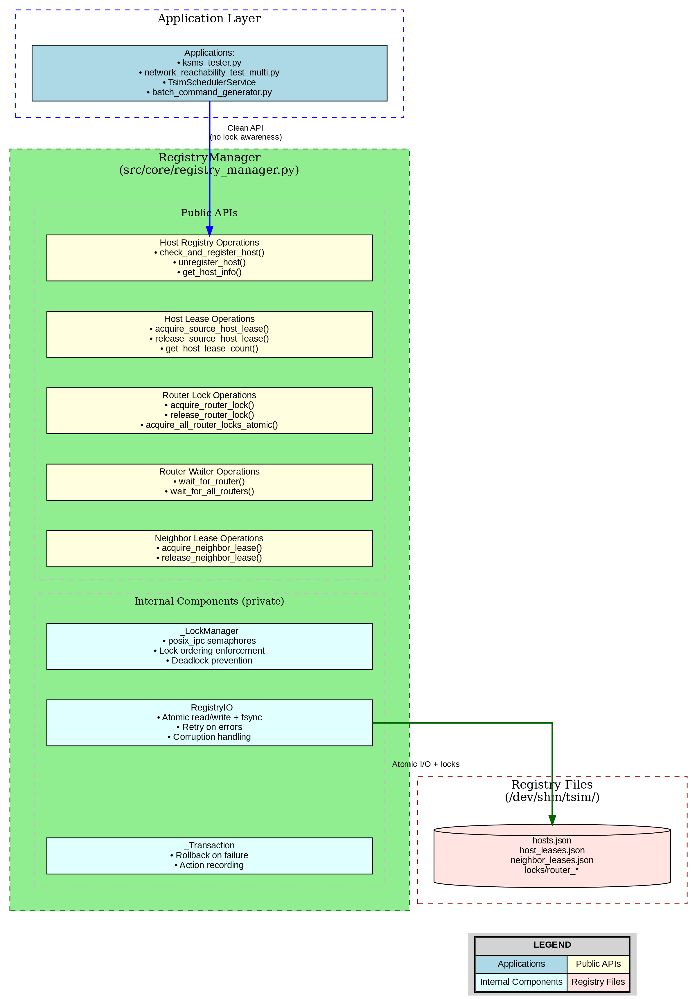

# Centralized Registry Manager Architecture

## Executive Summary

Implement a centralized `RegistryManager` that encapsulates all registry operations and locking mechanisms. All services and scripts will interact with registries exclusively through this manager, eliminating scattered lock management and ensuring atomic operations.

## Design Principles

### 1. Single Source of Truth
- **One manager** for all registry operations (hosts, routers, leases, neighbors)
- **No direct file access** - all services must use RegistryManager methods
- **Consistent interface** across all registry types

### 2. Encapsulated Locking
- **Internal lock management** - callers never see semaphores/locks
- **Atomic operations** - check-then-act sequences are single method calls
- **Automatic cleanup** - context managers ensure locks are released

### 3. Deadlock Prevention
- **Consistent lock ordering** - manager enforces global order
- **All-or-nothing acquisition** - atomic multi-resource locking
- **Timeout enforcement** - no indefinite blocking

### 4. ACID Properties
- **Atomicity** - operations complete fully or not at all
- **Consistency** - registries always in valid state
- **Isolation** - concurrent operations don't interfere
- **Durability** - changes persisted with fsync

## Architecture Overview



**Diagram Generation:** The architecture diagram is generated using `docs/generate_registry_manager_architecture.py`. To regenerate:
```bash
python3 docs/generate_registry_manager_architecture.py
```

**Architecture Layers:**

1. **Application Layer** (Blue)
   - `ksms_tester.py` - Quick analysis jobs
   - `network_reachability_test_multi.py` - Detailed analysis jobs
   - `TsimSchedulerService` - Job scheduling
   - `batch_command_generator.py` - Network setup
   - All applications use clean API with no lock awareness

2. **RegistryManager** (Green - Public APIs)
   - **Host Registry Operations**: Atomic check-and-register, TOCTOU elimination
   - **Host Lease Operations**: Reference counting for source hosts
   - **Router Lock Operations**: Exclusive locks with atomic multi-router acquisition
   - **Router Waiter Operations**: inotify-based waiting for lock release
   - **Neighbor Lease Operations**: Reference counting for ARP entries

3. **Internal Components** (Cyan - Private)
   - **_LockManager**: posix_ipc semaphores, lock ordering, deadlock prevention
   - **_RegistryIO**: Atomic read/write with fsync, retry logic, corruption handling
   - **_Transaction**: Rollback on failure with reverse order cleanup

4. **Registry Files** (Red)
   - `hosts.json` - Physical host registry
   - `host_leases.json` - Source host leases with reference counts
   - `neighbor_leases.json` - Neighbor ARP entry leases
   - `locks/router_*` - Router lock files

## Scope and Responsibilities

### In Scope

1. **Physical Host Registry** (`hosts.json`)
   - Create/update/delete host entries
   - Check IP address collisions
   - Query host information

2. **Host Leases Registry** (`host_leases.json`)
   - Acquire/release source host leases
   - Reference counting
   - Lease expiration checking

3. **Router Locks** (`router_locks/`)
   - Acquire/release individual router locks
   - Atomic multi-router lock acquisition
   - Notify waiter mechanisms

4. **Router Waiter Coordination**
   - Check if router is locked
   - Wait for router availability (inotify-based)

5. **Neighbor Leases** (`neighbor_leases.json`)
   - Track neighbor references
   - Reference counting for ARP entries

### Out of Scope

1. **Physical resource creation** - manager doesn't call `ip netns add`, `ip link add`, etc.
2. **Service lifecycle** - doesn't start/stop services
3. **Network topology** - doesn't understand routing, doesn't modify forwarding
4. **Business logic** - doesn't make decisions about WHEN to lock or WHAT to create

**Separation of Concerns:**
- `RegistryManager`: STATE TRACKING + COORDINATION
- Application scripts: PHYSICAL OPERATIONS + BUSINESS LOGIC

## API Design

### Class Structure

```python
class RegistryManager:
    """Centralized registry and lock manager for all coordination operations.

    Thread-safe and process-safe. All operations are atomic.
    """

    def __init__(self, config: Dict[str, Any], logger: Optional[logging.Logger] = None):
        """Initialize registry manager with configuration.

        Args:
            config: Configuration dict containing:
                - registry_dir: Base directory for all registries
                - lock_dir: Base directory for lock files
                - lock_timeouts: Dict of timeout values per operation type
            logger: Optional logger instance
        """
```

### Host Registry Operations

```python
# Check and Register (ATOMIC - eliminates TOCTOU)
def check_and_register_host(self, host_name: str, primary_ip: str,
                            connected_to: str, mac_address: str,
                            additional_info: Optional[Dict] = None) -> bool:
    """Atomically check availability and register host.

    CRITICAL: Entire operation under single lock - no TOCTOU vulnerability.

    Checks:
    1. Host name not already registered
    2. IP address not already in use
    3. MAC address not already in use

    If all checks pass, registers host atomically.

    Args:
        host_name: Unique host name
        primary_ip: Primary IP address (CIDR format)
        connected_to: Router name
        mac_address: MAC address
        additional_info: Optional metadata

    Returns:
        True if registered successfully, False if collision detected

    Raises:
        RegistryError: On I/O errors or corruption
    """

def unregister_host(self, host_name: str) -> bool:
    """Remove host from physical registry.

    Args:
        host_name: Host to remove

    Returns:
        True if removed, False if not found
    """

def get_host_info(self, host_name: str) -> Optional[Dict[str, Any]]:
    """Get host information (no lock needed - read-only).

    Args:
        host_name: Host to query

    Returns:
        Host info dict or None if not found
    """

def list_all_hosts(self) -> Dict[str, Dict[str, Any]]:
    """Get all registered hosts (no lock needed - read-only)."""
```

### Host Lease Operations

```python
def acquire_source_host_lease(self, run_id: str, host_name: str,
                               job_type: str, router_name: str,
                               dscp: Optional[int] = None) -> int:
    """Acquire lease for source host (reference counting).

    IMPORTANT: Caller MUST hold router lock for this host's router.
    This is enforced by design - router lock grants access to hosts.

    Args:
        run_id: Job identifier
        host_name: Source host name
        job_type: 'quick' or 'detailed'
        router_name: Router this host is attached to
        dscp: Optional DSCP for quick jobs

    Returns:
        Current reference count (>= 1)

    Raises:
        RegistryError: On I/O errors
        ValueError: If host not in physical registry
    """

def release_source_host_lease(self, run_id: str, host_name: str) -> Tuple[int, bool]:
    """Release lease for source host (decrement reference count).

    Args:
        run_id: Job identifier
        host_name: Source host name

    Returns:
        Tuple of (new_ref_count, should_delete)
        should_delete=True when ref_count reaches 0

    Raises:
        RegistryError: On I/O errors
        ValueError: If lease not found
    """

def get_host_lease_count(self, host_name: str) -> int:
    """Get current lease reference count for host.

    Args:
        host_name: Source host name

    Returns:
        Current reference count (0 if no leases)
    """

def list_host_leases(self, host_name: Optional[str] = None) -> Dict[str, Any]:
    """List all leases, optionally filtered by host name.

    Args:
        host_name: Optional filter by host

    Returns:
        Dict of lease information
    """
```

### Router Lock Operations

```python
def acquire_router_lock(self, router_name: str, job_id: str,
                        timeout: float = 30.0) -> bool:
    """Acquire exclusive lock for router.

    This grants exclusive access to:
    - Router itself (iptables, counters, forwarding)
    - ALL hosts attached to this router (source and destination)

    Args:
        router_name: Router to lock
        job_id: Job requesting lock
        timeout: Maximum wait time in seconds

    Returns:
        True if acquired, False if timeout

    Raises:
        RegistryError: On lock system errors
    """

def release_router_lock(self, router_name: str, job_id: str) -> bool:
    """Release router lock and notify waiters.

    Args:
        router_name: Router to unlock
        job_id: Job releasing lock

    Returns:
        True if released, False if not held
    """

def is_router_locked(self, router_name: str) -> bool:
    """Check if router is currently locked.

    Args:
        router_name: Router to check

    Returns:
        True if locked by any job
    """

def acquire_all_router_locks_atomic(self, router_names: List[str],
                                     job_id: str, timeout: float = 60.0) -> bool:
    """Atomically acquire ALL router locks or none (deadlock prevention).

    CRITICAL: All-or-nothing acquisition prevents deadlocks.

    Deadlock scenario without atomic acquisition:
    - Job A acquires router-1, tries router-2 (blocked by Job B)
    - Job B acquires router-2, tries router-1 (blocked by Job A)
    - DEADLOCK!

    Solution:
    1. Sort router names (consistent ordering)
    2. Try to acquire all locks in order
    3. If ANY fails, release ALL and return False

    Args:
        router_names: List of routers to lock
        job_id: Job requesting locks
        timeout: Maximum total time to acquire all

    Returns:
        True if ALL acquired, False if timeout or any unavailable
    """

def release_all_router_locks(self, router_names: List[str], job_id: str) -> int:
    """Release multiple router locks and notify all waiters.

    Args:
        router_names: List of routers to unlock
        job_id: Job releasing locks

    Returns:
        Number of locks successfully released
    """

@contextmanager
def router_lock(self, router_name: str, job_id: str, timeout: float = 30.0):
    """Context manager for single router lock.

    Usage:
        with registry_mgr.router_lock('router-1', 'job-123'):
            # Have exclusive access to router-1 and all its hosts
            perform_operations()
        # Lock automatically released
    """

@contextmanager
def all_router_locks(self, router_names: List[str], job_id: str,
                     timeout: float = 60.0):
    """Context manager for atomic multi-router locking.

    Usage:
        with registry_mgr.all_router_locks(['r1', 'r2'], 'job-123'):
            # Have exclusive access to ALL routers and ALL their hosts
            perform_parallel_operations()
        # ALL locks automatically released atomically
    """
```

### Router Waiter Operations

```python
def wait_for_router(self, router_name: str, timeout: float = 30.0) -> bool:
    """Wait until router is free (inotify-based, no polling).

    Used by quick jobs to wait if router is locked by detailed job.

    Args:
        router_name: Router to wait for
        timeout: Maximum wait time

    Returns:
        True if router became free, False if timeout
    """

def wait_for_all_routers(self, router_names: List[str],
                         timeout: float = 30.0) -> bool:
    """Wait until ALL routers are free.

    Args:
        router_names: List of routers to wait for
        timeout: Maximum total wait time

    Returns:
        True if all became free, False if timeout
    """
```

### Neighbor Lease Operations

```python
def acquire_neighbor_lease(self, run_id: str, host_name: str,
                           neighbor_ip: str) -> int:
    """Acquire lease for neighbor ARP entry (reference counting).

    Args:
        run_id: Job identifier
        host_name: Host that needs this neighbor
        neighbor_ip: Neighbor IP address

    Returns:
        Current reference count
    """

def release_neighbor_lease(self, run_id: str, host_name: str,
                           neighbor_ip: str) -> Tuple[int, bool]:
    """Release neighbor lease (decrement reference count).

    Args:
        run_id: Job identifier
        host_name: Host releasing neighbor
        neighbor_ip: Neighbor IP address

    Returns:
        Tuple of (new_ref_count, should_delete)
    """
```

## Internal Architecture

### Lock Hierarchy

To prevent deadlocks, locks are always acquired in this order:

```
1. Physical Host Registry Lock    (/tsim-hosts-registry)
2. Host Leases Registry Lock      (/tsim-host-leases)
3. Router Locks (sorted by name)  (/tsim-router-{name})
4. Neighbor Leases Registry Lock  (/tsim-neighbor-leases)
```

**Rule**: Never acquire a higher-numbered lock while holding a lower-numbered lock.

### Lock Implementation

```python
class _LockManager:
    """Internal lock manager (not exposed to callers)."""

    def __init__(self, lock_dir: Path):
        self.lock_dir = lock_dir
        self.semaphores = {}  # Cache of posix_ipc.Semaphore objects

    def acquire(self, lock_name: str, timeout: float) -> bool:
        """Acquire semaphore with timeout."""

    def release(self, lock_name: str) -> bool:
        """Release semaphore."""

    def acquire_multiple_atomic(self, lock_names: List[str],
                                timeout: float) -> Tuple[bool, List[str]]:
        """Atomically acquire multiple locks (sorted order).

        Returns:
            (success: bool, acquired: List[str])
        """
```

### Registry I/O

```python
class _RegistryIO:
    """Internal registry I/O handler (not exposed to callers)."""

    def atomic_read(self, file_path: Path) -> Dict[str, Any]:
        """Read registry file with error handling."""

    def atomic_write(self, file_path: Path, data: Dict[str, Any]) -> None:
        """Write registry file atomically with fsync.

        Process:
        1. Write to temporary file
        2. fsync temporary file
        3. Atomic rename to target
        """

    def atomic_update(self, file_path: Path,
                     update_fn: Callable[[Dict], Dict]) -> Dict[str, Any]:
        """Atomic read-modify-write operation.

        Args:
            file_path: Registry file to update
            update_fn: Function that takes current data and returns new data

        Returns:
            New data after update
        """
```

### Transaction Support

```python
class _Transaction:
    """Internal transaction manager for rollback on failure."""

    def __init__(self, registry_mgr: 'RegistryManager'):
        self.registry_mgr = registry_mgr
        self.actions = []  # List of (rollback_fn, args) tuples

    def record_action(self, rollback_fn: Callable, *args):
        """Record action for potential rollback."""

    def commit(self):
        """Commit transaction (clear rollback actions)."""

    def rollback(self):
        """Rollback all recorded actions in reverse order."""
```

## Error Handling

### Exception Hierarchy

```python
class RegistryError(Exception):
    """Base exception for registry operations."""

class RegistryLockTimeout(RegistryError):
    """Lock acquisition timeout."""

class RegistryCollision(RegistryError):
    """Resource collision detected (IP, name, etc.)."""

class RegistryCorruption(RegistryError):
    """Registry file corrupted or invalid."""

class RegistryNotFound(RegistryError):
    """Registry file or entry not found."""
```

### Error Recovery

1. **Lock timeout**: Return False or raise `RegistryLockTimeout`
2. **Collision detected**: Return False or raise `RegistryCollision`
3. **I/O error**: Retry up to 3 times, then raise `RegistryError`
4. **Corruption**: Log error, attempt recovery from backup, raise `RegistryCorruption`
5. **Partial failure**: Use `_Transaction` to rollback all changes

## Migration Strategy

### Phase 1: Create RegistryManager (No Disruption)

1. Implement `RegistryManager` as new class
2. Keep existing services unchanged
3. Add comprehensive unit tests
4. Add integration tests

### Phase 2: Migrate Services One-by-One

1. Start with lowest-level services (host_namespace_setup.py)
2. Modify to use RegistryManager
3. Test thoroughly
4. Move to next service

### Phase 3: Remove Old Code

1. Remove direct registry access from all services
2. Remove redundant lock management code
3. Deprecate old APIs

### Compatibility

During migration:
- RegistryManager reads/writes same JSON format
- Lock files remain compatible
- No breaking changes to registry structure

## Configuration

```json
{
  "registry_manager": {
    "enabled": true,
    "registry_dir": "/dev/shm/tsim",
    "lock_dir": "/dev/shm/tsim/locks",
    "lock_timeouts": {
      "host_registry": 5.0,
      "host_leases": 3.0,
      "router_lock": 30.0,
      "router_lock_atomic": 60.0,
      "neighbor_leases": 3.0
    },
    "retry_attempts": 3,
    "retry_delay": 0.1,
    "enable_transaction_log": true,
    "transaction_log_path": "/var/log/tsim/registry_transactions.log"
  }
}
```

## Benefits Summary

### For Developers

1. **Simple API** - call one method instead of managing locks
2. **No lock awareness** - encapsulated complexity
3. **Fewer bugs** - atomic operations eliminate race conditions
4. **Easier testing** - mock one manager instead of many

### For Operations

1. **Centralized logging** - all registry operations logged in one place
2. **Better diagnostics** - transaction log shows operation sequences
3. **Easier debugging** - single point of failure analysis
4. **Performance monitoring** - track lock contention in one place

### For System

1. **Guaranteed consistency** - ACID properties enforced
2. **Deadlock prevention** - consistent lock ordering
3. **Better scalability** - optimized locking strategies
4. **Future-proof** - easy to add new registry types

## Performance Considerations

### Lock Contention

- **Physical host registry**: Low contention (mostly at startup)
- **Host leases**: Medium contention (per-job acquire/release)
- **Router locks**: High contention (multiple jobs competing)

### Optimization Strategies

1. **Lock granularity**: Separate locks per registry type
2. **Read-only operations**: No locking for queries
3. **Batch operations**: Reduce lock acquisition overhead
4. **Lock caching**: Reuse semaphore objects

### Expected Performance

- Single lock acquire/release: < 1ms
- Atomic check-and-register: < 5ms
- Atomic multi-router lock: < 10ms per router
- Registry read (no lock): < 1ms

## Testing Strategy

### Unit Tests

1. Test each public method in isolation
2. Test lock ordering enforcement
3. Test atomic operations rollback
4. Test collision detection
5. Test concurrent access from multiple threads

### Integration Tests

1. Multiple processes competing for locks
2. Deadlock prevention verification
3. Transaction rollback on failure
4. Registry corruption recovery

### Stress Tests

1. 100+ concurrent jobs
2. Rapid lock acquire/release cycles
3. Large registry files (1000+ hosts)
4. Lock timeout scenarios

## Future Enhancements

### Phase 2 Features

1. **Lock statistics** - track contention, wait times, holder identity
2. **Lock debugging** - detailed trace of who holds what
3. **Automatic deadlock detection** - detect and break deadlocks
4. **Registry versioning** - schema evolution support
5. **Distributed locks** - support multi-node deployments
6. **Read-write locks** - allow concurrent readers
7. **Lock priority** - prioritize certain job types

### Monitoring Integration

1. Export lock metrics to Prometheus
2. Alert on high lock contention
3. Alert on lock timeouts
4. Dashboard showing lock status

## Conclusion

The centralized `RegistryManager` architecture provides:

- **Safety**: Eliminates TOCTOU vulnerabilities and race conditions
- **Simplicity**: Clean API hides complexity from callers
- **Reliability**: ACID properties and automatic rollback
- **Debuggability**: Centralized logging and transaction tracking
- **Maintainability**: Single point for all registry operations

This architecture aligns perfectly with the race condition elimination plan while providing a much cleaner implementation path.
