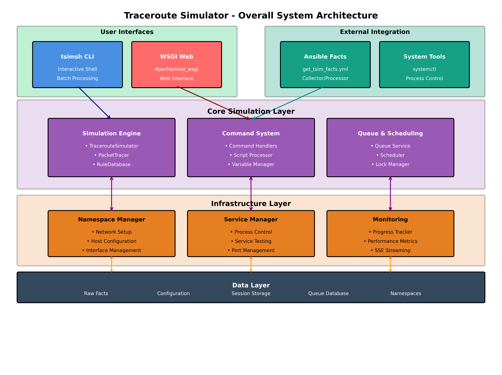
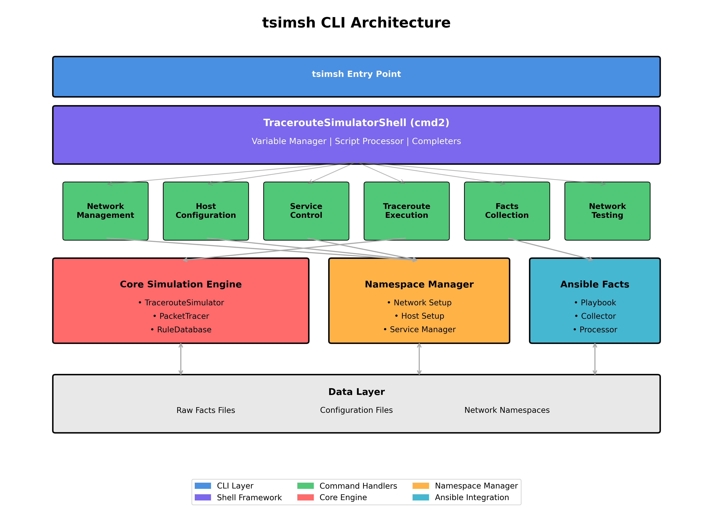
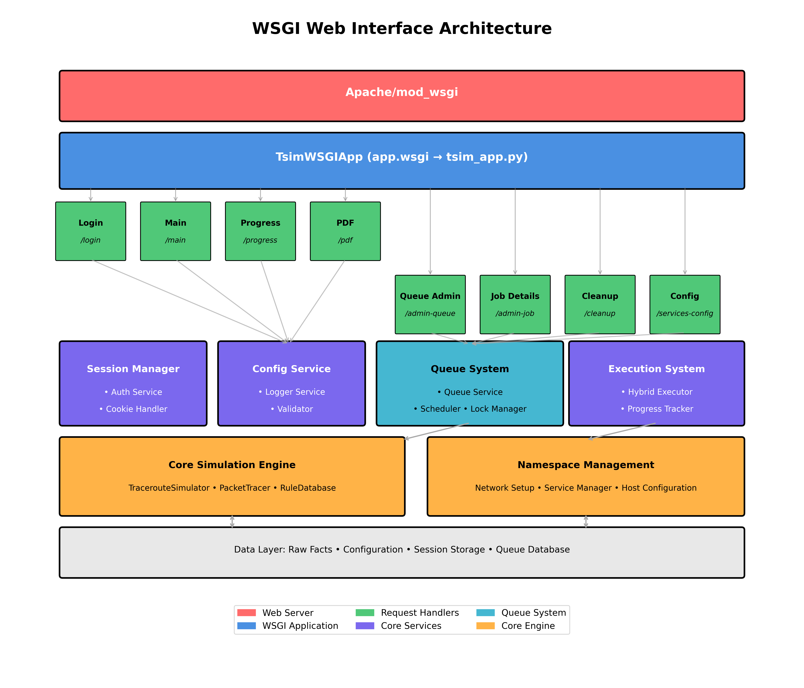

# Traceroute Simulator - System Administrator Guide

## Table of Contents

1. [System Architecture](#system-architecture)
2. [User Interfaces](#user-interfaces)
3. [Installation and Setup](#installation-and-setup)
4. [tsimsh - The Interactive Shell](#tsimsh---the-interactive-shell)
5. [Network Configuration](#network-configuration)
6. [Data Collection with Ansible](#data-collection-with-ansible)
7. [Linux Namespace Simulation](#linux-namespace-simulation)
8. [Security Configuration](#security-configuration)
9. [Make Targets Reference](#make-targets-reference)
10. [Python Scripts Direct Usage](#python-scripts-direct-usage)
11. [Troubleshooting and Maintenance](#troubleshooting-and-maintenance)

## System Architecture

The Traceroute Simulator is a comprehensive network simulation platform designed for testing and analyzing network routing behavior. The system provides two primary user interfaces: a command-line interface (tsimsh) and a web-based WSGI interface.



**Key Features:**
- **Dual interface design** (CLI and Web) - Both interfaces share the same core simulation engine
- **Ansible integration for data collection** - Automated network facts gathering via playbooks
- **Queue-based execution system** - All operations queued for optimal resource utilization
- **Network namespace isolation** - Each simulation runs in isolated Linux namespaces
- **Real-time monitoring and progress tracking** - Live updates via SSE streaming
- **Shared memory registries for performance** - Fast access to router/interface/bridge data
- **SSH-based router connectivity** - Secure connection to network devices

### Architecture Overview

The system is organized into four main layers:

1. **User Interface Layer**: Provides access through tsimsh CLI and WSGI web interface
2. **Core Simulation Layer**: Contains the simulation engine, command system, and queue management
3. **Infrastructure Layer**: Manages network namespaces, services, and monitoring
4. **Data Layer**: Handles raw facts, configuration, session storage, and namespace data

### Key Design Principles

- **Dual Interface Design**: Both CLI and web interfaces share the same core simulation engine
- **Queue-Based Execution**: All simulation tasks are queued and scheduled for optimal resource usage
- **Network Namespace Isolation**: Each simulation runs in isolated network namespaces
- **Real-Time Monitoring**: Progress tracking and SSE streaming for live updates
- **Ansible Integration**: Facts collection through Ansible playbooks for network discovery

## User Interfaces

The system provides two distinct user interfaces, both accessing the same core simulation engine:

### tsimsh CLI Interface

The tsimsh (Traceroute Simulator Shell) provides an interactive command-line interface built on the cmd2 framework.



**Execution Flow:**
1. **User input via tsimsh command line interface** - Interactive shell with tab completion
2. **cmd2 framework parses and validates commands** - Built-in command validation and help
3. **Command handler processes the specific request** - Modular handlers for each command type
4. **Core components execute simulation or management tasks** - Simulation engine, namespace manager, or Ansible facts
5. **Data layer provides facts, configuration, and namespace access** - Persistent storage and configuration
6. **Results returned through shell interface with optional JSON output** - Human-readable or machine-parseable formats

#### Components

- **Entry Point** (`tsimsh`): Main executable that initializes the shell
- **TracerouteSimulatorShell**: Core shell implementation with cmd2 framework
- **Command Handlers**: Modular command implementations
  - `network`: Network namespace management
  - `host`: Host configuration and setup
  - `service`: Service control and testing
  - `trace`: Traceroute execution
  - `facts`: Ansible facts collection and processing
  - `nettest`: Network connectivity testing

#### Usage Modes

1. **Interactive Mode**: Direct command entry with tab completion and history
2. **Batch Mode**: Script execution via stdin redirection
3. **Quick Mode** (`-q`): Skip network checks and initialization for faster startup

### WSGI Web Interface

The web interface provides a browser-based access to the simulator through Apache mod_wsgi.



**Request Flow:**
1. **HTTP request received by Apache web server** - Standard web server handling
2. **WSGI application dispatches to appropriate handler** - URL-based routing
3. **Handler processes request and validates parameters** - Input validation and sanitization
4. **Service orchestration manages session, config, and queue operations** - Coordination layer
5. **Queue system schedules execution or retrieves results** - Asynchronous job management
6. **Core simulation engine executes traceroute operations** - Actual simulation processing
7. **Real-time progress updates via SSE streaming** - Server-sent events for live updates
8. **Results formatted and returned to client** - HTML, JSON, or PDF output formats

#### Components

- **Apache/mod_wsgi**: Web server and WSGI container
- **TsimWSGIApp**: Main WSGI application dispatcher
- **Request Handlers**: URL-specific request processors
  - `/login`: Authentication and session management
  - `/main`: Primary simulation interface
  - `/progress`: Real-time progress monitoring
  - `/pdf`: PDF report generation
  - `/admin-queue`: Queue administration
  - `/services-config`: Service configuration management

#### Core Services

- **Session Manager**: User authentication and session handling
- **Config Service**: Configuration management and validation
- **Queue System**: Job queuing, scheduling, and lock management
- **Execution System**: Hybrid executor with progress tracking

### Ansible Facts Integration

The system includes comprehensive Ansible integration for network facts collection:

- **Facts Collection Command** (`tsimsh> facts collect`): Executes Ansible playbook
- **Playbook** (`ansible/get_tsim_facts.yml`): Collects network topology data
- **Processing** (`tsimsh> facts process`): Converts raw facts to simulator format
- **Validation** (`tsimsh> facts validate`): Ensures facts integrity

The architecture eliminates the classical CGI web interface and SSH-restricted access components, focusing on the modern WSGI web interface and comprehensive CLI.

### Key Directories

```bash
/home/user/traceroute-simulator/
├── src/                  # Core Python modules
├── wsgi/                 # WSGI web interface components
├── ansible/              # Data collection playbooks
├── tests/                # Test suites and test data
├── docs/                 # Documentation
└── scripts/              # Utility scripts
```

### Environment Variables and Configuration

Critical environment variables and configuration files:

```bash
# Required: Points to router facts directory
export TRACEROUTE_SIMULATOR_FACTS=/path/to/facts

# Optional: Raw facts for enhanced analysis
export TRACEROUTE_SIMULATOR_RAW_FACTS=/path/to/raw_facts
```

### Configuration Files

The system uses YAML configuration files with user-specific and system-wide settings:

**Configuration File Precedence:**
1. `~/traceroute_simulator.yaml` (current user's home directory)
2. `./traceroute_simulator.yaml` (current directory)
3. Built-in defaults

**User Configuration**: `~/traceroute_simulator.yaml`
- Used by tsimsh CLI when run by current user
- Contains personal settings for command-line operations
- SSH configuration for connecting to routers and controllers

**Web Interface Configuration**: `/opt/tsim/wsgi/conf/traceroute_simulator.yaml`
- Used by Apache/WSGI web interface
- Contains system-wide settings for web operations
- SSH configuration for web user (typically `apache`)

Both files share the same format but serve different execution contexts.

#### Configuration Parameters

**System Configuration:**
```yaml
system:
  unix_group: tsim-users              # Group for file ownership and permissions
  file_permissions: "0664"            # Default file permissions (rw-rw-r--)
  directory_permissions: "0775"       # Default directory permissions (rwxrwxr-x)
```

**Logging Configuration:**
```yaml
logging:
  base_directory: /var/log/tsim       # Log directory location
  format: json                        # Log format: json or text
  file_level: DEBUG                   # File logging level (DEBUG/INFO/WARNING/ERROR/CRITICAL)
  console_levels:                     # Console output levels by verbosity
    0: CRITICAL                       # No -v flag: only critical errors
    1: WARNING                        # -v: warnings and errors
    2: INFO                           # -vv: info, warnings, errors
    3: DEBUG                          # -vvv: all messages including debug
  batch_generator:
    log_file_pattern: "batch_generator_%Y%m%d_%H%M%S.json"
    log_commands: true                # Log all command executions
    log_outputs: true                 # Log command outputs (stdout/stderr)
    max_output_size: 10000           # Maximum output size per command (bytes)
```

**Shared Memory Configuration:**
```yaml
shared_memory:
  registries:
    routers:
      size: 2097152                   # 2MB for router registry
      persist: true                   # Keep across operations
    interfaces:
      size: 4194304                   # 4MB for interface registry
      persist: true
    bridges:
      size: 2097152                   # 2MB for bridge registry
      persist: true
    hosts:
      size: 1048576                   # 1MB for host registry
      persist: true
  batch_segments:
    max_size: 10485760                # 10MB maximum batch segment size
    cleanup_policy: manual            # Cleanup policy: manual/on_exit/never
```

**Network Setup:**
```yaml
network_setup:
  hidden_namespace: tsim-hidden       # Name for hidden infrastructure namespace
  batch_processing:
    enabled: true                     # Enable batch processing optimization
    parallel_limit: 50                # Maximum parallel operations per batch
```

**Output Control:**
```yaml
verbose: false                        # Default verbosity
verbose_level: 0                      # Default verbosity level
quiet: false                          # Quiet mode (exit codes only)
json_output: false                    # JSON output format
```

**Tracing Behavior:**
```yaml
enable_mtr_fallback: true             # Use MTR when path incomplete
enable_reverse_trace: true            # Try reverse tracing on forward failure
ansible_controller: false             # Set true if running on Ansible controller
controller_ip: "127.0.0.1"           # Ansible controller IP address
```

**SSH Configuration (Critical for ssh_mode):**

The `ssh_mode` parameter determines how SSH connections are made to routers:

```yaml
ssh:
  ssh_mode: user                      # Mode: 'user' or 'standard'
  ssh_user: traceuser                 # Username for user mode
  ssh_key: /opt/tsim/wsgi/conf/ssh_user.key  # Private key path for user mode
  ssh_options:
    BatchMode: "yes"                  # No interactive prompts
    LogLevel: "ERROR"                 # Minimal SSH logging
    ConnectTimeout: 5                 # Connection timeout (seconds)
    StrictHostKeyChecking: "no"       # Skip host key verification
    UserKnownHostsFile: "/dev/null"   # Don't save host keys
    PasswordAuthentication: "no"      # Key-based auth only

ssh_controller:                       # SSH to Ansible controller
  ssh_mode: user
  ssh_user: traceuser
  ssh_key: /opt/tsim/wsgi/conf/ssh_user.key
  ssh_options:
    BatchMode: "yes"
    LogLevel: "ERROR"
    ConnectTimeout: 10                # Longer timeout for controller
    StrictHostKeyChecking: "yes"      # Verify controller host key
    UserKnownHostsFile: "~/.ssh/known_hosts"  # Standard known hosts
    PasswordAuthentication: "no"
```

**SSH Mode Explanation:**
- **`user` mode**: Uses restricted SSH user with limited shell access (recommended)
- **`standard` mode**: Uses full SSH access with standard shell

**Key Differences Between User and Web Configurations:**

**User Configuration (`~/traceroute_simulator.yaml`):**
- SSH keys typically in user's home directory (`~/.ssh/`)
- Logs may go to user-accessible locations
- Personal preferences for output formats and verbosity

**Web Configuration (`/opt/tsim/wsgi/conf/traceroute_simulator.yaml`):**
- SSH keys in web-accessible location (`/opt/tsim/wsgi/conf/`)
- Logs directed to system directories (`/var/log/tsim/`)
- Optimized for web interface operations
- Must be readable by web server user (`apache`)

## Installation and Setup

### System Requirements

```bash
# Operating System
- Red Hat Enterprise Linux 7, 8, or 9
- Kernel with namespace support (3.8+)

# System Packages (RHEL 7/8/9)
sudo yum install -y \
    python3 \
    python3-pip \
    python3-devel \
    iproute \
    iptables \
    ipset \
    socat \
    gcc \
    make \
    git \
    httpd \
    httpd-devel

# For RHEL 8/9, you can also use dnf:
sudo dnf install -y \
    python3 \
    python3-pip \
    python3-devel \
    iproute \
    iptables \
    ipset \
    socat \
    gcc \
    make \
    git \
    httpd \
    httpd-devel
```

### Virtual Environment Setup

The project uses a dedicated virtual environment with Python 3.11 managed by uv:

```bash
# Create tsim-users group (required for shared operations)
sudo groupadd -f tsim-users
sudo usermod -a -G tsim-users $USER

# Logout and login again for group membership to take effect
# Then install the virtual environment and tsimsh
make install-venv

# This creates:
# - Virtual environment at /opt/tsim/venv
# - Python 3.11 installation via uv
# - All required dependencies including mod_wsgi built from source
# - tsimsh command available at /opt/tsim/venv/bin/tsimsh
# - mod_wsgi compiled for 100% compatibility with the Python binary
```

### tsimsh CLI Installation

After virtual environment setup, tsimsh is available:

```bash
# Activate the virtual environment
source /opt/tsim/venv/bin/activate

# Use tsimsh directly
tsimsh

# Or use the full path without activation
/opt/tsim/venv/bin/tsimsh

# Check tsimsh version
tsimsh -V
```


### WSGI Web Interface Setup

The WSGI interface requires the virtual environment to be set up first:

```bash
# 1. Install WSGI application (requires virtual environment)
sudo make install-wsgi

# This installs to:
# - Application files: /opt/tsim/wsgi/
# - Static files: /opt/tsim/htdocs/
# - Configuration: /opt/tsim/wsgi/conf/
# - Updates config.json to use /opt/tsim/venv
```

### Apache Configuration

```bash
# 2. Configure Apache for WSGI
# The install-wsgi target generates mod_wsgi configuration from the virtual environment
# This ensures 100% compatibility with the Python binary used

# Copy the generated Apache configuration
sudo cp /opt/tsim/wsgi/conf/apache-tsim-wsgi.conf /etc/httpd/conf.d/

# The mod_wsgi.conf file contains the LoadModule directive for the built mod_wsgi
# Include it in your Apache configuration
echo "Include /opt/tsim/wsgi/mod_wsgi.conf" | sudo tee -a /etc/httpd/conf.d/tsim-mod_wsgi.conf

# Edit main configuration if needed (paths are automatically configured)
sudo vim /etc/httpd/conf.d/apache-tsim-wsgi.conf

# Enable and start Apache
sudo systemctl enable httpd
sudo systemctl start httpd

# Configure firewall
sudo firewall-cmd --permanent --add-service=http
sudo firewall-cmd --permanent --add-service=https
sudo firewall-cmd --reload
```

### WSGI Configuration

The web interface uses two main configuration files installed during `make install-wsgi`:

#### WSGI Application Configuration (`/opt/tsim/wsgi/conf/config.json`)

This JSON file contains web-specific settings:

```json
{
  "venv_path": "/opt/tsim/venv",                    // Virtual environment path (auto-configured)
  "traceroute_simulator_conf": "/opt/tsim/wsgi/conf/traceroute_simulator.yaml",
  "data_dir": "/dev/shm/tsim",                      // Shared memory data directory
  "log_dir": "/var/log/tsim",                       // Application log directory
  "session": {
    "timeout": 1800,                                // Session timeout (30 minutes)
    "secure_cookie": true,                          // Use secure cookies (HTTPS)
    "httponly": true,                               // HTTP-only cookies (no JS access)
    "samesite": "strict"                            // CSRF protection
  },
  "queue": {
    "max_jobs": 100,                                // Maximum queued jobs
    "job_timeout": 3600,                            // Job timeout (1 hour)
    "cleanup_interval": 300                         // Queue cleanup interval (5 minutes)
  },
  "authentication": {
    "method": "pam",                                // Authentication method: pam/ldap/local
    "pam_service": "tsim-web",                      // PAM service name
    "session_secret": "auto-generated-secret",     // Session encryption secret
    "require_https": false                          // Require HTTPS for authentication
  },
  "progress_tracking": {
    "update_interval": 1.0,                         // Progress update frequency (seconds)
    "retention_hours": 24,                          // Keep progress data (hours)
    "max_entries": 1000                             // Maximum progress entries
  },
  "performance": {
    "enable_caching": true,                         // Enable response caching
    "cache_timeout": 300,                           // Cache timeout (5 minutes)
    "max_concurrent_jobs": 10                       // Maximum concurrent executions
  }
}
```

#### Configuration File Installation and Editing

**Automatic Installation:**
```bash
# Files are installed during make install-wsgi:
# - Copies traceroute_simulator.yaml to /opt/tsim/wsgi/conf/
# - Creates config.json with proper paths
# - Sets ownership to apache:tsim-users
# - Updates venv_path to /opt/tsim/venv automatically
```

**Manual Configuration Steps:**

```bash
# 1. Edit WSGI application configuration
sudo vim /opt/tsim/wsgi/conf/config.json

# Key settings to verify/modify:
# - authentication.method: Set to "pam", "ldap", or "local"
# - session.secure_cookie: Set to true for HTTPS
# - authentication.require_https: Set to true for production

# 2. Edit system configuration for web interface
sudo vim /opt/tsim/wsgi/conf/traceroute_simulator.yaml

# Key settings for web interface:
# - ssh.ssh_key: Path to SSH private key for web user
# - ssh.ssh_user: SSH username for router connections
# - logging.base_directory: Must be writable by apache user

# 3. Set proper permissions
sudo chown apache:tsim-users /opt/tsim/wsgi/conf/config.json
sudo chmod 640 /opt/tsim/wsgi/conf/config.json
sudo chown apache:tsim-users /opt/tsim/wsgi/conf/traceroute_simulator.yaml
sudo chmod 640 /opt/tsim/wsgi/conf/traceroute_simulator.yaml

# 4. Create SSH key for web interface (if using SSH mode)
sudo -u apache ssh-keygen -t rsa -b 2048 -f /opt/tsim/wsgi/conf/ssh_user.key -N ""
sudo chmod 600 /opt/tsim/wsgi/conf/ssh_user.key
sudo chown apache:tsim-users /opt/tsim/wsgi/conf/ssh_user.key*

# 5. Restart Apache to load new configuration
sudo systemctl restart httpd
```

**Configuration Differences Summary:**

| Aspect | User Config (`~/traceroute_simulator.yaml`) | Web Config (`/opt/tsim/wsgi/conf/`) |
|--------|---------------------------------------------|-------------------------------------|
| **Owner** | Current user | `apache:tsim-users` |
| **SSH Keys** | `~/.ssh/` | `/opt/tsim/wsgi/conf/` |
| **Log Directory** | User-writable paths | `/var/log/tsim/` |
| **Permissions** | User read/write | Group readable, web writable |
| **Purpose** | CLI operations | Web interface operations |
| **Session Management** | Not applicable | config.json parameters |
| **Authentication** | Direct user context | PAM/LDAP via web server |

### Verification

After installation, verify the setup:

```bash
# Check virtual environment
source /opt/tsim/venv/bin/activate
python -c "import tsim; print('tsimsh installed successfully')"

# Test tsimsh
/opt/tsim/venv/bin/tsimsh -V

# Check WSGI installation
ls -la /opt/tsim/wsgi/app.wsgi

# Test Apache configuration
sudo httpd -t

# Check dependency status
make check-deps
```

## tsimsh - The Interactive Shell

### Overview

tsimsh is the primary interface for system administrators, providing:
- Tab completion for commands and IP addresses
- Command history and search
- Scripting capabilities
- Variable support
- Batch processing

### Basic Usage

```bash
# Launch interactive shell
./tsimsh

# Quick mode (skip network checks)
./tsimsh -q

# Execute single command
echo "trace -s 10.1.1.1 -d 10.2.1.1" | ./tsimsh

# Run script file
./tsimsh < commands.tsim

# Batch processing with error handling
cat script.tsim | ./tsimsh
echo $?  # Check exit code
```

### Command Categories

#### Trace Commands
```bash
# Basic trace
tsimsh> trace -s 10.1.1.1 -d 10.2.1.1

# JSON output
tsimsh> trace -s 10.1.1.1 -d 10.2.1.1 -j

# Verbose mode (can be used multiple times)
tsimsh> trace -s 10.1.1.1 -d 10.2.1.1 -v
tsimsh> trace -s 10.1.1.1 -d 10.2.1.1 -vv

# With controller IP for MTR execution
tsimsh> trace -s 10.1.1.1 -d 8.8.8.8 --controller-ip 10.1.2.3
```

#### Network Management
```bash
# Setup namespace network (batch mode - faster)
tsimsh> network setup --create
tsimsh> network setup --clean --create    # Clean and create
tsimsh> network setup --clean --create --verify  # With verification

# Setup namespace network (serial mode - slower but more stable)
tsimsh> network setup-serial
tsimsh> network setup-serial --verify

# Check status
tsimsh> network status                     # Show summary
tsimsh> network status all                 # Show all details
tsimsh> network status interfaces          # Show interfaces only
tsimsh> network status interfaces --limit hq-*  # Specific routers

# Test network connectivity
tsimsh> network test --source 10.1.1.1 --destination 10.2.1.1
tsimsh> network test --source 10.1.1.1 --destination 10.2.1.1 --test-type mtr

# Clean up
tsimsh> network clean                      # Batch cleanup
tsimsh> network clean-serial --force       # Serial cleanup
```

#### Service Management
```bash
# Start services
tsimsh> service start --ip 10.1.1.1 --port 8080
tsimsh> service start --ip 10.2.1.1 --port 53 --protocol udp

# List services
tsimsh> service list
tsimsh> service list -j  # JSON output

# Test connectivity
tsimsh> service test -s 10.1.1.1 -d 10.2.1.1:8080
tsimsh> service test -s 10.1.1.1 -d 10.2.1.1:53 --protocol udp

# Stop services
tsimsh> service stop --ip 10.1.1.1 --port 8080
tsimsh> service clean  # Stop all services
```

#### Host Management
```bash
# Add dynamic host
tsimsh> host add --name web1 --primary-ip 10.1.1.100/24 --connect-to hq-gw
tsimsh> host add --name db1 --primary-ip 10.2.1.50/24 --connect-to br-core --secondary-ips 192.168.1.1/24

# List hosts
tsimsh> host list
tsimsh> host list -j  # JSON output

# Remove host
tsimsh> host remove --name web1 -f
tsimsh> host clean -f  # Remove all hosts
```

#### Facts Management
```bash
# Collect facts from network devices
tsimsh> facts collect --inventory hosts.ini --output-dir prod_facts

# Process raw facts into structured JSON
tsimsh> facts process --input-dir raw_facts --output-dir json_facts --validate

# Validate processed facts files
tsimsh> facts validate --facts-dir json_facts --verbose
```

### Advanced Shell Features

#### Variables and Scripting
```bash
# Set variables
tsimsh> set SOURCE 10.1.1.1
tsimsh> set DEST 10.2.1.1
tsimsh> trace -s $SOURCE -d $DEST

# Conditional execution
tsimsh> if trace -s 10.1.1.1 -d 10.2.1.1 -q; then
tsimsh>   echo "Path exists"
tsimsh> else
tsimsh>   echo "No path"
tsimsh> fi

# Loops
tsimsh> for ip in 10.1.1.1 10.2.1.1 10.3.1.1; do
tsimsh>   trace -s $ip -d 8.8.8.8 -j > trace_$ip.json
tsimsh> done
```

#### Shell Configuration

Create `.tsimrc` in home directory for startup commands:
```bash
# ~/.tsimrc
# Set default variables
set CONTROLLER_IP 10.1.2.3
set DEFAULT_SOURCE 10.1.1.1

# Aliases
alias t trace
alias ns network status
alias sl service list

# Auto-complete custom IPs
_custom_ips 10.1.1.1 10.2.1.1 10.3.1.1
```

## Network Configuration

### Understanding the Test Network

The included test network represents a typical enterprise setup:

```
Headquarters (HQ)
├── hq-gw (10.1.1.1)      - Edge router/firewall
├── hq-core (10.1.2.1)    - Core switch/router
├── hq-dmz (10.1.3.1)     - DMZ network router
└── hq-lab (10.1.4.1)     - Lab network router

Branch Office
├── br-gw (10.2.1.1)      - Edge router/firewall
├── br-core (10.2.1.2)    - Core switch/router
└── br-wifi (10.2.1.3)    - WiFi access router

Data Center
├── dc-gw (10.3.1.1)      - Edge router/firewall
├── dc-core (10.3.1.2)    - Core switch/router
└── dc-srv (10.3.1.3)     - Server network router
```

### Network Interconnections

#### WireGuard VPN Tunnels
```bash
# HQ to Branch tunnel
HQ (10.100.1.1) <---wg0---> Branch (10.100.1.2)

# HQ to DC tunnel  
HQ (10.100.2.1) <---wg1---> DC (10.100.2.2)

# Branch to DC tunnel
Branch (10.100.3.1) <---wg1---> DC (10.100.3.2)
```

### Modifying Network Topology

#### Adding a New Router

1. **Create Facts File**:
```json
{
  "hostname": "new-router",
  "metadata": {
    "linux": true,
    "type": "router",
    "location": "branch"
  },
  "interfaces": {
    "eth0": {
      "addresses": ["10.4.1.1/24"],
      "state": "UP"
    }
  },
  "routes": [
    {
      "destination": "default",
      "gateway": "10.4.1.254",
      "interface": "eth0"
    }
  ]
}
```

2. **Update Network Setup**:
```bash
# Add facts file to facts directory
cp new-router.json $TRACEROUTE_SIMULATOR_FACTS/

# Regenerate namespace configuration
source /opt/tsim/venv/bin/activate
tsimsh
tsimsh> network clean
tsimsh> network setup --create

# Verify
tsimsh> network status interfaces --limit new-router
```

#### Modifying Firewall Rules

1. **Update Router Facts**:
```bash
# Edit facts file directly
vim $TRACEROUTE_SIMULATOR_FACTS/hq-gw.json
# Update iptables section as needed

# Validate the updated facts
source /opt/tsim/venv/bin/activate
tsimsh
tsimsh> facts validate --facts-dir $TRACEROUTE_SIMULATOR_FACTS

# Recreate namespace with new rules
tsimsh> network clean
tsimsh> network setup --create
tsimsh> network status iptables --limit hq-gw
```

### Policy-Based Routing

Configure multiple routing tables for advanced routing:

```bash
# Example: Add policy routing to facts
{
  "ip_rules": [
    {
      "priority": 100,
      "from": "10.1.100.0/24",
      "table": "mgmt"
    }
  ],
  "routing_tables": {
    "mgmt": [
      {
        "destination": "default",
        "gateway": "10.1.1.254",
        "interface": "eth0"
      }
    ]
  }
}
```

## Data Collection with Ansible

### Setting Up Ansible Inventory

1. **Create Inventory File** (`inventory.yml`):
```yaml
all:
  vars:
    ansible_user: admin
    ansible_ssh_private_key_file: ~/.ssh/id_rsa
    
  children:
    routers:
      hosts:
        hq-gw:
          ansible_host: 192.168.1.1
          location: headquarters
          
        br-gw:
          ansible_host: 192.168.2.1
          location: branch
          
        dc-gw:
          ansible_host: 192.168.3.1
          location: datacenter
```

### Collecting Router Data

```bash
# Collect from all routers
make facts INVENTORY_FILE=inventory.yml

# Collect from specific group
make facts INVENTORY=routers

# Collect from single host
make facts INVENTORY=hq-gw

# With custom output directory
TRACEROUTE_SIMULATOR_FACTS=/custom/path make facts INVENTORY_FILE=inventory.yml
```

### Manual Data Collection

For routers without Ansible access:

```bash
# On the router (via SSH)
curl -O https://your-server/ansible/get_facts.sh
sudo bash get_facts.sh > router_facts.txt

# On your workstation
scp router:router_facts.txt ./

# Process raw facts using tsimsh
source /opt/tsim/venv/bin/activate
tsimsh
tsimsh> facts process --input-dir . --output-dir $TRACEROUTE_SIMULATOR_FACTS --validate
```

### Raw Facts Collection

For enhanced analysis with packet counts:

```bash
# Collect raw facts on router
sudo iptables -L -n -v -x > iptables_raw.txt
sudo ip route show table all > routes_raw.txt
sudo ip rule show > rules_raw.txt
sudo ipset list > ipsets_raw.txt

# Store in raw facts directory
mkdir -p $TRACEROUTE_SIMULATOR_RAW_FACTS/router-name
cp *_raw.txt $TRACEROUTE_SIMULATOR_RAW_FACTS/router-name/
```

### Tracersh Setup for Restricted SSH

Configure restricted SSH access for remote tracing:

```bash
# Install tracersh on router
scp ansible/tracersh router:/usr/local/bin/
ssh router chmod +x /usr/local/bin/tracersh

# Configure SSH key with restriction
ssh router 'echo "command=\"/usr/local/bin/tracersh\" $(cat ~/.ssh/trace_key.pub)" >> ~/.ssh/authorized_keys'

# Test restricted access
ssh -i ~/.ssh/trace_key router
# Should see: Restricted shell - only traceroute commands allowed
```

## Linux Namespace Simulation

### Understanding Namespaces

Linux namespaces provide isolated network stacks, allowing multiple virtual routers on a single host:

```bash
# Each namespace has independent:
- Network interfaces
- Routing tables  
- Firewall rules
- ARP tables
- Network sockets
```

### Creating the Simulation

```bash
# Full setup with all routers
sudo -E make netsetup

# Verbose output for debugging
sudo -E make netsetup ARGS='-vvv'

# Verify creation
sudo ip netns list | wc -l  # Should show 10 namespaces

# Check specific namespace
sudo ip netns exec hq-gw ip addr show
sudo ip netns exec hq-gw ip route show
sudo ip netns exec hq-gw iptables -L -n
```

### Managing Virtual Networks

#### Namespace Operations
```bash
# Enter namespace shell
sudo ip netns exec hq-gw bash

# Run command in namespace
sudo ip netns exec hq-gw ping 10.2.1.1

# Monitor traffic
sudo ip netns exec hq-gw tcpdump -i eth0

# Check connections
sudo ip netns exec hq-gw ss -tuln
```

#### Network Testing
```bash
# Test connectivity
sudo -E make nettest ARGS='-s 10.1.1.1 -d 10.2.1.1 --test-type ping'

# MTR trace in namespace
sudo -E make nettest ARGS='-s 10.1.1.1 -d 8.8.8.8 --test-type mtr'

# Combined testing
sudo -E make nettest ARGS='-s 10.1.1.1 -d 10.3.1.1 --test-type both -v'
```

#### Service Testing
```bash
# Start service in namespace
sudo -E make svcstart ARGS='10.1.1.1:8080'

# Test from another namespace
sudo -E make svctest ARGS='-s 10.2.1.1 -d 10.1.1.1:8080'

# List all services
sudo -E make svclist

# Clean up services
sudo -E make svcclean
```

### Advanced Namespace Features

#### Adding Virtual Hosts
```bash
# Create host connected to router
sudo -E make hostadd ARGS='--host web1 --primary-ip 10.1.10.100/24 --connect-to hq-core'

# With custom routes
sudo -E make hostadd ARGS='--host db1 --primary-ip 10.2.10.50/24 --connect-to br-core --gateway 10.2.1.1 --routes "10.0.0.0/8 via 10.2.1.1"'

# List hosts
sudo -E make hostlist

# Remove host
sudo -E make hostdel ARGS='--host web1'
```

#### Bridge Networks
```bash
# Bridges are automatically created for multi-connected networks
# Example: hq-core bridge connecting DMZ and LAB networks

# Check bridge
sudo ip netns exec hq-core bridge link show

# Monitor bridge traffic
sudo ip netns exec hq-core tcpdump -i br0
```

### Troubleshooting Namespaces

```bash
# Check namespace resources
sudo ip netns exec hq-gw ip link show
sudo ip netns exec hq-gw ip addr show
sudo ip netns exec hq-gw ip route show
sudo ip netns exec hq-gw ip neigh show

# Debug connectivity issues
sudo ip netns exec hq-gw ping -c 1 10.1.1.2
sudo ip netns exec hq-gw traceroute 10.2.1.1
sudo ip netns exec hq-gw tcpdump -i any icmp

# Clean up stuck namespaces
sudo -E make netclean --force
sudo ip netns delete hq-gw  # If needed
```

## Security Configuration

### Sudoers Configuration

Required sudo permissions for namespace operations:

```bash
# Display recommended sudoers configuration
make show-sudoers

# Add to /etc/sudoers.d/traceroute-simulator
%netadmins ALL=(root) NOPASSWD: /usr/sbin/ip netns *, \
    /usr/bin/make netsetup*, \
    /usr/bin/make netclean*, \
    /usr/bin/make nettest*, \
    /usr/bin/make svc*
```

### Access Control

Network namespace operations require sudo privileges:

```bash
# All namespace operations use sudo
sudo ip netns list
sudo ip netns exec router-name command

# Group membership required for shared operations
sudo usermod -a -G tsim-users $USER
```

### Web Interface Security

#### Apache Security Headers
```apache
# In apache-site.conf
Header always set X-Frame-Options "DENY"
Header always set X-Content-Type-Options "nosniff"
Header always set X-XSS-Protection "1; mode=block"
Header always set Referrer-Policy "strict-origin-when-cross-origin"
```

#### Session Security
```json
// wsgi/conf/config.json
{
  "session": {
    "timeout": 1800,
    "secure_cookie": true,
    "httponly": true,
    "samesite": "strict"
  }
}
```

#### File Permissions
```bash
# Set proper ownership (RHEL uses apache user)
sudo chown -R apache:apache wsgi/
sudo chmod 750 wsgi/
sudo chmod 640 wsgi/conf/config.json

# Protect sensitive directories
sudo chmod 700 wsgi/conf/
```


## tsimsh Command Reference

All functionality is accessed through the tsimsh CLI interface. The system no longer supports direct Python script execution - all operations should use tsimsh commands.

### Core Operations

```bash
# Activate virtual environment
source /opt/tsim/venv/bin/activate

# Start tsimsh
tsimsh

# Traceroute simulation
tsimsh> trace -s 10.1.1.1 -d 10.2.1.1 -j

# Network namespace management
tsimsh> network setup --create
tsimsh> network status all
tsimsh> network test --source 10.1.1.1 --destination 10.2.1.1

# Service management
tsimsh> service start --ip 10.1.1.1 --port 8080
tsimsh> service test -s 10.2.1.1 -d 10.1.1.1:8080
tsimsh> service list

# Host management
tsimsh> host add --name web1 --primary-ip 10.1.1.100/24 --connect-to hq-gw
tsimsh> host list
tsimsh> host remove --name web1 -f

# Facts management
tsimsh> facts collect --inventory hosts.ini --output-dir facts
tsimsh> facts process --input-dir raw_facts --output-dir facts --validate
tsimsh> facts validate --facts-dir facts
```

### Advanced Operations

```bash
# Batch script execution
cat commands.tsim | tsimsh

# Variables and scripting
tsimsh> set SOURCE_IP 10.1.1.1
tsimsh> set DEST_IP 10.2.1.1
tsimsh> trace -s $SOURCE_IP -d $DEST_IP

# Help for any command
tsimsh> help network
tsimsh> help trace
tsimsh> help service
```

### Script Environment

Set environment for scripts (use virtual environment):

```bash
# Activate virtual environment first
source /opt/tsim/venv/bin/activate

# Required environment
export TRACEROUTE_SIMULATOR_FACTS=/path/to/facts
export TRACEROUTE_SIMULATOR_RAW_FACTS=/path/to/raw_facts

# Python path for imports (when using repository directly)
export PYTHONPATH=/path/to/traceroute-simulator/src:$PYTHONPATH

# Script environment settings (already set in virtual environment)
export PYTHONDONTWRITEBYTECODE=1
export PYTHONUNBUFFERED=1
```

## Troubleshooting and Maintenance

### Common Issues

#### "No router data found"
```bash
# Check environment variable
echo $TRACEROUTE_SIMULATOR_FACTS

# Verify directory exists
ls -la $TRACEROUTE_SIMULATOR_FACTS

# Check JSON files are valid (use virtual environment)
source /opt/tsim/venv/bin/activate
for f in $TRACEROUTE_SIMULATOR_FACTS/*.json; do
    python -m json.tool "$f" > /dev/null || echo "Invalid: $f"
done
```

#### "Permission denied" for namespaces
```bash
# Check sudo configuration
sudo -l | grep netns

# Test with explicit sudo
sudo -E ip netns list

# Verify group membership
groups | grep tsim-users
```

#### Namespace operations hang
```bash
# Check for stuck processes
ps aux | grep netns

# Force cleanup
sudo -E make netclean --force

# Manual cleanup if needed
for ns in $(sudo ip netns list | awk '{print $1}'); do
    sudo ip netns delete "$ns"
done
```

#### WSGI interface errors
```bash
# Check Apache error log (RHEL)
sudo tail -f /var/log/httpd/error_log

# Verify WSGI application (use virtual environment)
sudo -u apache /opt/tsim/venv/bin/python -c "import wsgi.tsim_app"

# Check permissions
ls -la /opt/tsim/wsgi/
ls -la /opt/tsim/wsgi/conf/

# Test configuration (use virtual environment)
source /opt/tsim/venv/bin/activate
python -c "import json; json.load(open('/opt/tsim/wsgi/conf/config.json'))"
```

### Performance Tuning

#### System Limits
```bash
# Increase file descriptors
ulimit -n 65536

# For permanent change
echo "* soft nofile 65536" >> /etc/security/limits.conf
echo "* hard nofile 65536" >> /etc/security/limits.conf
```

#### Network Performance
```bash
# Enable IP forwarding
echo 1 > /proc/sys/net/ipv4/ip_forward

# Increase network buffers
sysctl -w net.core.rmem_max=134217728
sysctl -w net.core.wmem_max=134217728
```

#### Namespace Limits
```bash
# Increase max namespaces
echo 50000 > /proc/sys/user/max_net_namespaces

# Monitor namespace usage
ls /var/run/netns/ | wc -l
```

### Maintenance Tasks

#### Regular Cleanup
```bash
# Clean test artifacts
make clean

# Remove old namespace setups
sudo -E make netclean

# Clear Python cache
find . -type d -name __pycache__ -exec rm -rf {} + 2>/dev/null

# Clean old logs
find /var/log -name "traceroute-sim*.log" -mtime +30 -delete
```

#### Backup Important Data
```bash
# Backup facts
tar czf facts_backup_$(date +%Y%m%d).tar.gz $TRACEROUTE_SIMULATOR_FACTS/

# Backup configuration
cp -r /opt/tsim/wsgi/conf/ /opt/tsim/wsgi/conf.backup.$(date +%Y%m%d)/

# Backup user scripts
tar czf scripts_backup_$(date +%Y%m%d).tar.gz ~/.tsimrc *.tsim
```

#### Update Procedures
```bash
# Pull latest code
git pull origin main

# Rebuild virtual environment with latest dependencies
make install-venv

# Rebuild WSGI installation
sudo make install-wsgi

# No additional wrapper installation needed

# Run tests (from virtual environment)
source /opt/tsim/venv/bin/activate
make test

# Restart services (RHEL)
sudo systemctl restart httpd
```

### Monitoring and Logging

#### Logging Architecture

The system uses a multi-tier logging approach with different components logging to different locations:

**Configuration Locations:**
- System configuration: `/opt/tsim/wsgi/conf/traceroute_simulator.yaml`
- WSGI configuration: `/opt/tsim/wsgi/conf/config.json`

#### Log Directories and Files

Based on Configuration.mk and traceroute_simulator.yaml:

```bash
# Primary log directory (TSIM_LOG_DIR)
/var/log/tsim/
├── batch_generator_YYYYMMDD_HHMMSS.json  # Batch command execution logs
├── network_setup.json                    # Network namespace setup logs
├── host_operations.json                  # Host management operation logs
├── service_manager.json                  # Service control and testing logs
├── session_*.json                        # Individual session logs
└── debug/                                 # Debug-level logs when enabled

# Apache/WSGI logs (RHEL)
/var/log/httpd/
├── access_log                            # HTTP access logs
├── error_log                             # Apache/WSGI error logs
└── ssl_access_log                        # HTTPS access logs (if enabled)
```

#### What Gets Logged Where

**1. Application Logs (`/var/log/tsim/`)**

JSON-formatted logs with configurable levels:

```yaml
# From traceroute_simulator.yaml
logging:
  file_level: DEBUG                       # All events logged to files
  format: json                           # Structured JSON format
  console_levels:
    0: CRITICAL  # -v0: Only critical errors to console
    1: WARNING   # -v:  Warnings and errors to console
    2: INFO      # -vv: Info, warnings, errors to console
    3: DEBUG     # -vvv: Everything to console
```

- **Batch Generator Logs**: Command execution, outputs, timing
- **Network Setup Logs**: Namespace creation, interface configuration, routing
- **Host Operations**: Dynamic host addition/removal, configuration changes
- **Service Manager**: Service start/stop, connectivity tests, port management

**2. WSGI Application Logs**

```bash
# WSGI application logs in Apache error log
tail -f /var/log/httpd/error_log | grep -E "tsim|WSGI"

# Common WSGI log entries:
# - Session management (login/logout)
# - Queue operations (job submission, status)
# - Progress tracking updates
# - Configuration validation
# - Authentication events
```

**3. System Monitoring Commands**

```bash
# Monitor namespace memory usage
ps aux | grep netns | awk '{sum+=$6} END {print sum/1024 " MB"}'

# Check network namespace count
sudo ip netns list | wc -l

# Monitor socat services (port listeners in namespaces)
ps aux | grep socat | wc -l

# Check shared memory usage (TSIM_DATA_DIR)
df -h /dev/shm
ls -la /dev/shm/tsim*/

# Monitor log directory usage
du -sh /var/log/tsim/
ls -lt /var/log/tsim/ | head -10
```

#### TSIM_DATA_DIR: Shared Memory Storage

**Location**: `/dev/shm/tsim` (configurable via TSIM_DATA_DIR)

This directory uses shared memory (tmpfs) for high-performance temporary data:

```bash
/dev/shm/tsim/
├── registries/                           # Shared memory registries
│   ├── routers.shm          (2MB)       # Router registry data
│   ├── interfaces.shm       (4MB)       # Interface configuration data
│   ├── bridges.shm          (2MB)       # Bridge network data
│   └── hosts.shm            (1MB)       # Dynamic host registry
├── batch_segments/                       # Batch command data
│   ├── segment_XXXXX.dat    (max 10MB)  # Command execution segments
│   └── metadata_XXXXX.json              # Segment metadata
├── session_data/                         # Active session data
│   ├── session_ID.json                   # Session state and variables
│   ├── progress_ID.json                  # Real-time progress tracking
│   └── queue_state.json                  # Job queue state
└── locks/                                # File-based coordination locks
    ├── network_setup.lock                # Network operation locks
    ├── service_manager.lock               # Service operation locks
    └── batch_XXXXX.lock                  # Batch execution locks
```

**Registry Details** (from traceroute_simulator.yaml):

- **routers.shm** (2MB): Namespace router configurations, routing tables
- **interfaces.shm** (4MB): Virtual interface mappings, IP assignments, bridge connections
- **bridges.shm** (2MB): Bridge network topologies, VLAN configurations
- **hosts.shm** (1MB): Dynamic host entries, temporary assignments

**Performance Characteristics**:
- Stored in RAM for fastest access
- Automatically cleaned on system reboot
- Manual cleanup policy for batch segments
- Shared between processes for coordination

#### Monitoring Log Files

```bash
# Real-time application logging
tail -f /var/log/tsim/session_$(date +%Y%m%d).json

# Monitor batch operations
tail -f /var/log/tsim/batch_generator_*.json | jq .

# Watch WSGI errors
tail -f /var/log/httpd/error_log | grep -i tsim

# Check shared memory usage patterns
watch "ls -lah /dev/shm/tsim/ 2>/dev/null || echo 'No active data'"

# Analyze log file sizes and rotation needs
find /var/log/tsim -name "*.json" -mtime +7 -ls
```

#### Audit Trail
```bash
# Track namespace operations
sudo auditctl -w /var/run/netns -p rwxa

# Monitor iptables changes
sudo auditctl -w /sbin/iptables -p x

# Review audit logs
sudo aureport --executable
sudo ausearch -c iptables
```

### Emergency Procedures

#### System Recovery
```bash
# If namespace system is corrupted
sudo rm -rf /var/run/netns/*
sudo systemctl restart systemd-networkd

# If WSGI interface is down (RHEL)
sudo systemctl restart httpd
sudo httpd -t

# If facts are corrupted
# Restore from backup
tar xzf facts_backup_YYYYMMDD.tar.gz
export TRACEROUTE_SIMULATOR_FACTS=/path/to/restored/facts
```

#### Data Recovery
```bash
# Recreate facts from routers
make facts INVENTORY_FILE=emergency_inventory.yml

# Rebuild from raw facts using tsimsh
source /opt/tsim/venv/bin/activate
tsimsh
tsimsh> facts process --input-dir $TRACEROUTE_SIMULATOR_RAW_FACTS --output-dir $TRACEROUTE_SIMULATOR_FACTS --validate
```