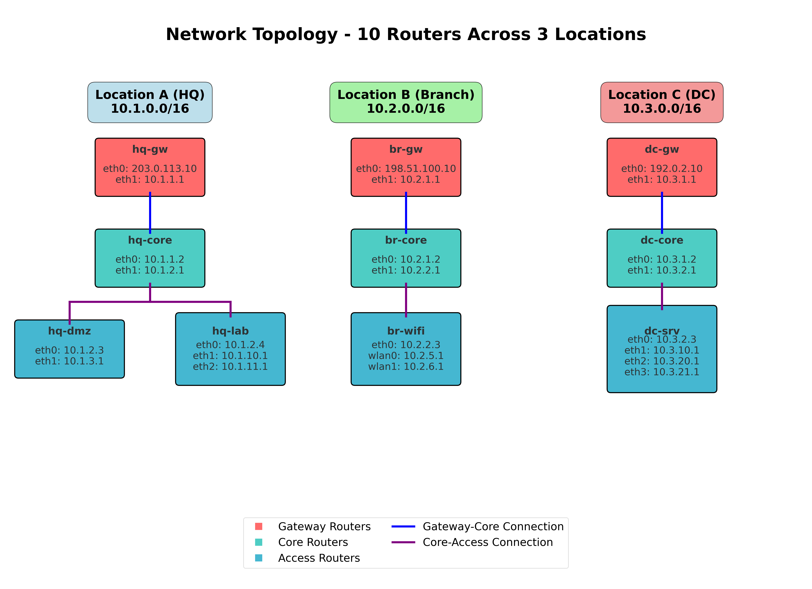

# Network Topology Documentation

This document describes the complex 10-router network topology used for testing the traceroute simulator.

## Overview

The test environment consists of 3 locations connected via WireGuard VPN tunnels:
- **Location A (Headquarters)**: 4 routers, 5 network segments
- **Location B (Branch Office)**: 3 routers, 4 network segments  
- **Location C (Data Center)**: 3 routers, 5 network segments

## Network Diagram



The complete network topology diagram shows the 10-router enterprise network across 3 locations with WireGuard VPN mesh connectivity. High-resolution versions are available as `network_topology.png` and `network_topology.pdf` (generated by `network_topology_diagram.py`).

### Updating the Topology Diagram

To regenerate or modify the network topology diagram:

1. **Regenerate existing diagram:**
   ```bash
   cd testing
   python3 network_topology_diagram.py
   ```

2. **Modify diagram layout:**
   - Edit `network_topology_diagram.py` to adjust router positions, colors, or styling
   - Router positions are defined in the `gateways`, `cores`, and `access` arrays
   - Box sizes automatically adjust based on number of interfaces
   - Connection coordinates update automatically with router positions

3. **Generated files:**
   - `network_topology.png` - High-resolution raster image (300 DPI)
   - `network_topology.pdf` - Vector format for scalable printing

4. **Customization options:**
   - Font sizes: Router names (20pt), interfaces (19pt), titles (33pt), headers (24pt)
   - Colors: Defined in `colors` dictionary for consistent theming
   - Layout: Hierarchical positioning with automatic connection routing
   - Box sizing: Automatically scales based on interface count (2-4 interfaces)

## Location Details

### Location A - Headquarters (10.1.0.0/16)

**Router: hq-gw** (Gateway Router)
- Role: Internet gateway and WireGuard hub
- Interfaces:
  - eth0: 203.0.113.10/24 (Internet)
  - eth1: 10.1.1.1/24 (Internal core)
  - wg0: 10.100.1.1/24 (WireGuard mesh)
- Routes: Default to internet, static routes to other locations

**Router: hq-core** (Core Distribution)
- Role: Internal distribution and routing
- Interfaces:
  - eth0: 10.1.1.2/24 (Core network)
  - eth1: 10.1.2.1/24 (Distribution network)
- Routes: Default via hq-gw, local distribution

**Router: hq-dmz** (DMZ Router)
- Role: DMZ and security services
- Interfaces:
  - eth0: 10.1.2.3/24 (Distribution network)
  - eth1: 10.1.3.1/24 (DMZ network)
- Routes: Default via hq-core

**Router: hq-lab** (Lab Router)
- Role: Development and lab networks
- Interfaces:
  - eth0: 10.1.2.4/24 (Distribution network)
  - eth1: 10.1.10.1/24 (Lab network 1)
  - eth2: 10.1.11.1/24 (Lab network 2)
- Routes: Default via hq-core

**Networks:**
- 10.1.1.0/24 - Core infrastructure
- 10.1.2.0/24 - Distribution layer
- 10.1.3.0/24 - DMZ services
- 10.1.10.0/24 - Lab network 1
- 10.1.11.0/24 - Lab network 2

### Location B - Branch Office (10.2.0.0/16)

**Router: br-gw** (Branch Gateway)
- Role: Internet gateway and WireGuard endpoint
- Interfaces:
  - eth0: 198.51.100.10/24 (Internet)
  - eth1: 10.2.1.1/24 (Internal core)
  - wg0: 10.100.1.2/24 (WireGuard mesh)
- Routes: Default to internet, static routes to other locations

**Router: br-core** (Branch Core)
- Role: Internal distribution
- Interfaces:
  - eth0: 10.2.1.2/24 (Core network)
  - eth1: 10.2.2.1/24 (Distribution network)
- Routes: Default via br-gw

**Router: br-wifi** (WiFi Controller)
- Role: Wireless network management
- Interfaces:
  - eth0: 10.2.2.3/24 (Distribution network)
  - wlan0: 10.2.5.1/24 (WiFi network 1)
  - wlan1: 10.2.6.1/24 (WiFi network 2)
- Routes: Default via br-core

**Networks:**
- 10.2.1.0/24 - Core infrastructure
- 10.2.2.0/24 - Distribution layer
- 10.2.5.0/24 - WiFi network 1
- 10.2.6.0/24 - WiFi network 2

### Location C - Data Center (10.3.0.0/16)

**Router: dc-gw** (Data Center Gateway)
- Role: Internet gateway and WireGuard endpoint
- Interfaces:
  - eth0: 192.0.2.10/24 (Internet)
  - eth1: 10.3.1.1/24 (Internal core)
  - wg0: 10.100.1.3/24 (WireGuard mesh)
- Routes: Default to internet, static routes to other locations

**Router: dc-core** (Data Center Core)
- Role: Internal distribution
- Interfaces:
  - eth0: 10.3.1.2/24 (Core network)
  - eth1: 10.3.2.1/24 (Distribution network)
- Routes: Default via dc-gw

**Router: dc-srv** (Server Router)
- Role: Server network management
- Interfaces:
  - eth0: 10.3.2.3/24 (Distribution network)
  - eth1: 10.3.10.1/24 (Server network 1)
  - eth2: 10.3.20.1/24 (Server network 2)
  - eth3: 10.3.21.1/24 (Server network 3)
- Routes: Default via dc-core

**Networks:**
- 10.3.1.0/24 - Core infrastructure
- 10.3.2.0/24 - Distribution layer
- 10.3.10.0/24 - Server network 1
- 10.3.20.0/24 - Server network 2
- 10.3.21.0/24 - Server network 3

## WireGuard VPN Configuration

The three locations are interconnected using a full-mesh WireGuard VPN on the 10.100.1.0/24 network:

- **hq-gw**: 10.100.1.1/24 (Hub node)
- **br-gw**: 10.100.1.2/24 (Spoke node)
- **dc-gw**: 10.100.1.3/24 (Spoke node)

## Routing Summary

### Inter-Location Routing
- All inter-location traffic flows through WireGuard tunnels
- Each gateway router has static routes to other locations' networks
- Metric 10 preference for VPN routes

### Intra-Location Routing
- Default routes point to location gateway
- Distribution layer handles internal routing
- Metric 1 for local routes

### Internet Access
- Each location has independent internet connectivity
- Default routes to respective ISP gateways
- Metric 100 for internet routes

## Test Scenarios

The network supports testing of:

1. **Simple Routing**: Router-to-router within same location
2. **Distribution Routing**: Through internal distribution layers
3. **VPN Routing**: Between locations via WireGuard
4. **Multi-hop Routing**: Complex paths through multiple routers
5. **Network Segment Routing**: Host-to-host across subnets
6. **Internet Routing**: Access to external destinations

## IP Address Allocation

- **10.1.0.0/16**: Location A (Headquarters)
- **10.2.0.0/16**: Location B (Branch Office)  
- **10.3.0.0/16**: Location C (Data Center)
- **10.100.1.0/24**: WireGuard VPN mesh network
- **203.0.113.0/24**: HQ Internet (RFC 5737 documentation)
- **198.51.100.0/24**: Branch Internet (RFC 5737 documentation)
- **192.0.2.0/24**: DC Internet (RFC 5737 documentation)

This topology provides comprehensive coverage for testing complex routing scenarios while maintaining realistic network design principles.